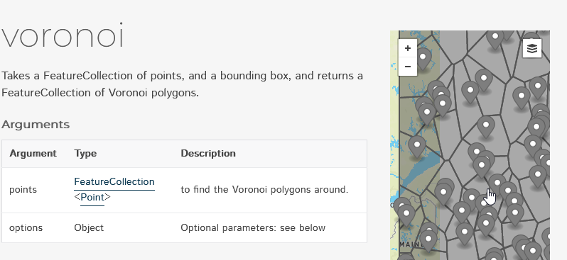
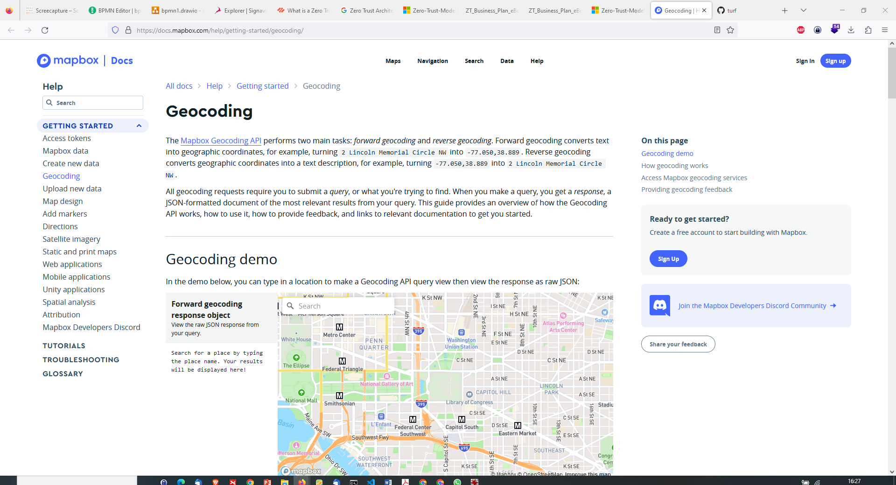
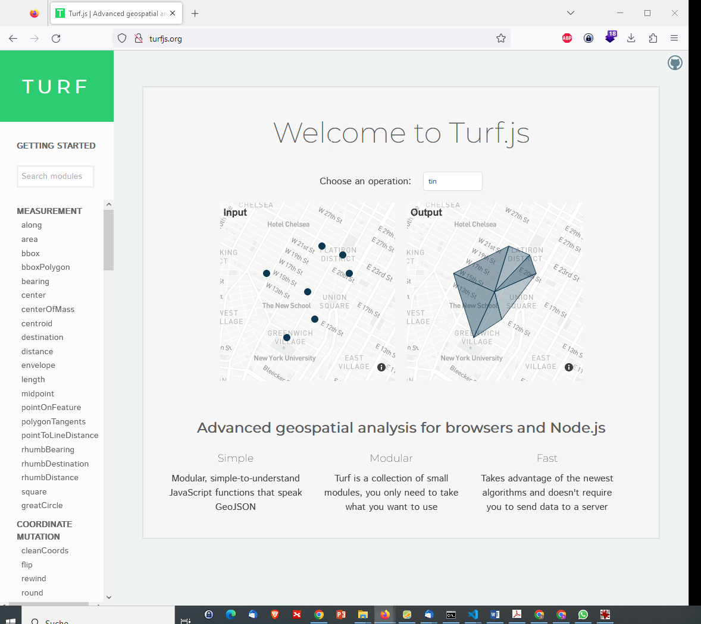

- [Mapbox : Maps and location for developers](#mapbox--maps-and-location-for-developers)
- [Advanced geospatial analysis for browsers and Node.js](#advanced-geospatial-analysis-for-browsers-and-nodejs)

# Mapbox : Maps and location for developers

<https://docs.mapbox.com/help/getting-started/geocoding/>

<https://docs.mapbox.com/playground/geocoding/>

# Advanced geospatial analysis for browsers and Node.js

<http://turfjs.org/>

<https://github.com/Turfjs/turf/>
