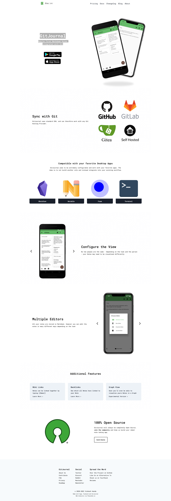

# markdown-static-websites

## https://jamstackthemes.dev/

Themes für Static sites 

https://jamstackthemes.dev/

https://jamstackthemes.dev/demo/theme/hugo-cohub/

## Pandoc   a universal document converter

https://pandoc.org/demos.html

## https://www.gatsbyjs.com/

https://www.gatsbyjs.com/
https://www.gatsbyjs.com/docs/quick-start/

## Pelican 

Python based md websitegenerator 

https://docs.getpelican.com/en/latest/tips.html#publishing-to-github
https://github.com/getpelican/pelican

## https://hedgedoc.org/

https://github.com/hedgedoc
https://github.com/hedgedoc/hedgedoc

## hugo 
in GO 
https://gohugo.io/

# jekyll 
in Ruby 
https://jekyllrb.com/

## mkdocs
https://www.mkdocs.org/

https://squidfunk.github.io/mkdocs-material/
https://squidfunk.github.io/mkdocs-material/getting-started/

https://github.com/mkdocs/mkdocs/wiki/MkDocs-Themes

https://github.com/byrnereese/mkdocs-minify-plugin

https://github.com/mkdocs/mkdocs-redirects

## Docusaurus 

- https://docusaurus.io/blog/2022/08/01/announcing-docusaurus-2.0

## markdown blog 

## GitJournal Mobile first Markdown Notes integrated with Git

https://gitjournal.io/

  
