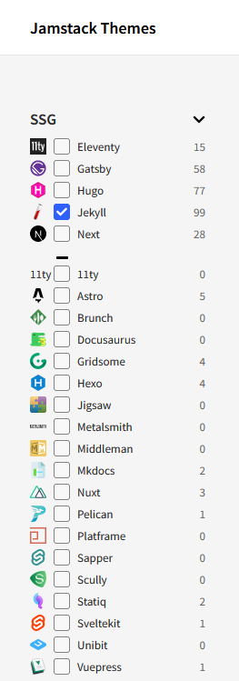
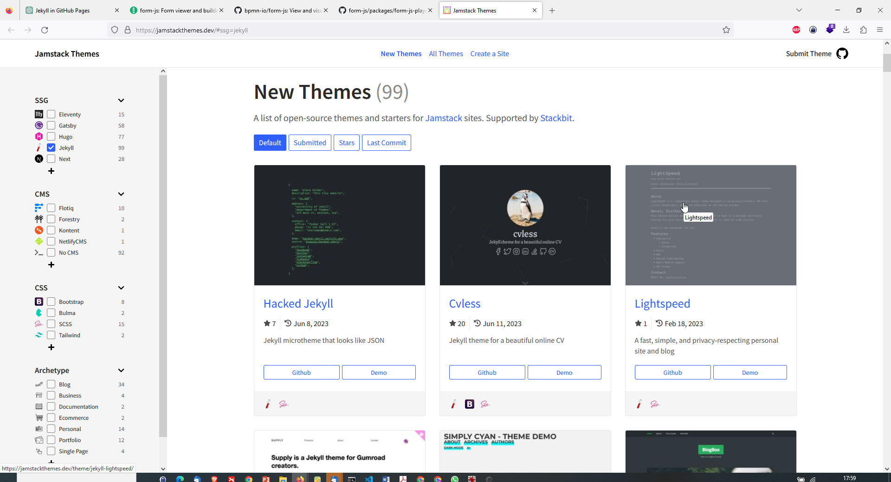
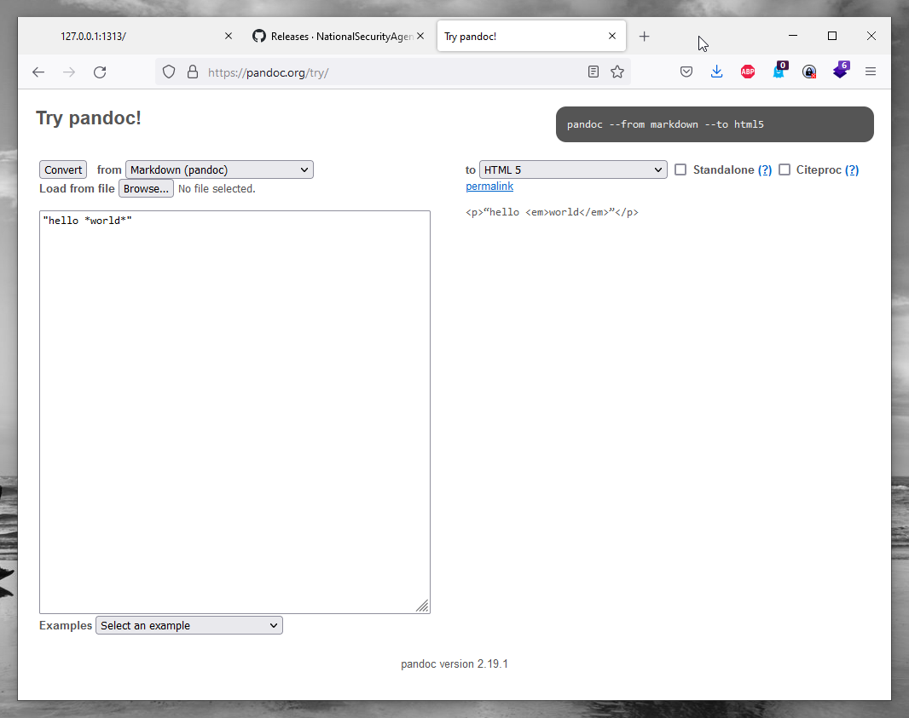

- [Jamstack: Static Sites Generators with Markdown](#jamstack-static-sites-generators-with-markdown)
  - [1. Static Sites:](#1-static-sites)
  - [2. Jamstack:](#2-jamstack)
  - [Jamstack Themes](#jamstack-themes)
  - [Pandoc a universal document converter](#pandoc-a-universal-document-converter)
  - [https://www.gatsbyjs.com/](#httpswwwgatsbyjscom)
  - [Pelican](#pelican)
  - [Hedgedoc](#hedgedoc)
  - [Hugo](#hugo)
  - [Jekyll](#jekyll)
  - [mkdocs](#mkdocs)
  - [Docusaurus](#docusaurus)
  - [Markdown Blog](#markdown-blog)
  - [GitJournal Mobile first Markdown Notes integrated with Git](#gitjournal-mobile-first-markdown-notes-integrated-with-git)

# Jamstack: Static Sites Generators with Markdown
Static sites and Jamstack are closely related concepts that focus on building modern web applications with simplicity, speed, and security in mind. Let's delve into each of these terms:

## 1. Static Sites:
A static site refers to a website that consists of pre-rendered HTML, CSS, and JavaScript files. Unlike dynamic websites that generate content dynamically on the server for each request, static sites do not require server-side processing or database queries to deliver content. Each page of a static site is a separate HTML file, and the content remains fixed unless manually updated.

Static sites offer several advantages, including:

- Speed: With no server-side processing or database interactions, static sites can be delivered quickly to users, resulting in faster page load times.
- Scalability: Static sites are highly scalable since they can be served by content delivery networks (CDNs) that distribute files globally, reducing latency and improving performance.
- Security: Since static sites do not involve server-side processing, they have a reduced attack surface and are less vulnerable to common security exploits.

However, static sites are generally more suitable for content-focused websites, blogs, portfolios, or brochure sites where the content doesn't change frequently.

## 2. Jamstack:
Jamstack is an architectural approach for building web applications that embraces static site principles while incorporating modern development practices. Jamstack stands for JavaScript, APIs, and Markup. Here's what each component entails:

- JavaScript: JavaScript is used to add interactivity and dynamic functionality to the static site. This can be done through client-side JavaScript frameworks or libraries that handle dynamic behavior and user interactions.

- APIs: Jamstack leverages APIs to access dynamic data or perform server-side operations. These APIs are typically called during build time or client-side JavaScript execution to fetch data from external sources or perform other operations.

- Markup: Markup refers to the static HTML files that are pre-rendered and served to users. These files can be generated during the build process, either from content management systems (CMS) or static site generators.

Jamstack combines the benefits of static sites with the flexibility of dynamic functionalities through JavaScript and APIs. It allows developers to build performant, scalable, and secure web applications by separating the presentation layer (static markup) from the dynamic functionality (JavaScript and APIs).

Jamstack applications can be deployed on a variety of hosting platforms, including specialized Jamstack platforms like Netlify, Vercel, or static file hosts such as AWS S3 or GitHub Pages.

Overall, Jamstack promotes modern web development practices by prioritizing speed, security, and scalability while providing a smooth developer experience.
## Jamstack Themes

Themes für Static Sites 

- <https://jamstackthemes.dev/>

- <https://jamstackthemes.dev/demo/theme/hugo-cohub/>

## Pandoc a universal document converter

- <https://pandoc.org/demos.html>

  

## https://www.gatsbyjs.com/

- <https://www.gatsbyjs.com/>
- <https://www.gatsbyjs.com/docs/quick-start/>

## Pelican 

Python based md Websitegenerator 

<https://docs.getpelican.com/en/latest/tips.html#publishing-to-github>
<https://github.com/getpelican/pelican>

## Hedgedoc
<https://hedgedoc.org/>
<https://github.com/hedgedoc>
<https://github.com/hedgedoc/hedgedoc>

## Hugo 
in GO 
- <https://gohugo.io/>

## Jekyll 
in Ruby 
- <https://jekyllrb.com/>

## mkdocs
- <https://www.mkdocs.org/>

- <https://squidfunk.github.io/mkdocs-material/>
- <https://squidfunk.github.io/mkdocs-material/getting-started/>

- <https://github.com/mkdocs/mkdocs/wiki/MkDocs-Themes>

- <https://github.com/byrnereese/mkdocs-minify-plugin>

- <https://github.com/mkdocs/mkdocs-redirects>

## Docusaurus 

- <https://docusaurus.io/blog/2022/08/01/announcing-docusaurus-2.0>

## Markdown Blog 

## GitJournal Mobile first Markdown Notes integrated with Git

- <https://gitjournal.io/>

  
