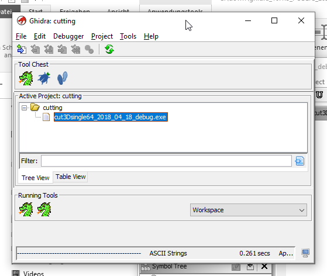

---
layout: post
title: Ghidra Software Reverse Engineering Framework by NSA
categories: [Reverse Engineering]
tags: [Ghidra, Software, Reverse Engineering, Framework,NSA]
--- 

# Ghidra Software Reverse Engineering Framework

Ghidra is a software reverse engineering (SRE) framework created and maintained by the National Security Agency Research Directorate. This framework includes a suite of full-featured, high-end software analysis tools that enable users to analyze compiled code on a variety of platforms including Windows, macOS, and Linux. Capabilities include disassembly, assembly, decompilation, graphing, and scripting, along with hundreds of other features. Ghidra supports a wide variety of processor instruction sets and executable formats and can be run in both user-interactive and automated modes. Users may also develop their own Ghidra extension components and/or scripts using Java or Python.

In support of NSA's Cybersecurity mission, Ghidra was built to solve scaling and teaming problems on complex SRE efforts, and to provide a customizable and extensible SRE research platform. NSA has applied Ghidra SRE capabilities to a variety of problems that involve analyzing malicious code and generating deep insights for SRE analysts who seek a better understanding of potential vulnerabilities in networks and systems.

<https://github.com/NationalSecurityAgency/ghidra/releases>

Binary Executable  File Analyse / Debugger 

  

  

