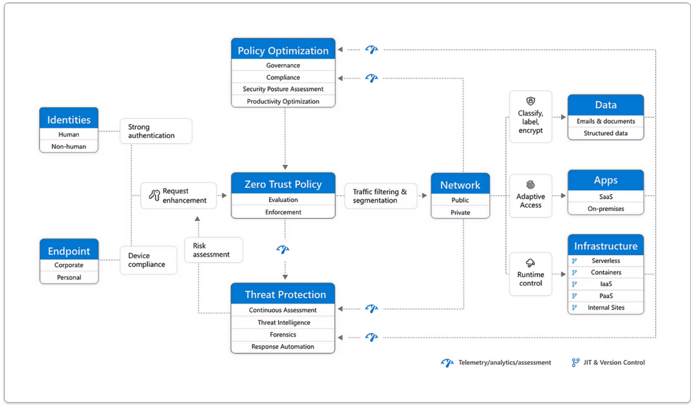

---
layout: post
title: collection of zero trust topics
categories: [zerotrust]
tags: []
--- 

# collection of zero trust topics

## Tags 

open source, Netzwerkprotokolle, feldbus systeme, profinet, Modbus, siemens S5, siemans S7, schutzmechanismen cloud, cloud access broker, web proxying, OWASP top 10, pPerimeterbasierte Firewall, Penetration Test, Wireshark   

## Zero Trust Micosoft Modell 

<https://www.microsoft.com/de-de/security/business/zero-trust>

## Links 

- What is a Zero Trust Architecture
  
<https://www.paloaltonetworks.com/cyberpedia/what-is-a-zero-trust-architecture>

- Organizations facing problems in zero-trust implementation

<https://techwireasia.com/2022/02/problems-with-zero-trust/>

- Zero-Trust-Sicherheit für Behörden: Ein Ansatz für mehr IT-Sicherheit und optimierte Entscheidungsprozesse zugleich 

<https://www.splunk.com/de_de/blog/industries/zero-trust-sicherheit-fuer-behoerden-ein-ansatz-fur-mehr-it-sicherheit-und-optimierte-entscheidungsprozesse-zugleich.html>
