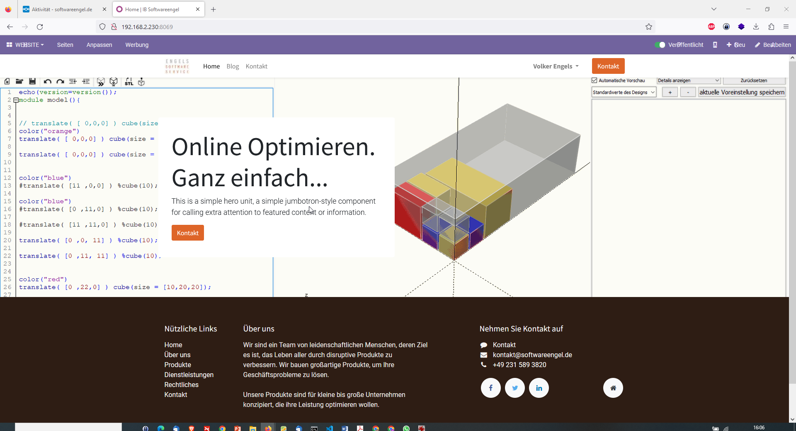
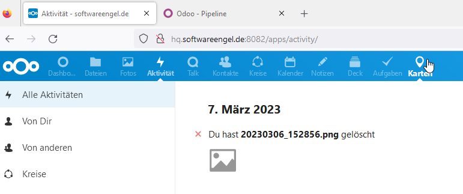
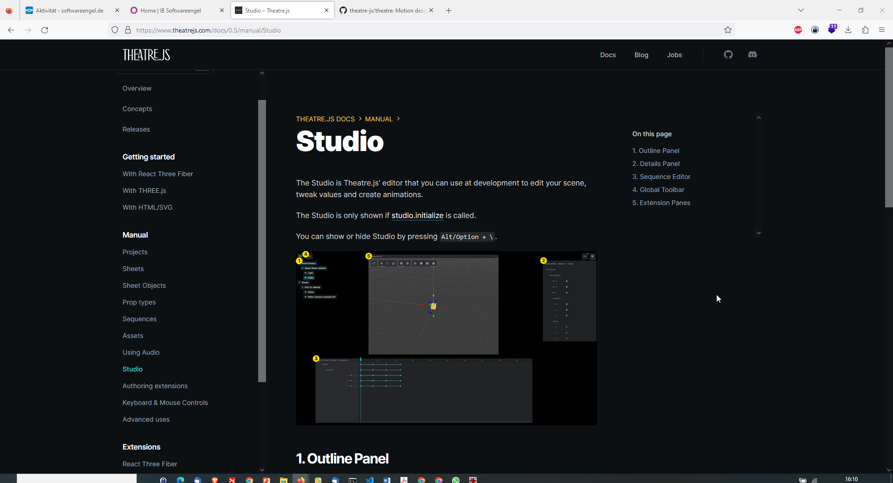

- [Linux-Mitigations Benchmark Redbleed](#linux-mitigations-benchmark-redbleed)
- [gcc vs. Clang auf Apple M2 Silicon \[compiler\]](#gcc-vs-clang-auf-apple-m2-silicon-compiler)
- [CRM OSS](#crm-oss)
  - [Odoo OSS CRM](#odoo-oss-crm)
  - [Vtiger OSS CRM](#vtiger-oss-crm)
- [Colaboration](#colaboration)
  - [Nextcloud OSS](#nextcloud-oss)
- [3D JS Theatrejs](#3d-js-theatrejs)

 # Linux-Mitigations Benchmark Redbleed 

 <https://www.phoronix.com/review/retbleed-benchmark>
 <https://comsec.ethz.ch/wp-content/files/retbleed_sec22.pdf>

 - Redbleed:  
 <https://www.phoronix.com/news/RETBLEED>
 <https://comsec.ethz.ch/research/microarch/retbleed/>

 # gcc vs. Clang auf Apple M2 Silicon [compiler]
 
 <https://www.phoronix.com/review/apple-m2-compilers>

# CRM OSS 

##  Odoo OSS CRM 
- kein vcard sync 
- Projekte Kanban
- Kundenverwaltung Leads Kanban 
- eigene Website mit Baukastenelementen 
- Kalender 
- Chat & Diskussion 
- Kontakte 
- Verkaufsprozess 
- Abrechnung 

## Vtiger OSS CRM 
- OSS version sehr abgespeckt - nicht aktuell 

# Colaboration 

## Nextcloud OSS 

- vcard sync, vcal sync 
- keine Kontakthistorie der Kontakte 
- datei - Verwaltung, Bilder 
- Termine,Kontakte, Aktivitäten, Aufgaben 
- Deck (KanbanBord)
- web Editor MD + Drawio 

# 3D JS Theatrejs 

Theatre.js is an animation library for high-fidelity motion graphics. It is designed to help you express detailed animation, enabling you to create intricate movement, and convey nuance.

Theatre.js can be used both programmatically and visually.

<https://www.theatrejs.com/blog/theatre-05-is-out>

<https://github.com/theatre-js/theatre>

