# BPMN 
BPMN stands for Business Process Model and Notation. It is a graphical representation and notation standard for visualizing and documenting business processes. BPMN provides a common language and framework that allows stakeholders, including business analysts, process owners, and developers, to understand, analyze, and improve business processes in a clear and standardized way.

Here are some key aspects of BPMN:

1. Graphical Notation: BPMN uses a set of symbols and graphical elements to represent different elements and activities within a business process. These symbols include events, activities, gateways, flows, and artifacts, which are arranged in a process diagram.

2. Process Flow: BPMN diagrams represent the flow of activities and information within a business process. They show how different tasks, decisions, and events are interconnected and organized to achieve a specific business objective. The process flow is visualized using arrows and connecting lines.

3. Events: BPMN defines various types of events that can occur during a business process, such as the start of a process, intermediate events, and end events. Events represent triggers or milestones that affect the flow or behavior of the process.

4. Activities: Activities represent the tasks or actions performed within a process. They can be manual or automated activities, and they indicate the work that needs to be done to complete a process. Activities are typically depicted as rectangles in BPMN diagrams.

5. Gateways: Gateways are used to represent decision points or branching within a process. They define the conditions or rules that determine which path the process flow should take based on different scenarios or outcomes. Gateways are represented by diamond-shaped symbols.

6. Artifacts: BPMN allows the inclusion of artifacts, which are non-flow objects that provide additional information or documentation within the process diagram. Examples of artifacts include annotations, data objects, and groups.

7. Collaboration and Choreography: BPMN supports modeling collaboration and choreography between multiple participants or entities involved in a business process. It enables the visualization of interactions, message flows, and responsibilities between different process participants.

BPMN provides a standardized notation that promotes consistency and clarity when documenting and analyzing business processes. It facilitates communication and understanding among stakeholders, enabling effective process management, optimization, and automation. Many software tools and systems support BPMN for process modeling and execution, allowing organizations to align their business operations and drive process improvements.

# Singavio 
## Bpmn 

## BPMN Urlausantrag

## Nachrichten 

## EPK

## Organigramm - ohne Oval - Stabstelle 

## Prozesslandkarte 

## UML Klassendiagram

## UML Usecase Diagram 

## Signavio Simulation 

## Szenario - Alternativen 

# Camunda 

## Camunda Download  
- Docker 
https://camunda.com/download/self-managed/docker-compose/

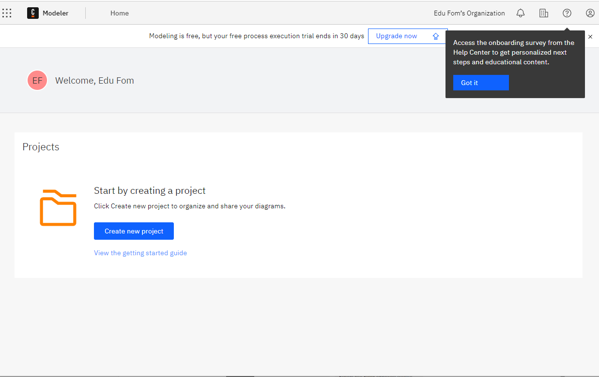

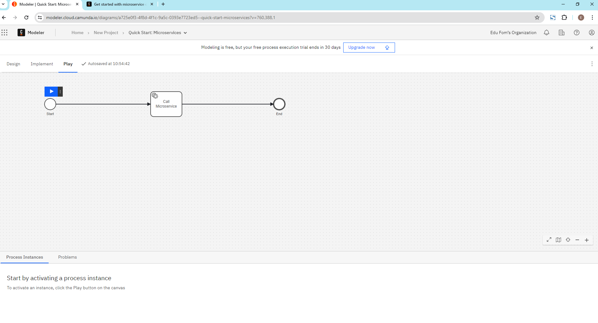
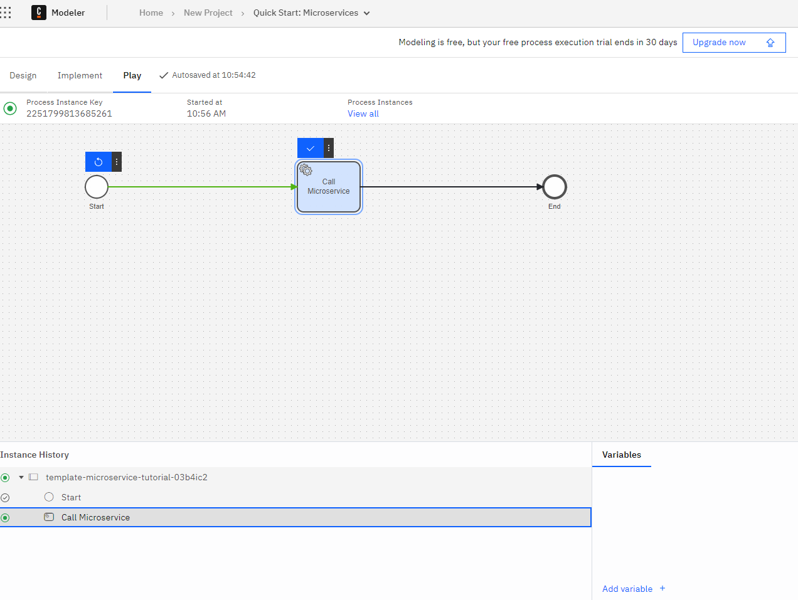
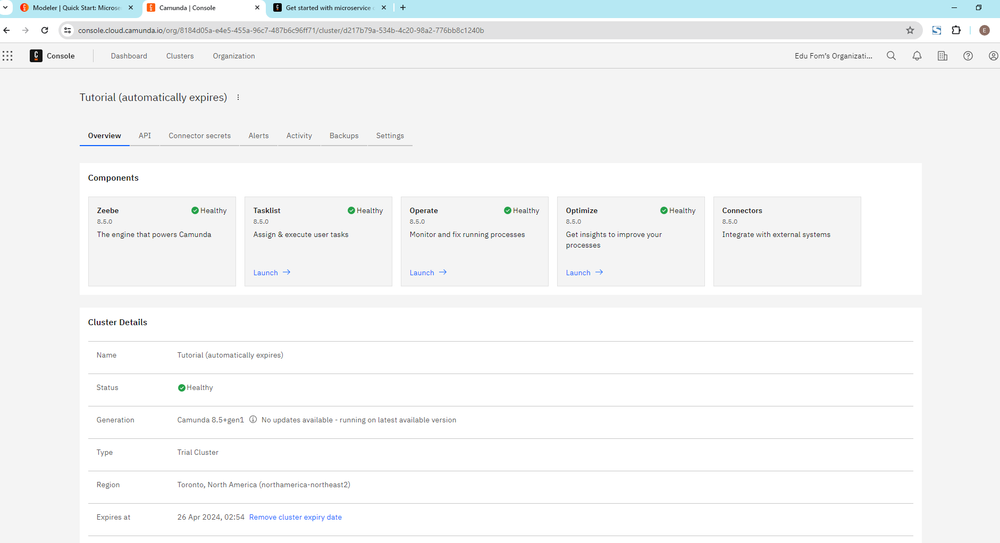

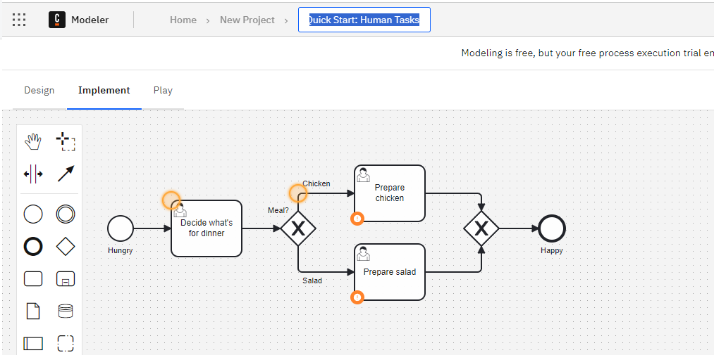

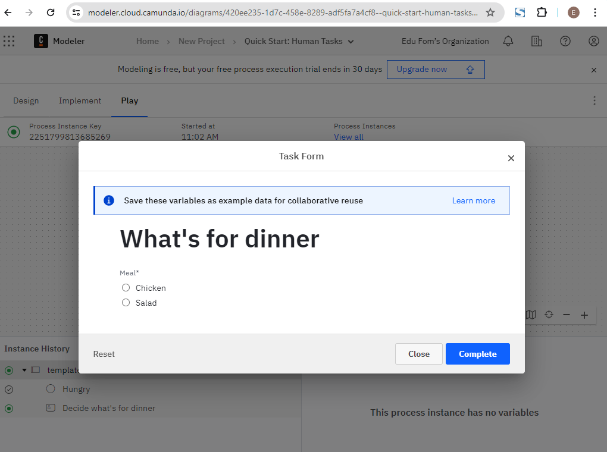

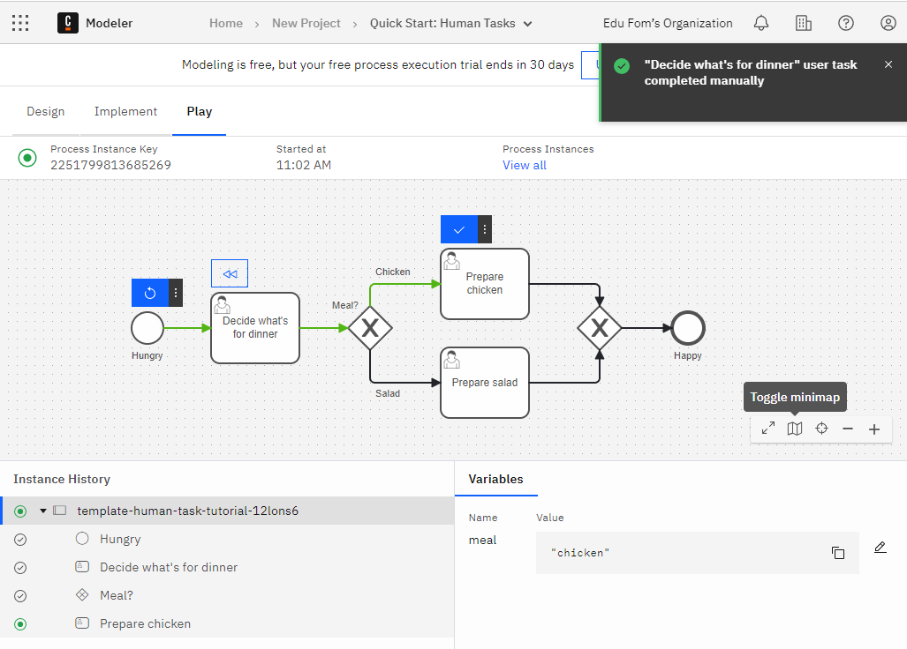

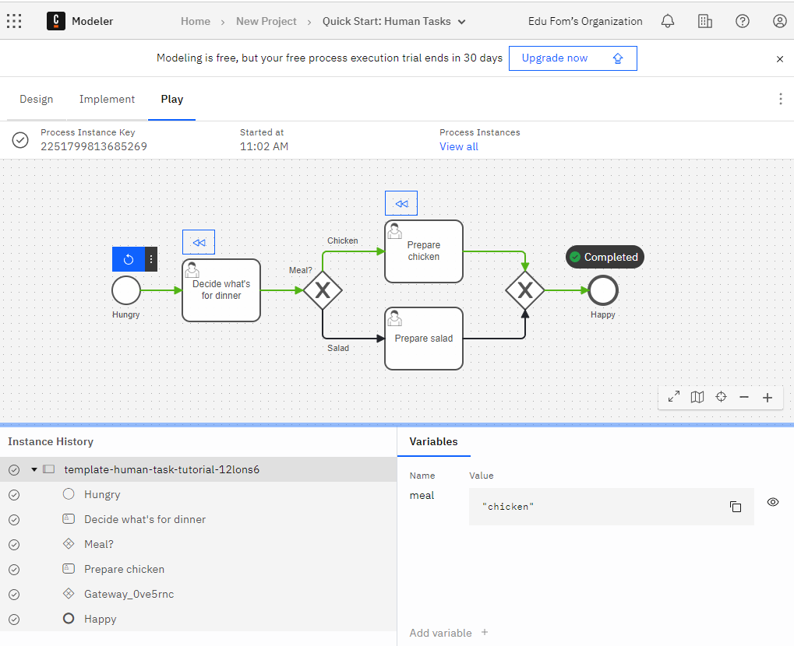

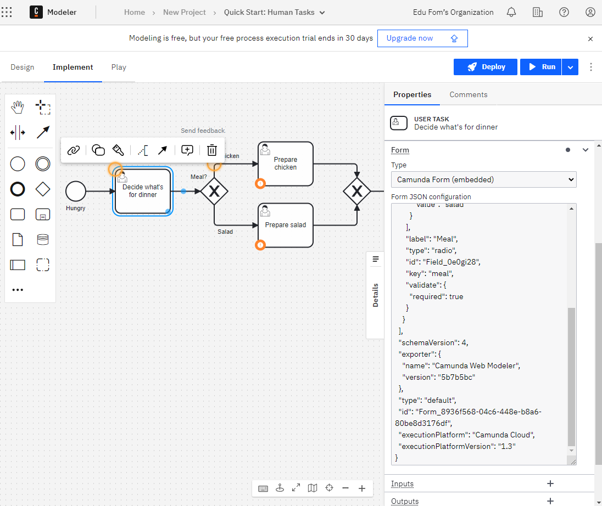

## Camunda Form Editor 

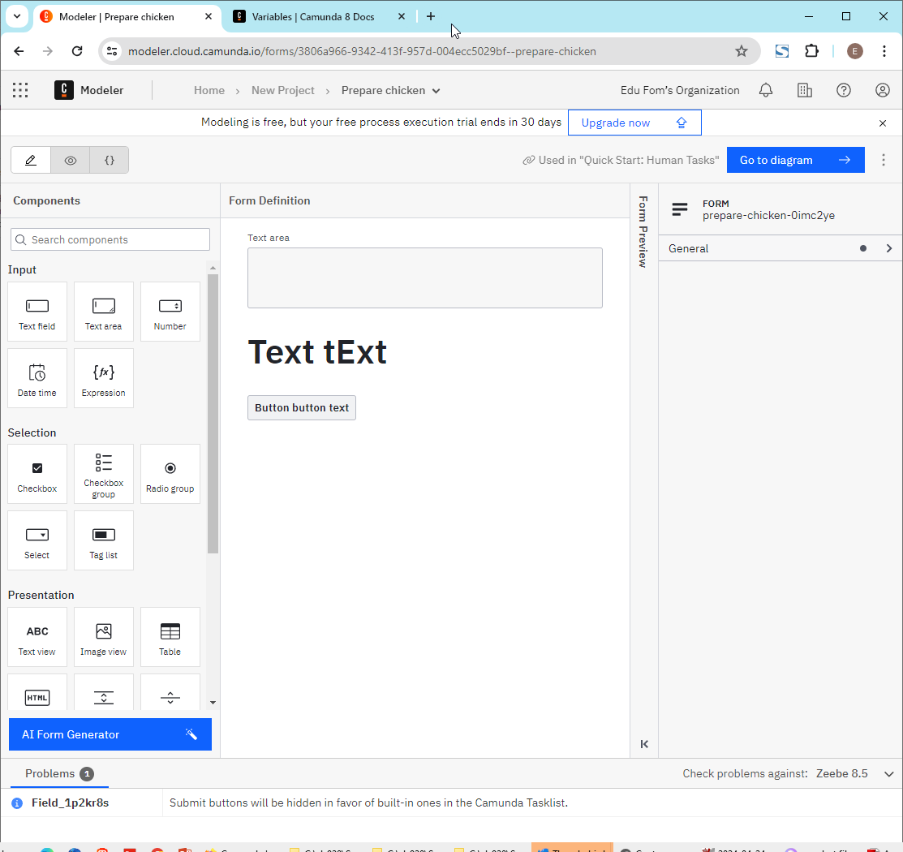

## Camunda Processes

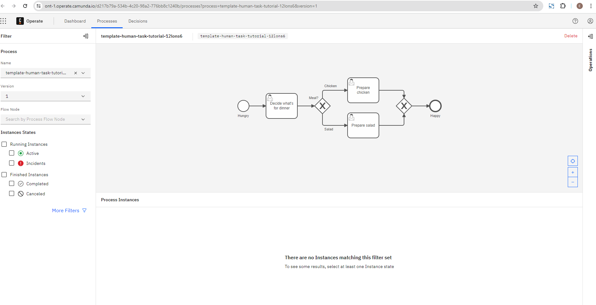
## Camunda Condition 

## Camunda Tasks in Processes 

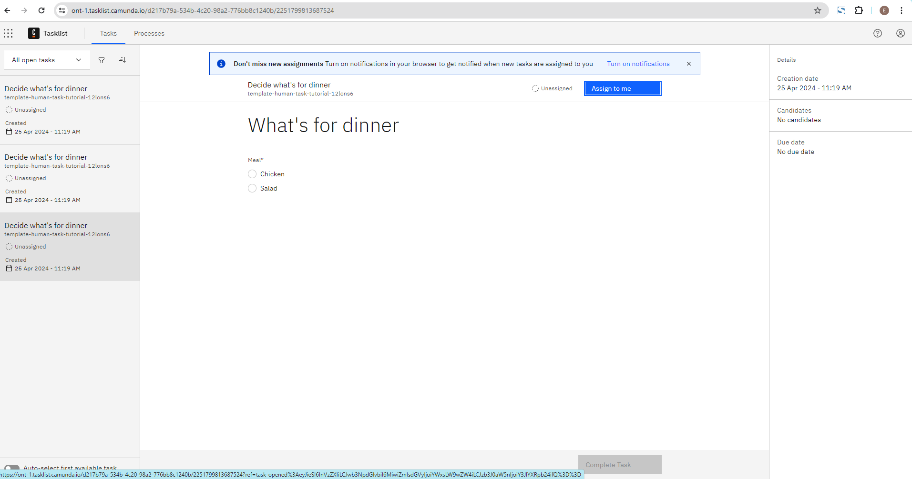

## Camunda Operate 
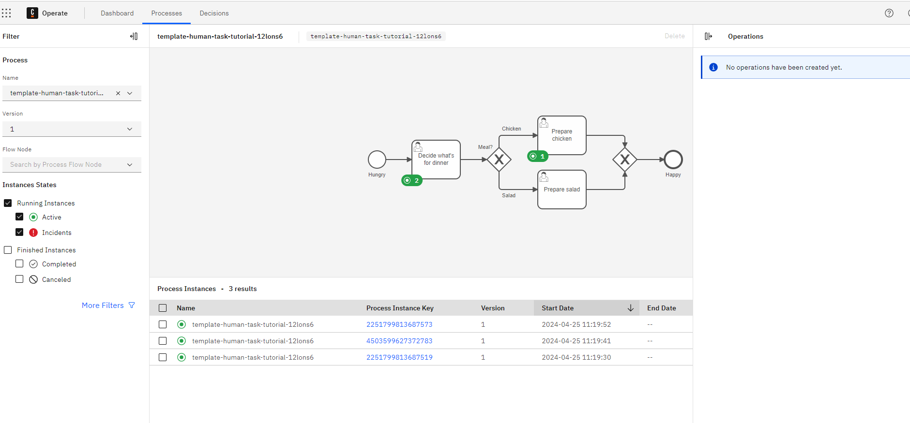
## Process instance 

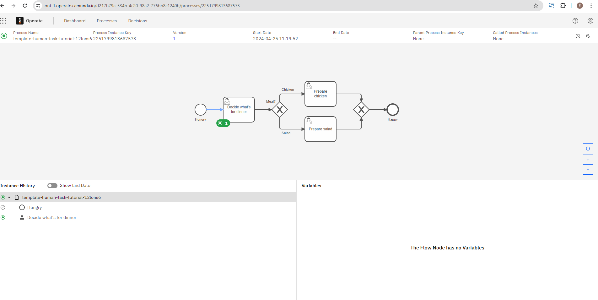

## Optimizing 

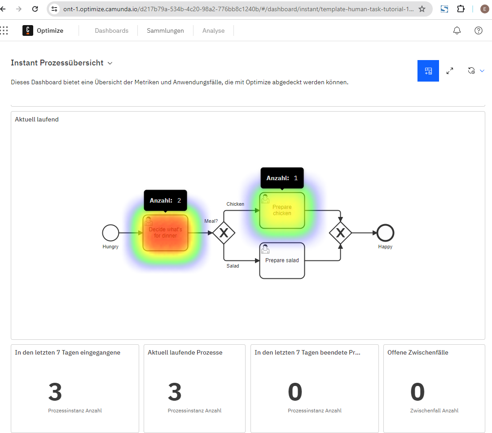
## Verlaufsanalyse 

### Token Simulation 

# # Bpmn.io, bpmn.js (Camunda)

<https://demo.bpmn.io/>

### form.js - Form builder 

<https://github.com/bpmn-io/form-js#builder>

<https://github.com/bpmn-io/form-js/tree/develop/packages/form-js-playground>

# Draw.io 

# History Free & Open Source BPMN 

- <https://www.techjockey.com/blog/free-open-source-bpm-software-businesses-2019>

  

#

# Refs

- https://github.com/camunda

  
