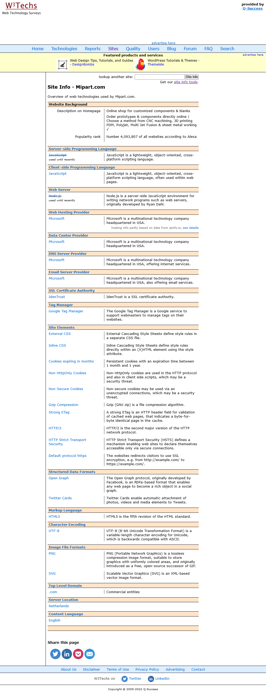
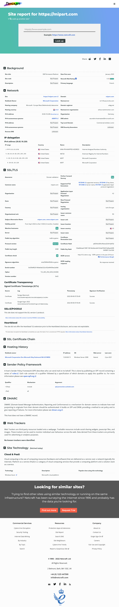
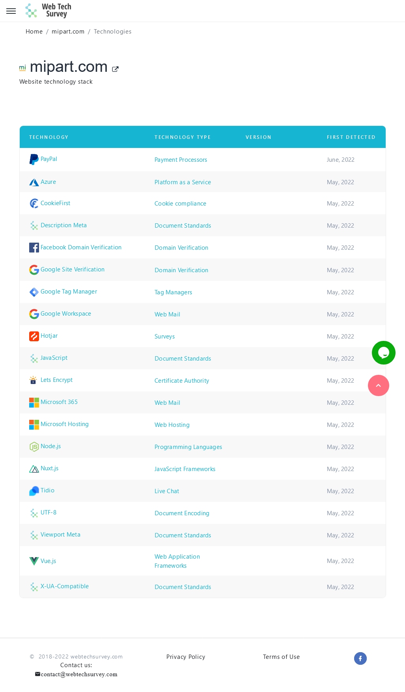
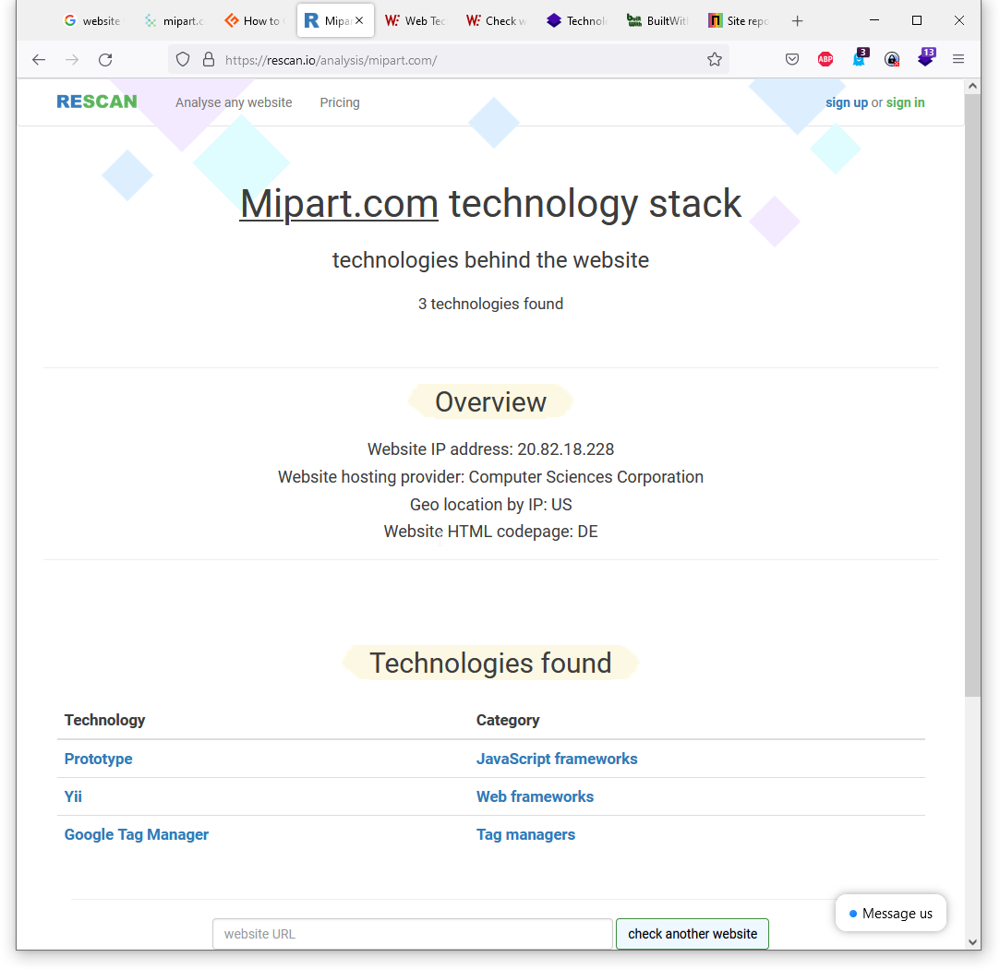

---
layout: post
title: Website Technology Analyse Tools
categories: [web, Tool]
tags: [website, technology, Analyse, Tool]
--- 
# Website Technology Analyse Tools

- [Website Technology Analyse Tools](#website-technology-analyse-tools)
- [Survey](#survey)
- [Build With](#build-with)
- [Weppalyzer](#weppalyzer)
- [w3techs Site INfo](#w3techs-site-info)
- [Netcraft](#netcraft)

# Survey 
- https://geekflare.com/what-technology-website-using/
- 

# Build With 
- https://builtwith.com

  

- https://builtwith.com/detailed/mipart.com

  

# Weppalyzer 

- Browser Add-in

  

- Website - Paywall 

  

# w3techs Site INfo 

- https://w3techs.com/sites

  

  

# Netcraft 

https://sitereport.netcraft.com/?url=https%3A%2F%2Fmipart.com

  

# Webtechsurvey

https://webtechsurvey.com/website/mipart.com/technologies

  

# Rescan (poor)
- https://rescan.io/analysis/mipart.com/
  
  