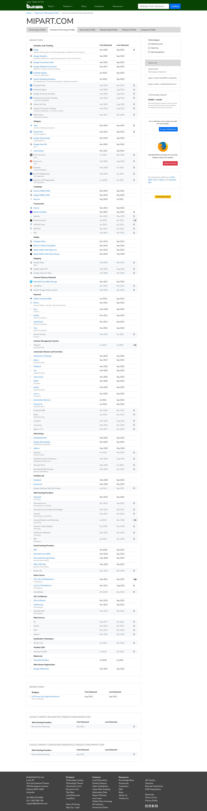
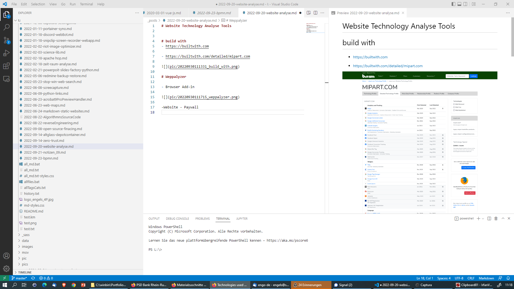

- [Website Technology Analyse Tools](#website-technology-analyse-tools)
- [Survey](#survey)
- [Build With](#build-with)
- [Weppalyzer](#weppalyzer)
- [w3techs Site Info](#w3techs-site-info)
- [Netcraft](#netcraft)
- [Webtechsurvey](#webtechsurvey)
- [Rescan (poor)](#rescan-poor)

# Website Technology Analyse Tools

# Survey 
- <https://geekflare.com/what-technology-website-using/>

# Build With 
- <https://builtwith.com>

  

- <https://builtwith.com/detailed/mipart.com>

  

# Weppalyzer 

- Browser Add-in

  

- Website - Paywall 

  

# w3techs Site Info 

- <https://w3techs.com/sites>

  

  

# Netcraft 

<https://sitereport.netcraft.com/?url=https%3A%2F%2Fmipart.com>

  

# Webtechsurvey

<https://webtechsurvey.com/website/mipart.com/technologies>

  

# Rescan (poor)
- <https://rescan.io/analysis/mipart.com/>
  
  