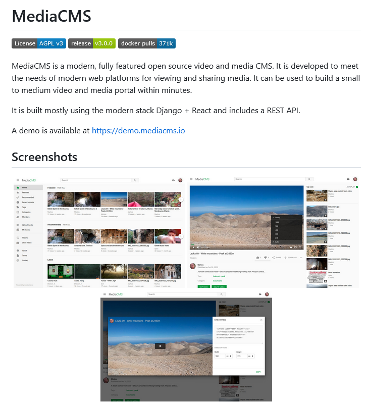

---
layout: post
title: Notes on Saarx, OSS, CRM, Checkmk, Mattermost, Ansible, jamstack, Strapi, CMS, Cryptboard, Arrow-js, Forestry, Vitejs, Awsome-link-list
categories: [notes]
tags: [saarx, oss, crm, checkmk, mattermost,ansible, jamstack, strapi, cms,cryptboard, arrow-js, forestry, vitejs, awsome-link-list ]
--- 
- [Searx OSS - Search without being tracked](#searx-oss---search-without-being-tracked)
- [MediaCMS oss CMS Foto + Video](#mediacms-oss-cms-foto--video)
- [Monitoring Checkmk](#monitoring-checkmk)
- [Redhat Paywall OSS Problem](#redhat-paywall-oss-problem)
- [Ansible - Redhat - IBM](#ansible---redhat---ibm)
- [Mattermost OSS(?)](#mattermost-oss)
- [Jamstack Survey](#jamstack-survey)
- [Sanity CMS](#sanity-cms)
- [Notion as CMS](#notion-as-cms)
- [Strapi CMS](#strapi-cms)
- [Clipboard Cryptboard](#clipboard-cryptboard)
- [Feee Tech Ebooks](#feee-tech-ebooks)
- [ToolJet](#tooljet)
- [Processor Design - An introdiction](#processor-design---an-introdiction)
- [Arrow JS](#arrow-js)
- [MikeOS x86 operating system](#mikeos-x86-operating-system)
- [forestry cms](#forestry-cms)
- [Web Framework vitejs](#web-framework-vitejs)
- [Awsome Link List](#awsome-link-list)

# Searx OSS - Search without being tracked

<https://searx.github.io/searx/>
<https://github.com/searx/searx>

# MediaCMS oss CMS Foto + Video 
Modern, fully featured open source
video and media CMS

<https://mediacms.io/>

<https://github.com/mediacms-io/mediacms>

# Monitoring Checkmk 
Monitoring für Ihre gesamte IT-Infrastruktur
<https://checkmk.com/de>
<https://checkmk.com/partners/find-partner>
<https://checkmk.com/imprint>
<https://github.com/Checkmk/checkmk>

# Redhat Paywall OSS Problem 
<https://www.jeffgeerling.com/blog/2023/dear-red-hat-are-you-dumb> 
<https://www.jeffgeerling.com/blog/2023/im-done-red-hat-enterprise-linux>
<https://youtu.be/kF5pyVUQBH8>

# Ansible - Redhat - IBM 
Automation for everyone

No matter your role, or what your automation goals are, Ansible can help you demonstrate value, connect teams, and deliver efficiencies for your organization. Built on open source, Red Hat® Ansible® Automation Platform is a hardened, tested subscription product that offers full life cycle support for organizations. Explore how Ansible can help you automate today—and scale for the future.

<https://www.heise.de/ratgeber/Agile-IT-mit-Ansible-Grundlagen-zur-Automatisierung-5076652.html>
<https://docs.ansible.com/ansible/latest/dev_guide/overview_architecture.html>

# Mattermost OSS(?) 
Mattermost is an open source platform for secure collaboration across the entire software development lifecycle.

Secure collaboration for technical teams

Give operational and engineering teams the workspace they need to collaborate securely and effectively. 

<https://github.com/mattermost>
<https://mattermost.com/>
<https://github.com/mattermost/mattermost-server>

<https://developers.mattermost.com/contribute/more-info/server/developer-setup/>

# Jamstack Survey 
<https://jamstack.org/survey/2022/>

- Jamstack CMS 

<https://jamstack.org/survey/2022/#content-management-systems>

  

# Sanity CMS 

<https://www.sanity.io>

# Notion as CMS 

https://www.thisdot.co/blog/using-notion-as-a-cms
https://datanarratives.com/blog/notion-headless-cms/
https://developers.notion.com/docs/getting-started 
https://developers.notion.com/

# Strapi CMS

Strapi  is  the leading open-source headless CMS. It’s 100% JavaScript and fully customizable.
<https://strapi.io/>

# Clipboard Cryptboard 

<https://github.com/MihanEntalpo/cryptboard.io>
<https://cryptboard.io/>

# Feee Tech Ebooks 
<https://www.freetechbooks.com/artificial-intelligence-f55.html>

# ToolJet 

ToolJet is an open-source low-code framework to build and deploy internal tools quickly with minimal engineering effort. ToolJet's drag and drop frontend builder allows you to build complicated responsive frontends within minutes. You can also connect to your data sources, such as databases ( PostgreSQL, MongoDB, Elasticsearch & more), API endpoints (ToolJet supports importing OpenAPI spec & OAuth2 authorization), SaaS tools (Stripe, Slack, Google Sheets, Airtable, Notion & more) and object storage services ( S3, GCS, Minio, etc ) to fetch and write data.

<https://github.com/ToolJet/ToolJet>

# Processor Design - An introdiction 

<http://www.gamezero.com/team-0/articles/math_magic/micro/index.html>

# Arrow JS 
What is Arrow?

ArrowJS is an experimental tool for programming reactive interfaces using native JavaScript. It’s not really a framework, but not less powerful than a framework either. At its core — ArrowJS is an admission that while we developers were falling in love with UI frameworks — JavaScript itself got good, really good. 

<https://www.arrow-js.com/>
<https://github.com/justin-schroeder/arrow-js>

# MikeOS x86 operating system

MikeOS Main MenuMikeOS is an operating system for x86 PCs, written in assembly language. It is a learning tool to show how simple 16-bit, real-mode OSes work, with well-commented code and extensive documentation. 

<https://mikeos.sourceforge.net/>

# forestry cms
Give your editors the power of Git.
Create, edit, and instant preview Markdown-based sites.

<https://forestry.io/starters/>

# Web Framework vitejs
 Next Generation Frontend Tooling

Get ready for a development environment that can finally catch up with you.

<https://vitejs.dev/guide/>
<https://github.com/vitejs/awesome-vite#templates>
<https://github.com/Rich-Harris/degit>

<https://stackblitz.com/edit/vitejs-vite-c3tb8u?file=index.html&terminal=dev>

# Awsome Link List 

<https://github.com/sindresorhus/awesome>

