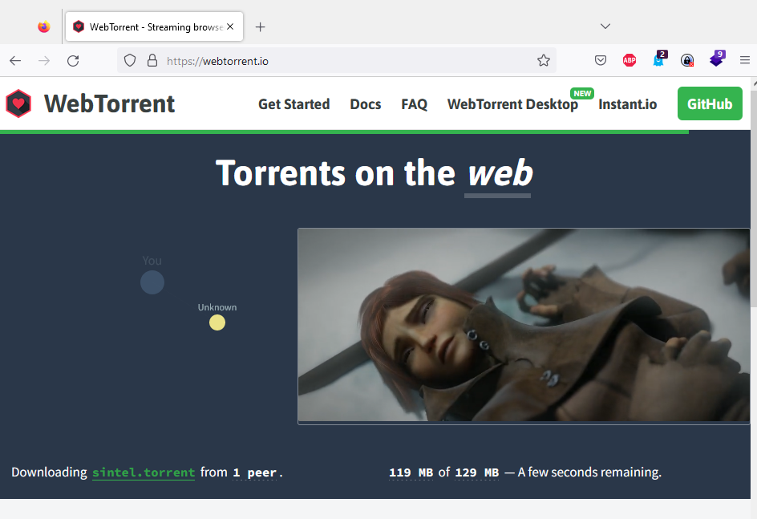
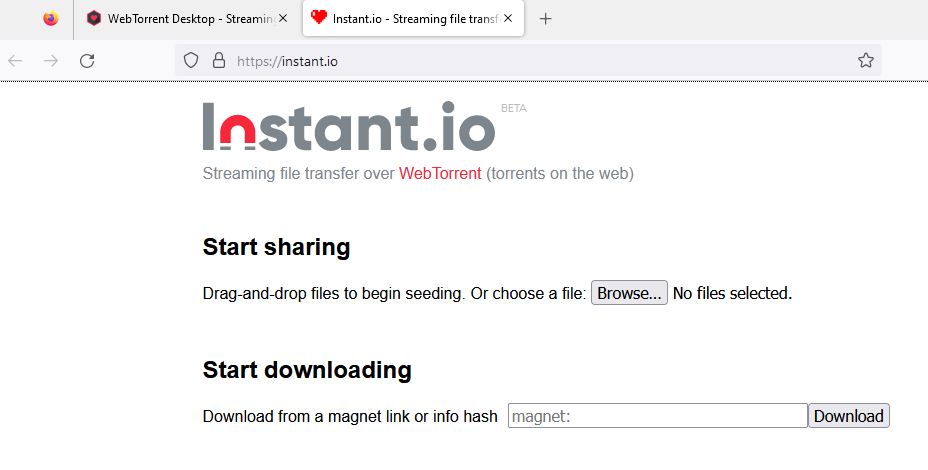

# notes 2022-12 

## Kryptografische Protokolle mit python code 

https://www.inf.hs-flensburg.de/lang/krypto/protokolle/index.htm

## A poor man's API

Creating a full-fledged API requires resources, both time and money. You need to think about the model, the design, the REST principles, etc., without writing a single line of code. Most of the time, you don’t know whether it’s worth it: you’d like to offer a Minimum Viable Product and iterate from there. I want to show how you can achieve it without writing a single line of code.

https://blog.frankel.ch/poor-man-api/

## Photography for geeks
Billions of people carry cameras in their pockets and use them to document their lives. Yet, despite the democratization of photo hardware, the knowledge of photographic techniques remains elusive. Countless books, webpages, and YouTube videos purport to offer advice, but tend to dwell on topics of little consequence to most hobbyists - such as shopping for gear or memorizing made-up rules of composition that seldom make for a good shot.

I'm not a pro, but I dabbled in photography for more than two decades - and after making countless mistakes, I have gotten fairly good. This page is an impassioned contrarian take on what it takes to snap great photos, along with a set of simple experiments that can be repeated at home. 

https://lcamtuf.coredump.cx/photo_basics/

##  webtorrent.io, The streaming torrent client for Mac, Windows, & Linux, instant.io

https://webtorrent.io/intro
https://webtorrent.io/faq

  

https://instant.io/

  

# Creating a handwritten TrueType font in Linux
Art Inkscape Linux

I always wanted to create a font out of my handwritten letters and in this small tutorial I will show you the way I have done it with the help of FontForge, Inkscape and GIMP.

https://gordonlesti.com/creating-a-handwritten-truetype-font-in-linux/
