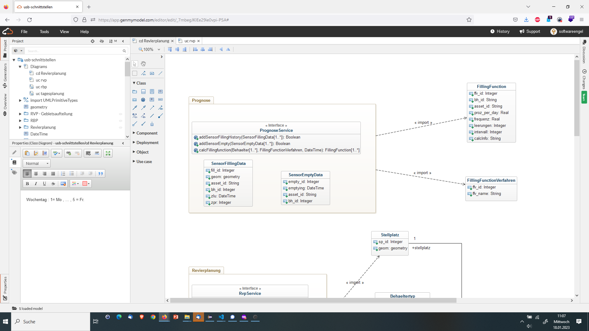
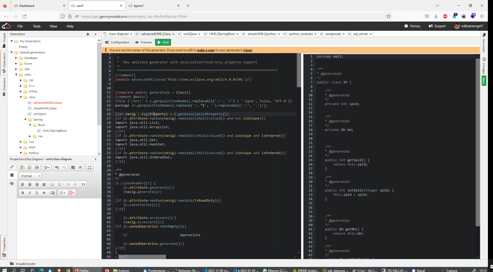
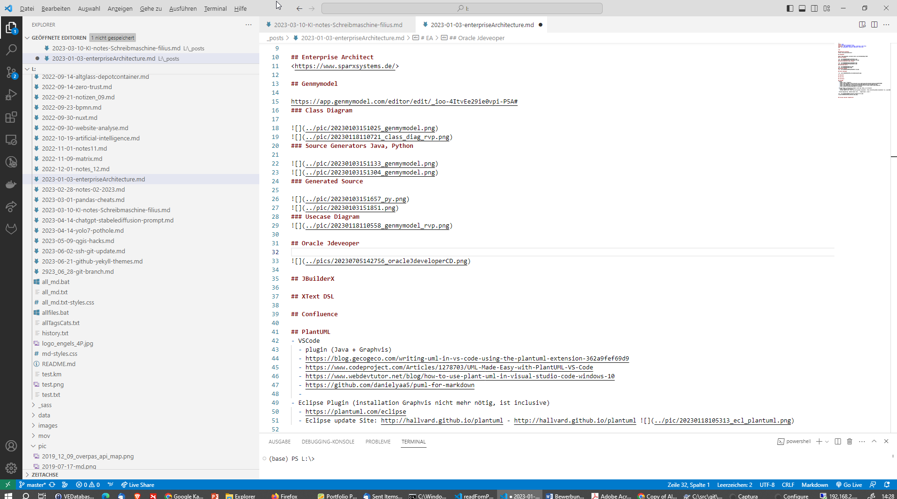

  
- [EA](#ea)
  - [Enterprise Architect](#enterprise-architect)
  - [Genmymodel](#genmymodel)
    - [Class Diagram](#class-diagram)
    - [Source Generators Java, Python](#source-generators-java-python)
    - [Generated Source](#generated-source)
    - [Usecase Diagram](#usecase-diagram)
  - [Oracle JDeveoper 12c](#oracle-jdeveoper-12c)
    - [CD](#cd)
    - [UC](#uc)
  - [JBuilderX](#jbuilderx)
  - [XText DSL](#xtext-dsl)
  - [PlantUML](#plantuml)
  - [Eclipse Jbuilder Togethersoft](#eclipse-jbuilder-togethersoft)

# EA

Was ist nur aus den EA Tools geworden? Versuche doch nur eine Schnittstelle von Java in Python zu nutzen ...

## Enterprise Architect 

<https://www.sparxsystems.de/>

## Genmymodel

https://app.genmymodel.com/editor/edit/_ioo-4ItvEe29ie0vpi-P5A# 
### Class Diagram 

  
  
### Source Generators Java, Python  

  
  
### Generated Source  

  
  
### Usecase Diagram
  

## Oracle JDeveoper 12c

### CD 

### UC

## JBuilderX

## XText DSL

## PlantUML
- VSCode 
  - plugin (Java + Graphvis)
  - https://blog.gecogeco.com/writing-uml-in-vs-code-using-the-plantuml-extension-362a9fef69d9
  - https://www.codeproject.com/Articles/1278703/UML-Made-Easy-with-PlantUML-VS-Code
  - https://www.webdevtutor.net/blog/how-to-use-plant-uml-in-visual-studio-code-windows-10
  - https://github.com/danielyaa5/puml-for-markdown
  - 
- Eclipse Plugin (installation Graphvis nicht mehr nötig, ist inclusive)
  - https://plantuml.com/eclipse
  - Eclipse update Site: http://hallvard.github.io/plantuml - http://hallvard.github.io/plantuml   
  
- Forward Engineering  (könnte besser sein ... klappt beim 2. start )

  
  
 

## Eclipse Jbuilder Togethersoft 
tbd.

