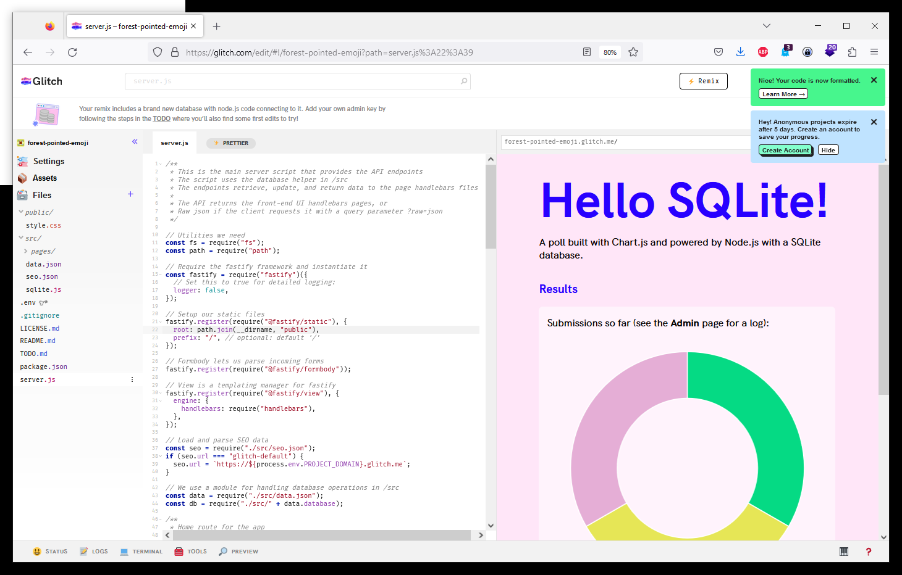
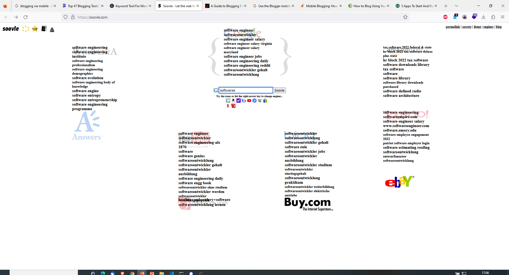

---
layout: post
title: Notes Feb 2023...Wasm, Emscripten, WebAssembly, sql.js
categories: [Notes]
tags: [Wasm, Emscripten, WebAssembly, sql.js]
--- 
- [Wasm Compiler Emscripten](#wasm-compiler-emscripten)
  - [WebAssembly](#webassembly)
  - [Server Side Webassembly WASM](#server-side-webassembly-wasm)
  - [Awesome WebAssembly Languages](#awesome-webassembly-languages)
  - [SQL DB  sql.js ( WASM Enscripten )](#sql-db--sqljs--wasm-enscripten-)
- [Javascript + CSS + HTML (JS, CSS, HTML)](#javascript--css--html-js-css-html)
  - [Courses by Mozilla Javascript, HTML, CSS](#courses-by-mozilla-javascript-html-css)
  - [Styled Components (JS, React)](#styled-components-js-react)
- [Webeditoren](#webeditoren)
  - [Code Pen - Online Javascript Editor / Suche nach Vorlagen](#code-pen---online-javascript-editor--suche-nach-vorlagen)
  - [JSFiddle](#jsfiddle)
  - [CodeSandbox](#codesandbox)
  - [Glitch](#glitch)
- [OT](#ot)
  - [authenticjobs.com - Online Jobs](#authenticjobscom---online-jobs)
  - [https://masterblogging.com/blogging-tools/](#httpsmasterbloggingcomblogging-tools)
  - [COCO Explorer](#coco-explorer)
  - [soovle](#soovle)

# Wasm Compiler Emscripten 

Emscripten is a complete Open Source compiler toolchain to WebAssembly. Using Emscripten you can:

Compile C and C++ code, or any other language that uses LLVM, into WebAssembly, and run it on the Web, Node.js, or other wasm runtimes.

Compile the C/C++ runtimes of other languages into WebAssembly, and then run code in those other languages in an indirect way (for example, this has been done for Python and Lua).

Practically any portable C or C++ codebase can be compiled into WebAssembly using Emscripten, ranging from high-performance games that need to render graphics, play sounds, and load and process files, through to application frameworks like Qt. Emscripten has already been used to convert a very long list of real-world codebases to WebAssembly, including commercial codebases like the Unreal Engine 4 and the Unity engine. For examples and demos, see the community-maintained list on the wiki.

Emscripten generates small and fast code! Its default output format is WebAssembly , a highly optimizable executable format, that runs almost as fast as native code, while being portable and safe. Emscripten does a lot of optimization work for you automatically, by careful integration with LLVM, Binaryen, Closure Compiler, and other tools.

- https://emscripten.org/docs/introducing_emscripten/about_emscripten.html
- Wasm compiler https://github.com/emscripten-core/emscripten

## WebAssembly 

WebAssembly (abbreviated Wasm) is a binary instruction format for a stack-based virtual machine. Wasm is designed as a portable compilation target for programming languages, enabling deployment on the web for client and server applications.

- Web JS VM https://webassembly.org/

## Server Side Webassembly WASM 

- Server Side WASM https://docs.wasmer.io/

## Awesome WebAssembly Languages 

WebAssembly, or wasm for short, is a low-level bytecode format that runs in the browser just like JavaScript. It is designed to be faster to parse than JavaScript, as well as faster to execute which makes it a suitable compilation target for new and existing languages.

This repo contains a list of languages that currently compile to or have their VMs in WebAssembly(wasm)

https://github.com/appcypher/awesome-wasm-langs

## SQL DB  sql.js ( WASM Enscripten )
SQLite compiled to JavaScript

sql.js is a javascript SQL database. It allows you to create a relational database and query it entirely in the browser. You can try it in this online demo. It uses a virtual database file stored in memory, and thus doesn't persist the changes made to the database. However, it allows you to import any existing sqlite file, and to export the created database as a JavaScript typed array.

sql.js uses emscripten to compile SQLite to webassembly (or to javascript code for compatibility with older browsers). It includes contributed math and string extension functions.

sql.js can be used like any traditional JavaScript library. If you are building a native application in JavaScript (using Electron for instance), or are working in node.js, you will likely prefer to use a native binding of SQLite to JavaScript. A native binding will not only be faster because it will run native code, but it will also be able to work on database files directly instead of having to load the entire database in memory, avoiding out of memory errors and further improving performances.

- <https://github.com/sql-js/sql.js>
- <https://sql.js.org/examples/GUI/>
- <https://sql.js.org/#/>

# Javascript + CSS + HTML (JS, CSS, HTML)

## Courses by Mozilla Javascript, HTML, CSS

- Java Script Basics https://developer.mozilla.org/en-US/docs/Learn/Getting_started_with_the_web/JavaScript_basics

- HTML Basics https://developer.mozilla.org/en-US/docs/Learn/Getting_started_with_the_web/HTML_basics

## Styled Components (JS, React)
Visual primitives for the component age.
Use the best bits of ES6 and CSS to style your apps without stress

- https://styled-components.com/
- https://github.com/styled-components/styled-components
  

# Webeditoren 

## Code Pen - Online Javascript Editor / Suche nach Vorlagen 
The best place to build, test, and discover front-end code.

CodePen is a social development environment for front-end designers and developers. Build and deploy a website, show off your work, build test cases to learn and debug, and find inspiration.

- <https://codepen.io/>

## JSFiddle 

Multiuser Web Editor: HTML+  JS+  CSS+  Preview 

- <https://jsfiddle.net/>

## CodeSandbox  
Code. Review. Deploy. Supercharge your workflow with instant cloud development environments.

- <https://codesandbox.io/s/vanilla-vanilla>

## Glitch 
Glitch is the friendly place where everyone builds the web. Start a new blog, play with React, or build new worlds with WebXR. Let’s go!

- <https://glitch.com/>

# OT 

## authenticjobs.com - Online Jobs 

The leading job board for designers, developers, and creative pros.

- <https://authenticjobs.com/>

## https://masterblogging.com/blogging-tools/

## COCO Explorer 

COCO is a large-scale object detection, segmentation, and captioning dataset. COCO has several features:

-   Object segmentation
-   Recognition in context
-   Superpixel stuff segmentation
-   330K images (>200K labeled)
-    1.5 million object instances
-    80 object categories
-    91 stuff categories
-    5 captions per image
-    250,000 people with keypoints

COCO 2017 train/val browser (123,287 images, 886,284 instances). Crowd labels not shown.

<https://cocodataset.org/#explore>

## soovle

<https://soovle.com/>
