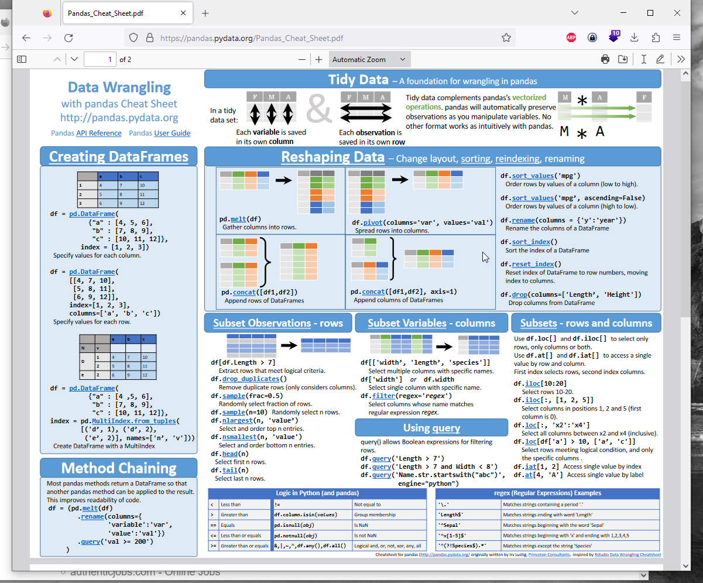

# Pandas Cheat Sheet 

<https://pandas.pydata.org/Pandas_Cheat_Sheet.pdf>

<https://pandas.pydata.org/docs/getting_started/intro_tutorials/06_calculate_statistics.html>

## Convert Column to Datetime 
```py
    df['col'] = pd.to_datetime(df['col'])
```
## (Time) Windowing 

Column "previous_timestamp" with value of previous value (in line -1) of column "timestamp"

```py
    df['previous_timestamp'] = df['timestamp'].shift(1)
```
