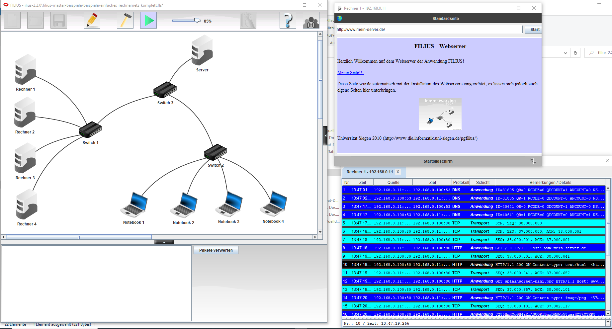

---
layout: post
title: KI-Notes, Filius, OSS-Website-clones, VanillaOS, MINIX
categories: [Notes]
tags: [Filius, OSS, Website, clones, VanillaOS, MINIX]
--- 

- [KI Chatbots](#ki-chatbots)
- [Netzwerk-Grundlagen](#netzwerk-grundlagen)
- [Clone Wars - Open source clones of popular sites](#clone-wars---open-source-clones-of-popular-sites)
- [To run the Vanilla OS website locally](#to-run-the-vanilla-os-website-locally)
- [MINIX From Scratch](#minix-from-scratch)
- [30-Days-Of-Python](#30-days-of-python)
- [Engineering-blogs](#engineering-blogs)

# KI Chatbots

- DeepL Write
- LanguageTool 
- Rytr
- TextCortex

# Netzwerk-Grundlagen 

- OSS Filius Netzwerksimulation 

<https://www.lernsoftware-filius.de/>

# Clone Wars - Open source clones of popular sites

Clone Wars - Open source clones of popular sites

    100+ open-source clones and alternatives of popular sites like Airbnb, Amazon, Instagram, Netflix, TikTok, Spotify, WhatsApp, YouTube, etc. List contains source code, tutorials, demo links, tech stack, and GitHub stars count. Great for learning purpose!

<https://github.com/GorvGoyl/Clone-Wars>

# To run the Vanilla OS website locally

<https://github.com/Vanilla-OS/website>

To run the Vanilla OS website locally, install Jekyll, the required plugins and clone this repository:

<https://github.com/Vanilla-OS/website>

# MINIX From Scratch 

<https://github.com/o-oconnell/minixfromscratch>

MINIX From Scratch
Why MINIX?

I believe that learning MINIX is probably the best way to learn about operating systems. Until now, I have not been able to find a MINIX 3 project that allows you to compile the code that is referenced in the book Operating Systems: Design and Implementation (3e) (v3.1.0). It was tricky to get a reasonable development setup to make it possible for newbies like myself to learn from the book. This is an attempt to fix that and make it easy to browse, edit, recompile, and execute the code.

Why should you learn MINIX instead of Linux? Or rather than another teaching OS such as xv6, NachOS, or Xinu?

Unlike most of these systems, MINIX:

    Is heavily commented.
    Comes with three highly detailed books as its primary form of documentation.
    Has a much smaller and easier-to-understand kernel (it helps that it's a microkernel).
    Runs quite well on an emulator without melting your CPU (at least since the 2nd edition).

Although xv6 and these other systems have been valuable tools for me (and may have extra features, like threads and NAT), I have found that the MINIX documentation is the most extensive.

<https://github.com/o-oconnell/minixfromscratch>

# 30-Days-Of-Python

Learning Python 

<https://github.com/Asabeneh/30-Days-Of-Python>

# Engineering-blogs

Collection of Eningeering Blogs by
- Companies
- Individuals
- Technologies

<https://github.com/kilimchoi/engineering-blogs>

