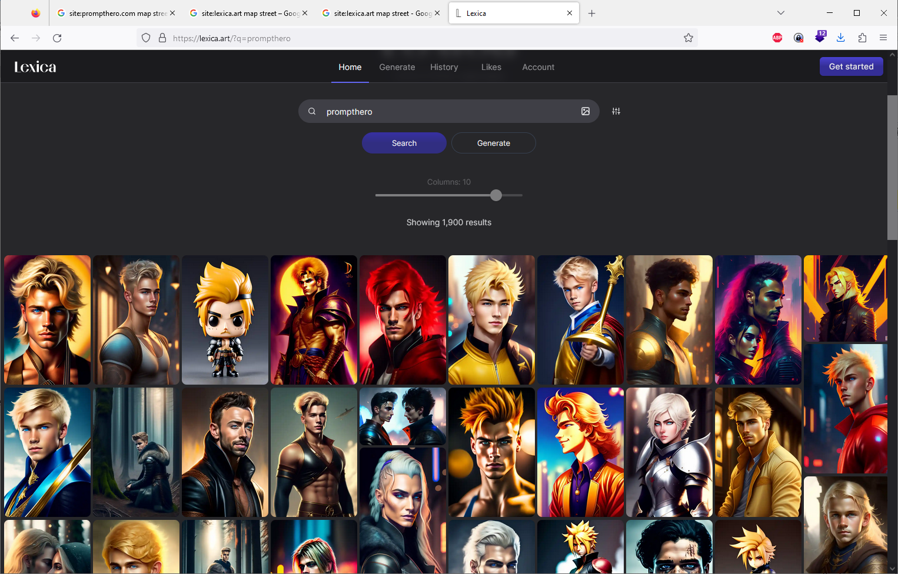
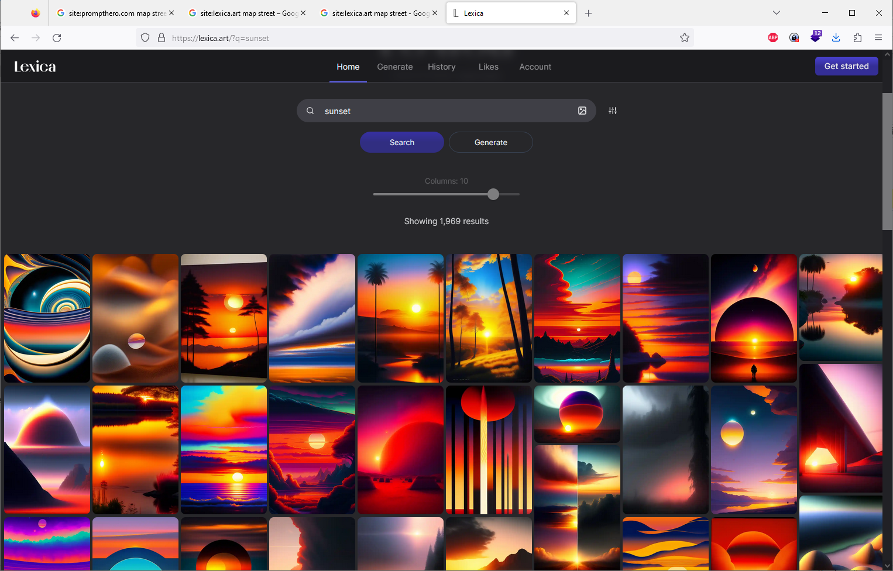
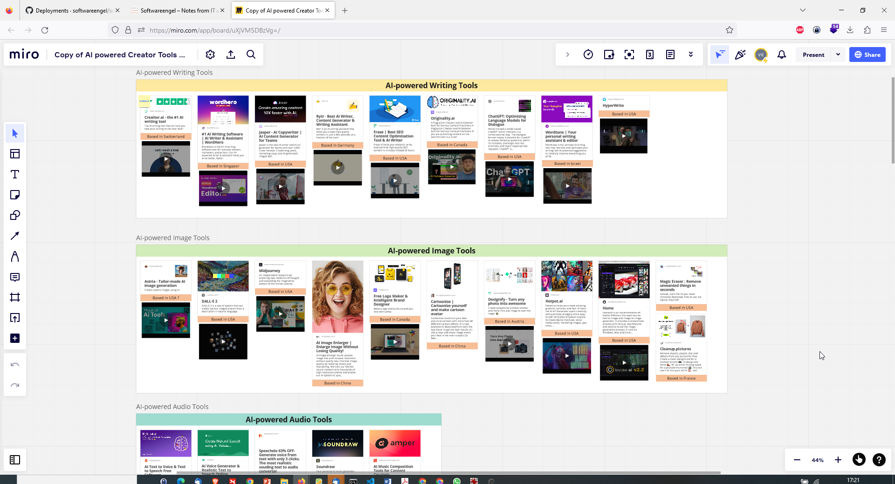

---
layout: post
title: New AI Tools, ChatGPT, Stable Diffusion, Prompt Engineering, Lexica 
categories: [Notes]
tags: [ai, chatgpt, prompthero, Stable Diffusion, Prompt Engineering, lexica ]
--- 

- [ChatGPT Stable Diffusion and Prompt Engineering](#chatgpt-stable-diffusion-and-prompt-engineering)
- [https://lexica.art/](#httpslexicaart)
- [Prompthero](#prompthero)
- [Models Huggingface](#models-huggingface)
- [Stable Diffusion](#stable-diffusion)
- [Midjourney](#midjourney)
- [Collection of new AI - Tools](#collection-of-new-ai---tools)

# ChatGPT Stable Diffusion and Prompt Engineering

1. ChatGPT Stable Diffusion:
ChatGPT Stable Diffusion is a variant of the ChatGPT language model developed by OpenAI. It builds upon the GPT-3.5 architecture, but with additional techniques to improve the stability and behavior of the model during interactions. The "diffusion" part refers to the use of a technique called "denoising diffusion probabilistic models" to achieve better sample quality and robustness.

Denoising diffusion is a method that involves training a model to predict corrupted versions of a given text and then refining the predictions through an iterative process. This technique helps in generating more coherent and contextually appropriate responses, reducing the likelihood of the model producing nonsensical or inappropriate outputs.

ChatGPT Stable Diffusion aims to address some of the limitations of earlier versions of ChatGPT, such as sensitivity to input phrasing and generating responses that may appear plausible but are not factually accurate. It aims to provide a more reliable and controlled user experience while maintaining a natural conversation flow.

2. Prompt Engineering:
Prompt engineering is a technique used to guide or instruct language models like ChatGPT to produce desired outputs by providing specific prompts or instructions. It involves carefully crafting the input text given to the model to elicit the desired behavior or generate responses that align with a particular context or goal.

Prompt engineering can be used to achieve various objectives, such as getting concise answers, clarifying ambiguous queries, or following a specific conversational style. By designing prompts effectively, developers and users can influence the output of the model and steer the conversation in desired directions.

Prompt engineering often involves providing context, specifying the format or structure of the desired response, or including explicit instructions within the prompt text. It requires experimentation and iteration to refine prompts for optimal results.

By combining the power of ChatGPT Stable Diffusion with effective prompt engineering techniques, users can have more control over the model's behavior, ensure more reliable responses, and guide the conversation in a way that aligns with their goals or requirements.

It's important to note that while prompt engineering can help guide the model's behavior, it may not completely eliminate the possibility of generating incorrect or biased responses. Careful monitoring and iterative improvements are necessary to ensure the model's outputs meet the desired quality standards.

# https://lexica.art/

<https://lexica.art/>

# Prompthero

<https://prompthero.com/chatgpt-prompts>

# Models Huggingface 

<https://huggingface.co/>

<https://huggingface.co/docs/transformers/quicktour>

# Stable Diffusion 

<https://colab.research.google.com/github/TheLastBen/fast-stable-diffusion/blob/main/fast_stable_diffusion_AUTOMATIC1111.ipynb?authuser=2#scrollTo=PjzwxTkPSPHf>

# Midjourney

<https://docs.midjourney.com/docs/quick-start>

# Collection of new AI - Tools 

<https://miro.com/app/board/uXjVM5DBzVg=/?share_link_id=988659563177>

