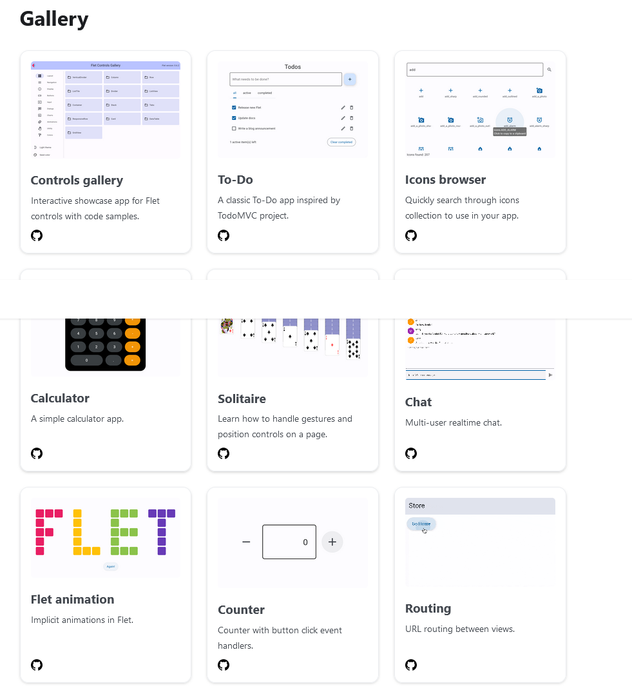
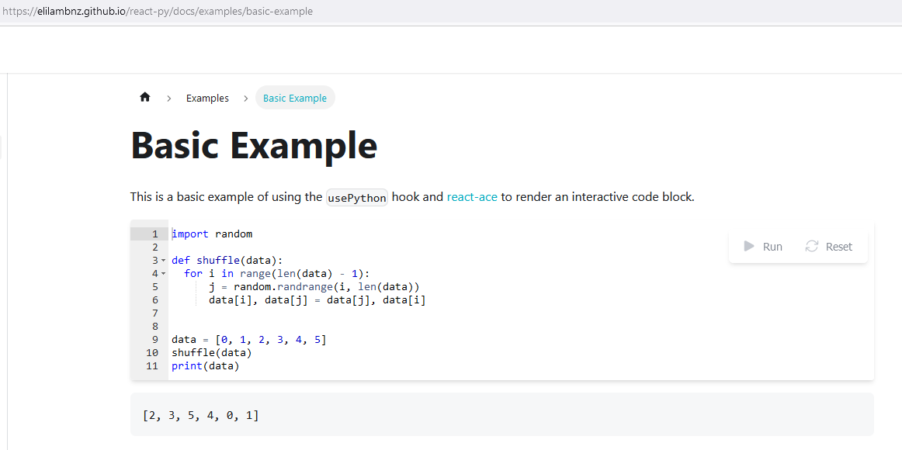
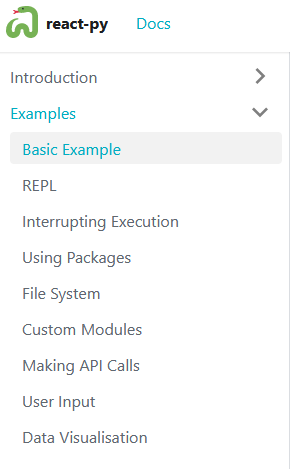

# Python and WASM 

## Pyodide
Pyodide is a Python distribution for the browser and Node.js based on WebAssembly.

## Deploy your first JupyterLite website on GitHub Pages

## Python Web Consonle WASM 

<https://pyodide.org/en/stable/console.html>
## Flet
The fastest way to build Flutter apps in Python

Flet enables developers to easily build realtime web, mobile and desktop apps in Python. No frontend experience required.

https://flet.dev/
https://flet.dev/docs/guides/python/getting-started
https://flet.dev/gallery

## React Py wasm in Browser 

https://elilambnz.github.io/react-py/docs/examples/basic-example

## Links: 

- <https://pyodide.org/en/stable/>
- Pyodide-kernel  https://github.com/jupyterlite/pyodide-kernel

- Try Pyodide in a REPL directly in your browser (no installation needed) <https://pyodide.org/en/stable/console.html>
- <https://micropip.pyodide.org/en/stable/project/usage.html>

- <https://jupyterlite.readthedocs.io/en/stable/quickstart/deploy.html>
- [https://github.com/jupyterlite/xeus-python-demo
- **Code Consoles**: Code consoles enable you to run code interactively in a kernel. The cells of a code console show the order in which code was executed in the kernel, as opposed to the explicit ordering of cells in a notebook document. Code consoles also display rich output, just like notebook cells. <https://jupyterlab.readthedocs.io/en/stable/user/code_console.html>
- weiteree Projekte <https://pyodide.org/en/stable/project/related-projects.html#notebook-environments-ides-repls>
- WebDash is a Plotly Dash distribution that runs entirely in the browser <https://github.com/ibdafna/webdash#webdash>
- https://flet.dev/

- https://github.com/SciTools/cartopy