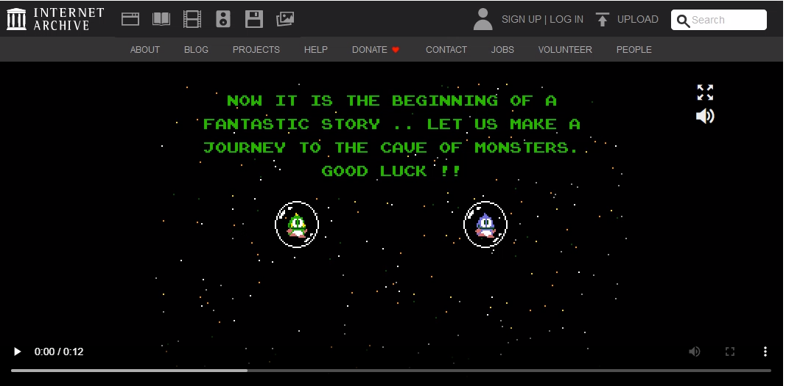

---
layout: post
title: Libadwaita game launcher
categories: [Games]
tags: [Games]
--- 

<figure class="video_container">
  <video width="920"  controls="true" allowfullscreen="true" poster="/pics/20231012100623_bubbleBobble.png">
    <source src="/mov/2023-10-11-13-09-12-bubble-bobble.mp4" type="video/mp4">
  </video>
</figure>

# Games

## Libadwaita game launcher

https://github.com/kra-mo/cartridges

## https://web.libretro.com/

## https://archive.org/

Indiana Jones and the Temple of Doom
https://archive.org/details/arcade_indytemp

Software Library: MS-DOS Games
https://archive.org/details/softwarelibrary_msdos_games?sort=-publicdate

Microsoft Visual Basic 1.0 Standard For MS DOS (1992)
https://archive.org/details/microsoft-visual-basic-for-ms-dos

Software Library: MS-DOS Games
https://archive.org/details/softwarelibrary_msdos_games

Die Siedler 2 – Gold Edition
https://archive.org/details/die_siedler_2_151

Microsoft Adventure Publication date     1981 
https://archive.org/details/msdos_Microsoft_Adventure_1981

Internet Arcade
https://archive.org/details/internetarcade

https://archive.org/details/internetarcade

Puzzle Bobble 4 (Ver 2.04O 1997/12/19) 
https://archive.org/details/arcade_pbobble4

OSComeback - Windows 1.01 (1985)
https://archive.org/details/ocb_win101

Bubble Bobble
https://archive.org/details/msdos_Bubble_Bobble_1988

<figure class="video_container">
  <video width="920"  controls="true" allowfullscreen="true" poster="/pics/20231012100623_bubbleBobble.png">
    <source src="/mov/2023-10-11-13-09-12-bubble-bobble.mp4" type="video/mp4">
  </video>
</figure>

Arkanoid II - Revenge of Doh
https://archive.org/details/msdos_Arkanoid_II_-_Revenge_of_Doh_1989

