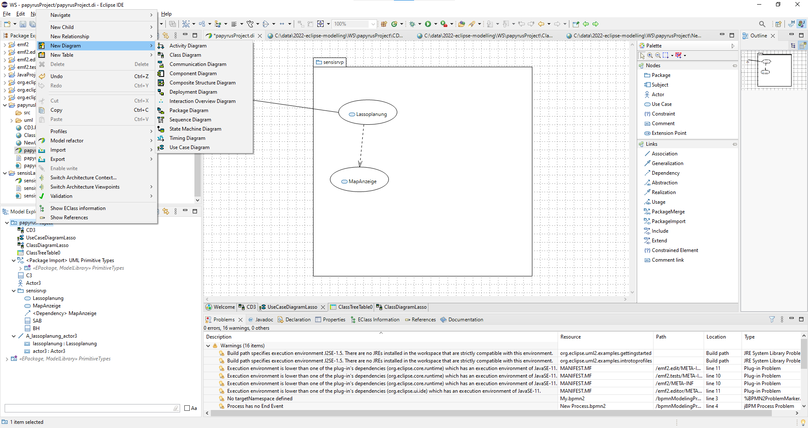
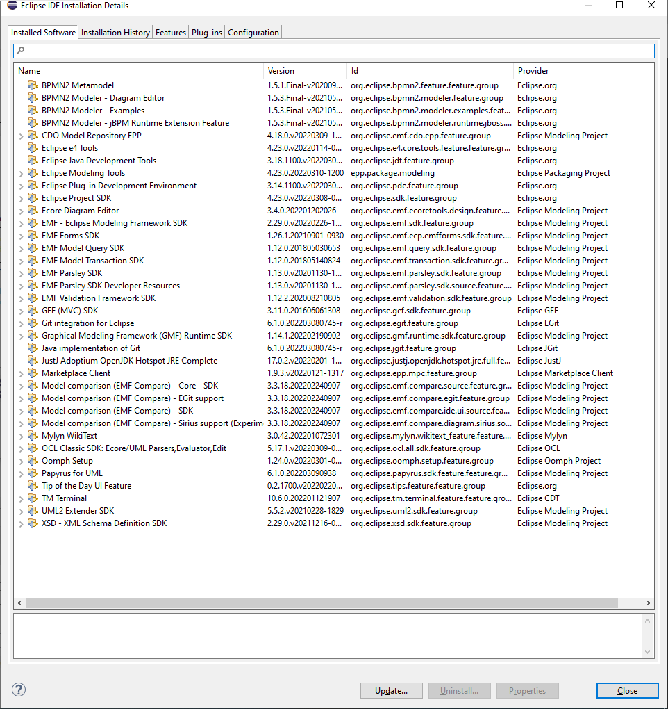

# Eclipse UML Papyrus Working .... nearly impossible ...

## About


```txt
Eclipse Modeling Tools

Version: 2022-03 (4.23.0)
Build id: 20220310-1457
```

## Papyrus new Diagrams



## Installed Software - Working



## Links

<https://www.youtube.com/watch?v=6_HY2u-EeE0>

<https://www.youtube.com/watch?v=Z3u5fSWkP-A>

<https://www.youtube.com/watch?v=FtRUrACUUsU>
