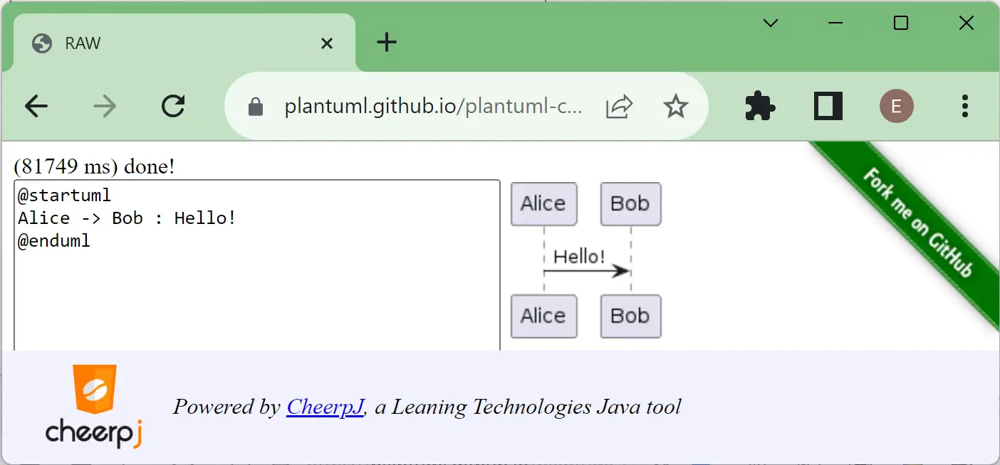
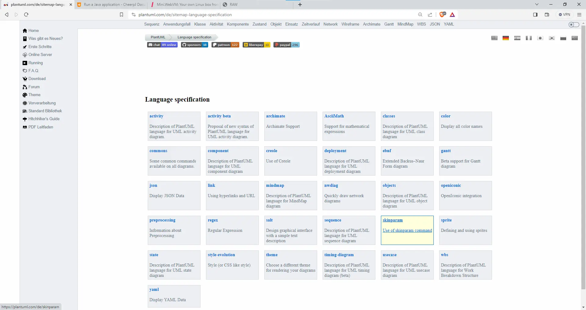
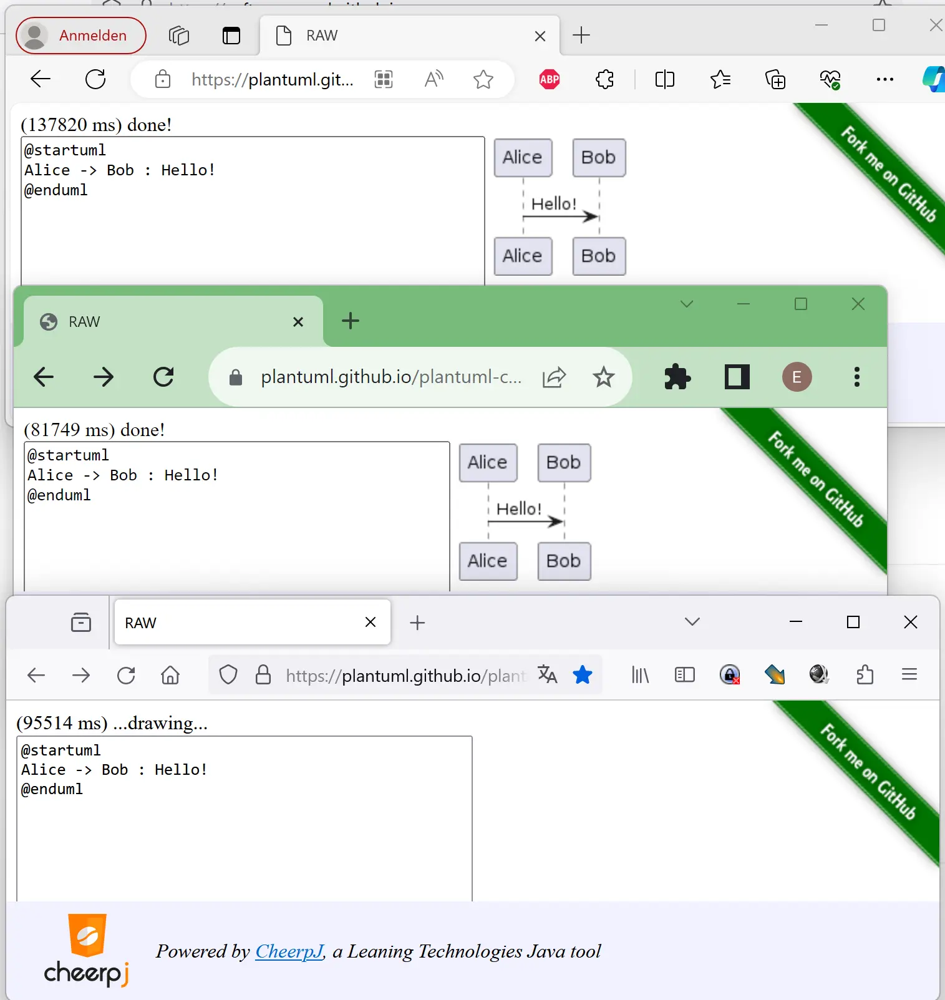
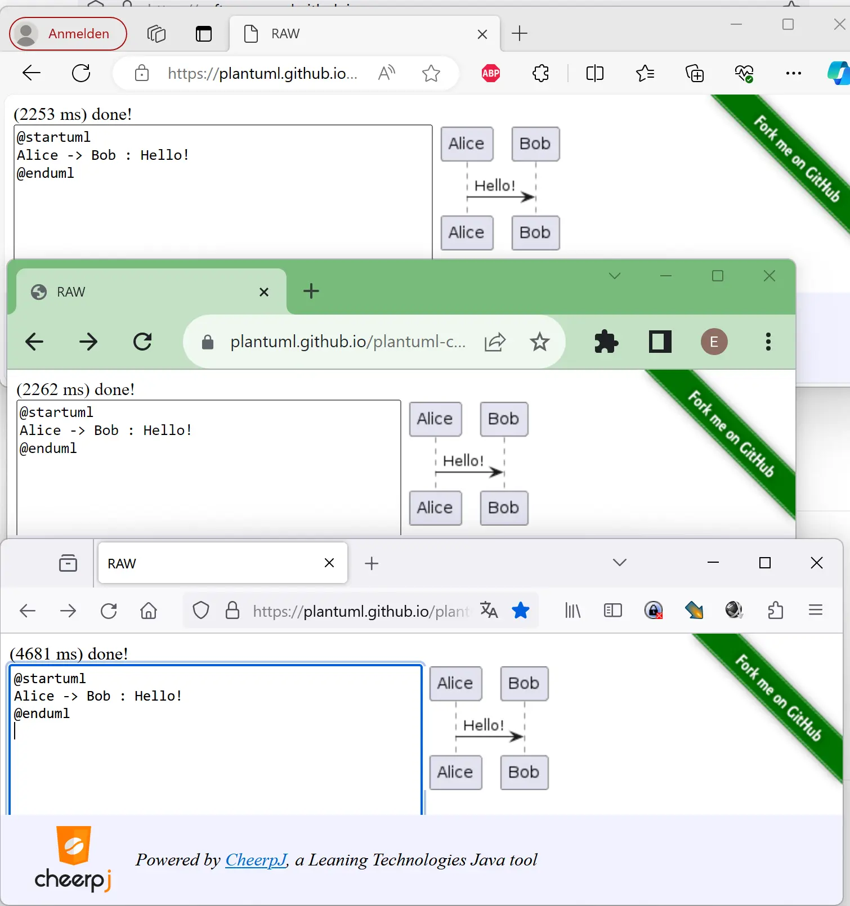
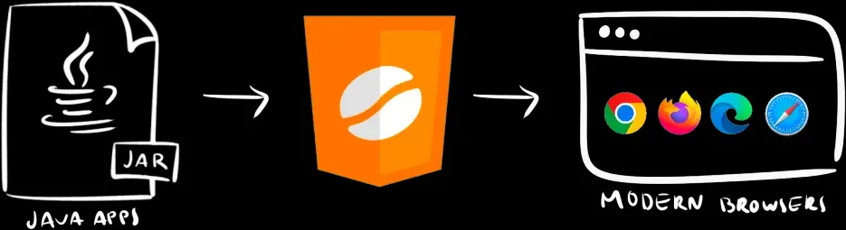

# PlantUML

https://plantuml.com/de/

## Sprachen

## PlantUML JS

PlantUML going serverless

<https://github.com/plantuml/plantuml-core>

<https://github.com/plantuml/plantuml-server>

### Vergleich UML JS

Vergleich Plant UML JS Rendering Time von von Edge, Chrome und Firefox

- 1st run

- 2nd Run

## What is CheerpJ?

CheerpJ is a Java bytecode to WebAssembly and JavaScript compiler, compatible with 100% of Java, which allows to compile any Java SE application, library or Java applet into a WebAssembly/JavaScript application.

<https://labs.leaningtech.com/cheerpj3>

<https://github.com/plantuml/plantuml-core#what-is-cheerpj>
