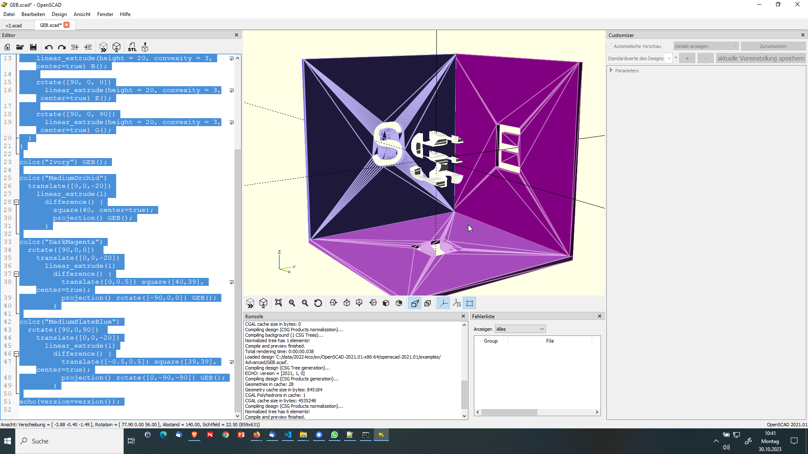

---
layout: post
title: Open SCAD 
categories: [cad ]
tags: [3d, cut, visualisation , cad , oss]
--- 


- [Open SCAD](#open-scad)
  - [3d Cut Beispiel](#3d-cut-beispiel)
  - [SSE - Beispiel 3D - Text](#sse---beispiel-3d---text)

# Open SCAD

## 3d Cut Beispiel


```txt
echo(version=version());
module model(){


// translate( [ 0,0,0] ) cube(size = [10,10,10]);
// color("orange")
translate( [ 0,0,0] ) cube(size = [1,1,1]);
    
translate( [ 0,0,0] ) cube(size = [10,10,10]);
    
    
// color("blue")
translate( [11 ,0,0] ) cube(10);

// color("blue")
translate( [0 ,11,0] ) cube(10);
    
translate( [11 ,11,0] ) cube(10);

translate( [0 ,0, 11] ) cube(10);

translate( [0 ,11, 11] ) cube(10);


// color("red")
translate( [0 ,22,0] ) cube(size = [10,20,20]);
    
translate( [11 ,22,0] ) cube(size = [10,20,20]);

translate( [22 ,0,0] ) cube(size = [20,40,20]);    
    


}
// color("lightgrey")
%model();
module modelbox(){
lm = [100,50,25];
 cube( lm );
}
// %modelbox();
color("red")
translate([-20,0,-22.5]) rotate([0,45,0]) line();
```

## SSE - Beispiel 3D - Text



```
font = "Liberation Sans";
// Nicer, but not generally installed:
// font = "Bank Gothic";

module G() offset(0.3) text("S", size=10, halign="center", valign="center", font = font);
module E() offset(0.3) text("E", size=10, halign="center", valign="center", font = font);
module B() offset(0.5) text("S", size=10, halign="center", valign="center", font = font);

$fn=64;

module GEB() {
intersection() {
    linear_extrude(height = 20, convexity = 3, center=true) B();
    
    rotate([90, 0, 0])
      linear_extrude(height = 20, convexity = 3, center=true) E();
    
    rotate([90, 0, 90])
      linear_extrude(height = 20, convexity = 3, center=true) G();
  }
}

color("Ivory") GEB();

color("MediumOrchid") 
  translate([0,0,-20])
    linear_extrude(1) 
      difference() {
        square(40, center=true);
        projection() GEB();
      }

color("DarkMagenta")
  rotate([90,0,0]) 
    translate([0,0,-20])
      linear_extrude(1) 
        difference() {
          translate([0,0.5]) square([40,39], center=true);
          projection() rotate([-90,0,0]) GEB();
        }

color("MediumSlateBlue")
  rotate([90,0,90]) 
    translate([0,0,-20])
      linear_extrude(1)
        difference() {
          translate([-0.5,0.5]) square([39,39], center=true);
          projection() rotate([0,-90,-90]) GEB();
        }

echo(version=version());

```