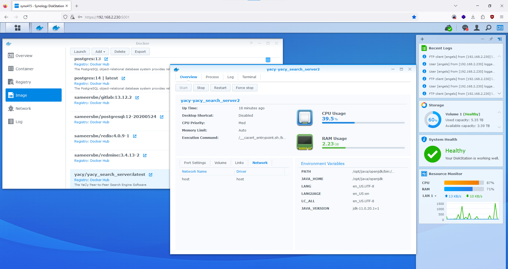
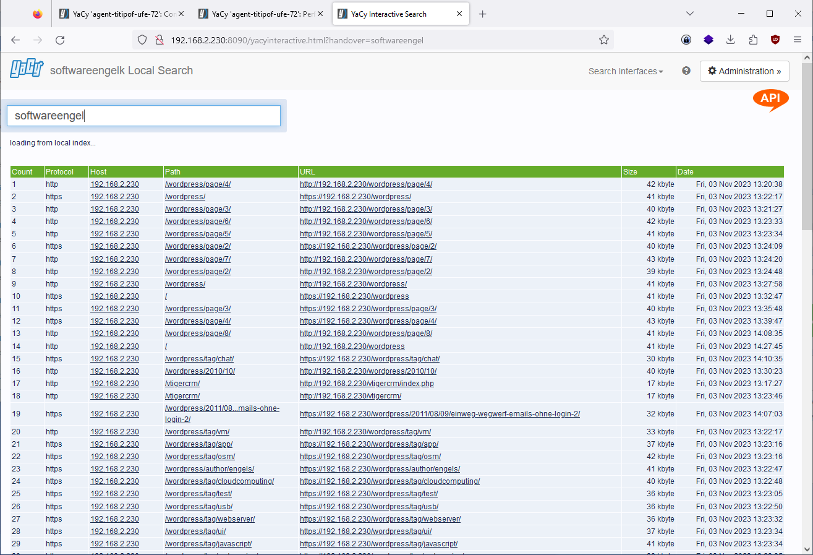

# setup yacy search engine in docker 

## setup yacy 

- intranet indexing only 

- Network config: robinson mode ... Private Peer 

## Setup Search 

- ftp - Search 
- depth `20` 
- regex filter `.*240.*` for ip adress only 
- add agent name for search `user240Regex-depth20`

## Max Ram usage

  
- Max RAM usage 900 MB
  

## Local Indexing 

## Local Search Result 

- web search result 

- web search result images 

- yacy file search result 

- view web url content 

