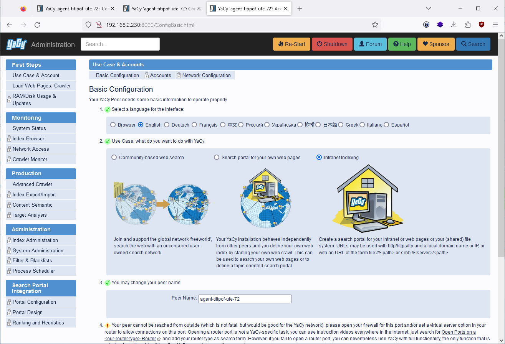
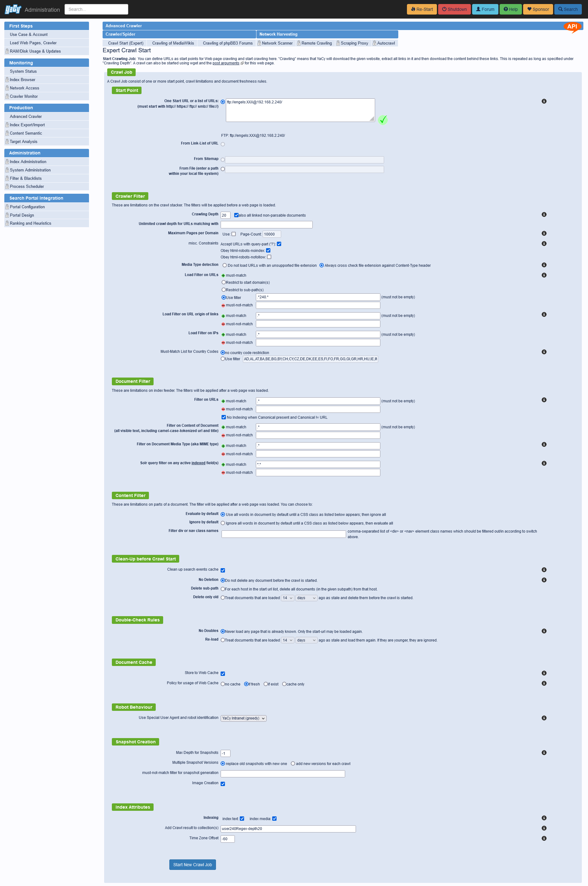
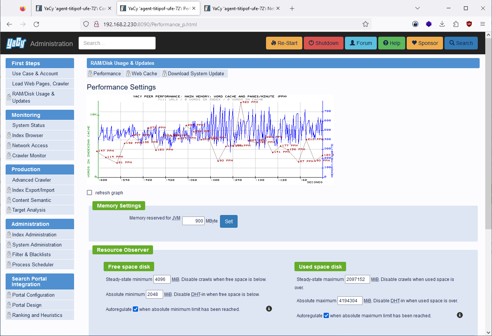
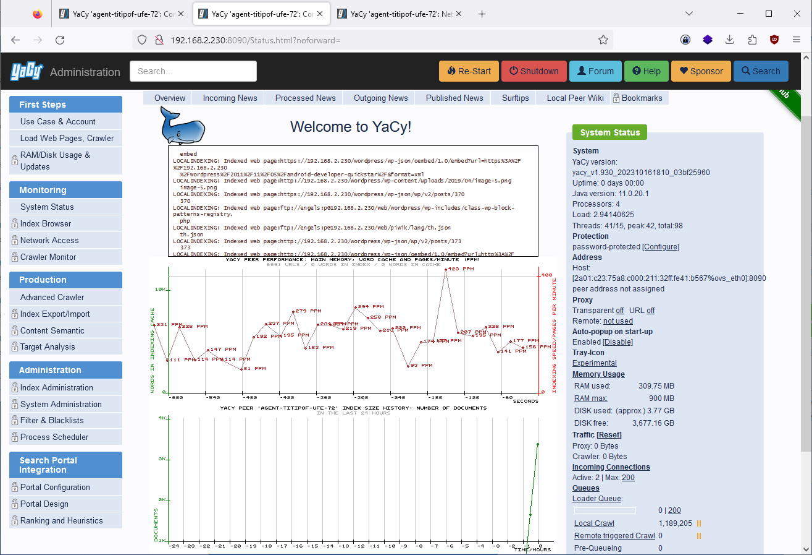

---
layout: post
title: yacy local network search setup 
categories: [yacy]
tags: [yacy, search, java, oss ]
--- 

# setup yacy search engine in docker 

## setup yacy 

- intranet indexing only 

- Network config: robinson mode ... Private Peer 

## Setup Search 

- ftp - Search 
- depth 20 
- regex filter .*240.* for ip adress only 
- add agent name for search user240Regex-depth20

## Max Ram usage

  
- max ram usage 900 MB
  

## Local Indexing 

## Local search Result 

- web search result 

- web search result images 

- yacy file search result 

- view web url content 

