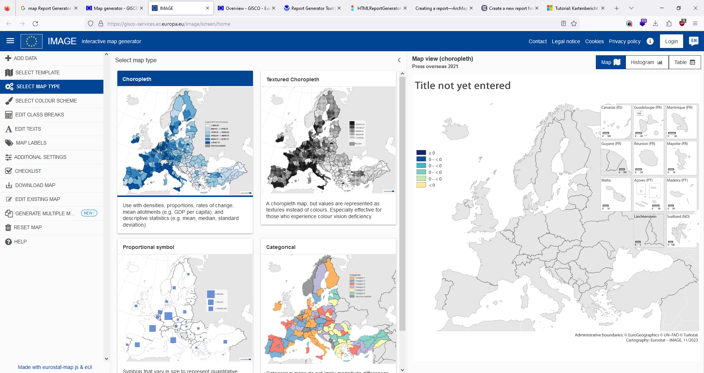
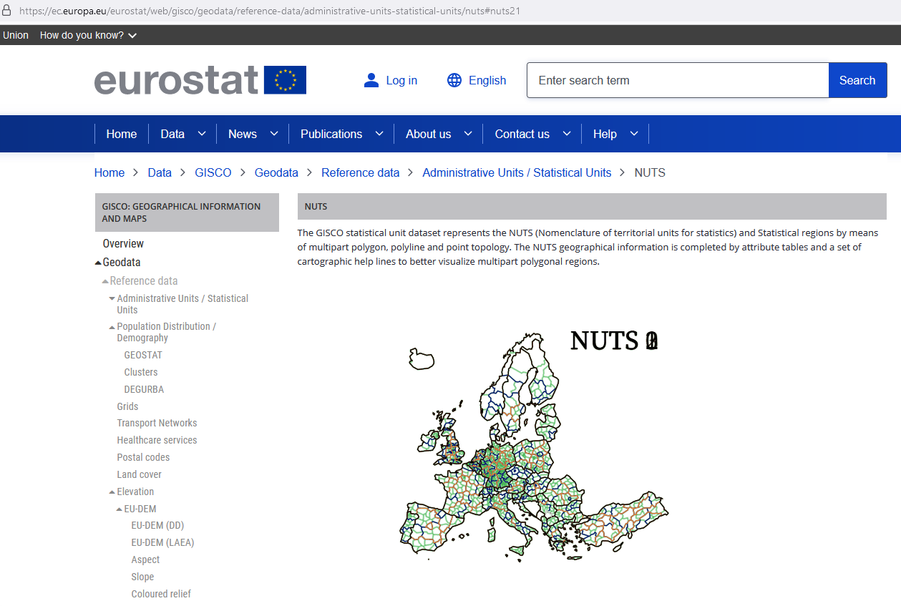

# Gisco

https://gisco-services.ec.europa.eu/image/screen/home

https://ec.europa.eu/eurostat/web/gisco/overview

- eurostat-map.js

https://github.com/eurostat/eurostat-map.js

Eurostat Map Generator 

https://ec.europa.eu/eurostat/web/gisco/gisco-activities/map-generator

<video src="../mov/2023-11-07-12-06-23.mp4" controls title="Title"></video>

# dekart

https://github.com/dekart-xyz/dekart

# Leaflet 
Popular Comparisons

    Cesium.
    OpenLayers3.
    polymaps.
    mapbox.js.
    kartograph.js.

<https://leafletjs.com/examples.html>

<https://github.com/Leaflet/Leaflet>

<https://leafletjs.com/plugins.html>

<https://leafletjs.com/reference.html>

# mapbox

https://www.mapbox.com/

Alternativen zu Mapbox

    ArcGIS. von ESRI. 4,6 (488) Produktdetails. ...
    CARTO. von CARTO. 4,8 (30) Produktdetails. ...
    Google Maps. von Google. 4,7 (1.501) ...
    NextBillion.ai. von NextBillion.ai. 4,8 (12) ...
    Yext. von Yext. 4,3 (109) ...
    The Rand Platform. von Rand McNally. 3,5 (16) ...
    Uberall CoreX. von uberall. 4,6 (33) ...
    Maptitude. von Caliper. 4,8 (63)

# openlayers

<https://openlayers.org/>

<https://openlayers.org/en/latest/examples/>

# Qgis2web 

<https://blog.rustprooflabs.com/2020/02/qgis2web-export-interactive-map>

<https://github.com/tomchadwin/qgis2web>

<https://plugins.qgis.org/plugins/qgis2web/version/3.16.0/>

<https://github.com/tomchadwin/qgis2web/wiki>

<https://github.com/tomchadwin/qgis2web/issues>

## OT

### JS DOjo Toolkit

https://dojotoolkit.org/

https://openjsf.org/ 