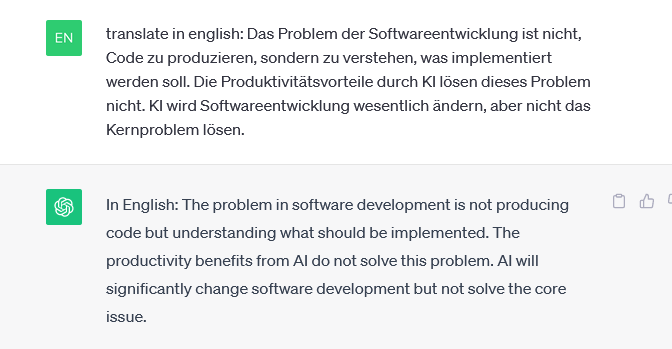

- [Count Number of Cars in Less Than 10 Lines of Code Using Python](#count-number-of-cars-in-less-than-10-lines-of-code-using-python)
- [cvlib : Yolo Object Detection in Seconds!](#cvlib--yolo-object-detection-in-seconds)
  - [Übung: Erkunden des maschinellen Sehens](#übung-erkunden-des-maschinellen-sehens)


## KI und code 



## TL;DR
The problem in software development is not producing code but understanding what should be implemented. The productivity benefits from AI do not solve this problem. AI will significantly change software development but not solve the core issue.

## Links:
<https://www.heise.de/blog/KI-in-der-Softwareentwicklung-Ueberschaetzt-9336902.html>


# Count Number of Cars in Less Than 10 Lines of Code Using Python


<https://towardsdatascience.com/count-number-of-cars-in-less-than-10-lines-of-code-using-python-40208b173554>


# cvlib : Yolo Object Detection in Seconds!


<https://github.com/arunponnusamy/cvlib>

 

<https://www.analyticsvidhya.com/blog/2021/06/yolo-object-detection-in-seconds-cvlib/>

<https://github.com/arunponnusamy/object-detection-opencv/blob/master/yolov3.txt>

```
person
bicycle
car
motorcycle
airplane
bus
train
truck
boat
traffic light
fire hydrant
stop sign
parking meter
bench
bird
cat
dog
horse
sheep
cow
elephant
bear
zebra
giraffe
backpack
umbrella
handbag
tie
suitcase
frisbee
skis
snowboard
sports ball
kite
baseball bat
baseball glove
skateboard
surfboard
tennis racket
bottle
wine glass
cup
fork
knife
spoon
bowl
banana
apple
sandwich
orange
broccoli
carrot
hot dog
pizza
donut
cake
chair
couch
potted plant
bed
dining table
toilet
tv
laptop
mouse
remote
keyboard
cell phone
microwave
oven
toaster
sink
refrigerator
book
clock
vase
scissors
teddy bear
hair drier
toothbrush
```

## Übung: Erkunden des maschinellen Sehens

https://learn.microsoft.com/de-de/training/modules/analyze-images-computer-vision/3-analyze-images

