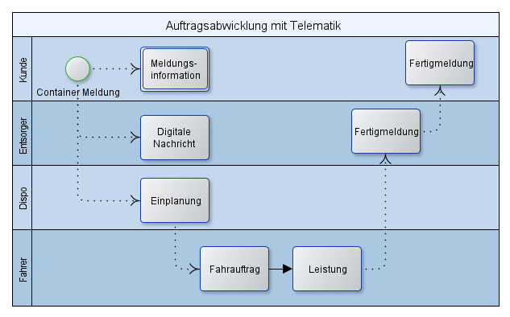
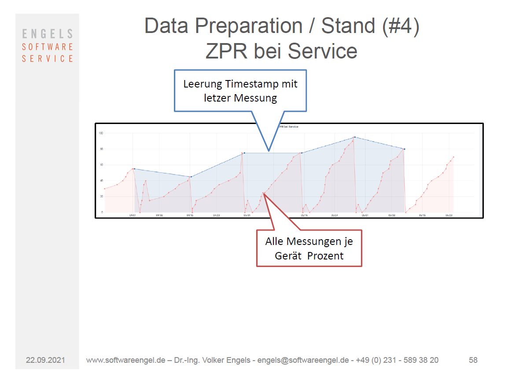
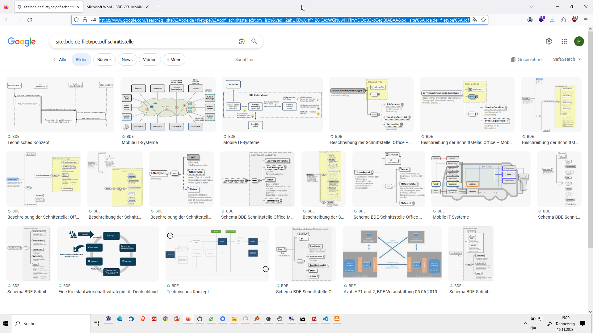
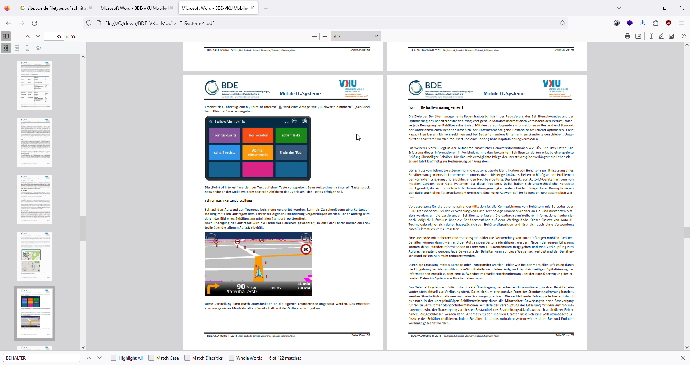
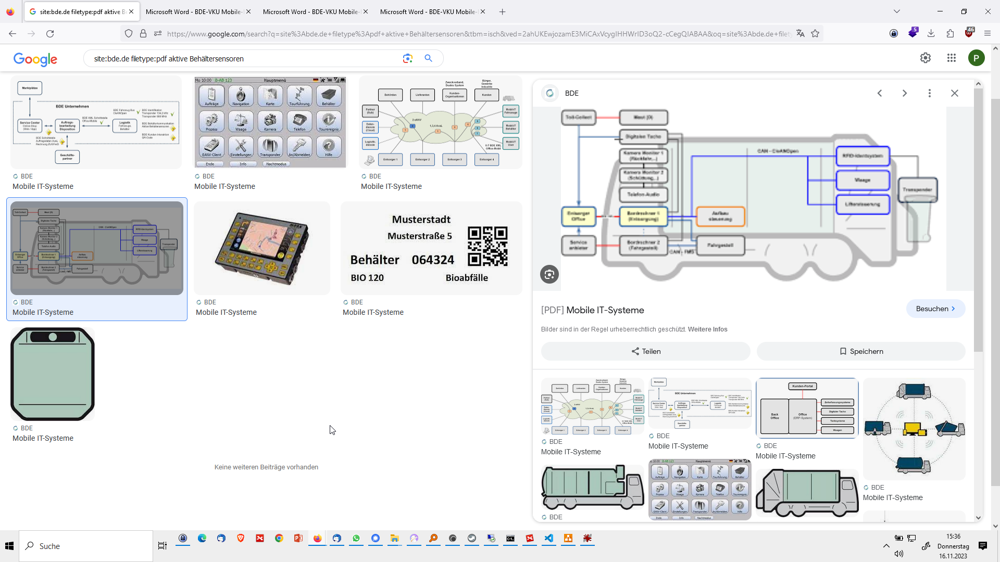

- [IOT Behälter in der Entsorgung](#iot-behälter-in-der-entsorgung)
  - [Auftrasabwicklung Presscontainer ohne IOT](#auftrasabwicklung-presscontainer-ohne-iot)
  - [Auftrasabwicklung Presscontainer mit IOT](#auftrasabwicklung-presscontainer-mit-iot)
  - [Zeiten bei Presscontainern](#zeiten-bei-presscontainern)
  - [Auftrasabwicklung Umleer IOT](#auftrasabwicklung-umleer-iot)
    - [ohne IOT DEpotcontainer](#ohne-iot-depotcontainer)
    - [mit IOT](#mit-iot)
  - [BDE](#bde)

# IOT Behälter in der Entsorgung
- Anwendungsfälle 
  - Presscontainer (Austausch)
  - Depotcontainer (Umleer)
  - UF-Behälter (Umleer)

## Auftrasabwicklung Presscontainer ohne IOT

## Auftrasabwicklung Presscontainer mit IOT

## Zeiten bei Presscontainern 

- Begriffe Zeiten Presscontainer

- mit IOT

- ohne IOT

## Auftrasabwicklung Umleer IOT

### ohne IOT DEpotcontainer 
- Regeltouren mit festen Rhythmen je Stellplatz 
- durchschnittlich 3 Leerungen je Stellplatz / Sammelinsel
- Depotcontainer durchschnittliche Füllung bei 50%(!) 
- Anzahl Tagestouren 40

### mit IOT 
- Sensordaten - Historie 
  
- Verwiegungsdaten Historie 
- Analyse Befüllungsgeschwindigkeit IOT - Behälter

- Füllstandsvorhersage je Behälter 
- dynamische Revier- und Tourenplanung
  - gleichartige,zusammenhängende Fahrzeugreviere wie bisher 
  - neue Rhythmen je Umleerbehälter 
  - Vorgabe Zielbefüllung (z.B. 80%)
  - durchschnittlich 2 Leerungen je Stellplatz / Sammelinsel

- resiliente Planung und trotzdem Einsparung Anfahrten 

  - Anzahl TagesTouren 32-39 
    - (je nach Zielbefüllung (80 oder 90 %))
    - je nach optimistischer oder passimistischer Vorherage 
  - Depotcontainer durchschnittliche Füllung bei 63-72%(!)  

## BDE 
<https://www.google.com/search?q=site%253Abde.de+filetype%253Apdf+schnittstelle>

<https://www.bde.de/documents/11/BDE-VKU-Mobile-IT-Systeme1.pdf>

- Behältermanagement

- aktive Behältersensoren...

<https://www.google.com/search?q=site%253Abde.de+filetype%253Apdf+aktive+Beh%C3%A4ltersensoren>

