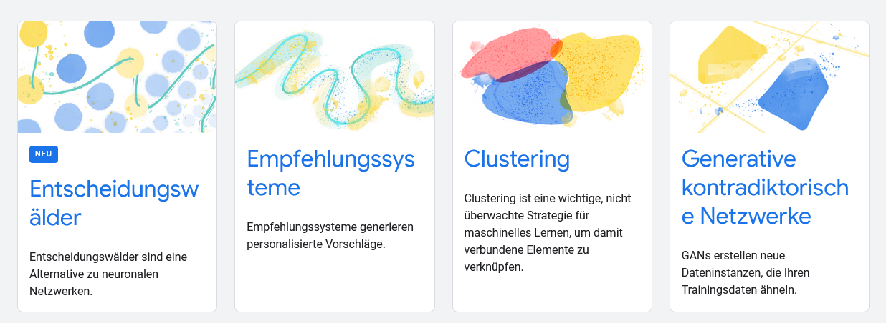
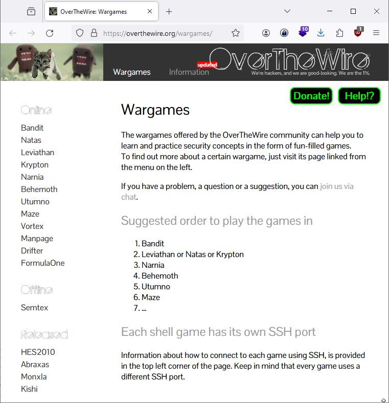
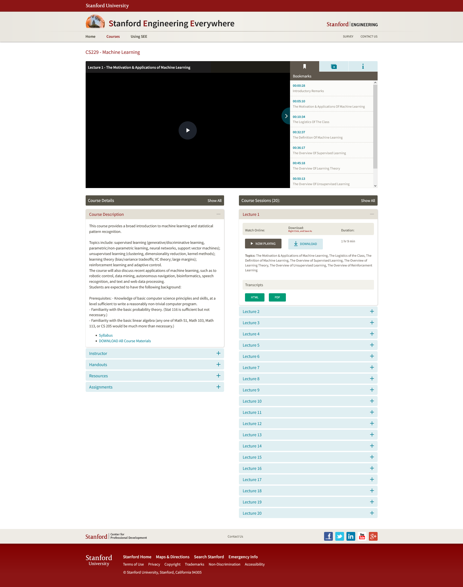

---
layout: post
title: Learning, KI,  Python Hacks - Backlog 
categories: []
tags: [KI, ML, Python, Learning, Courses, Wargames]
lastupdate: 2024-12-15
--- 

## HarvardX CS50AICS50
HarvardX CS50AICS50's Introduction to Artificial Intelligence with Python

- FF-NN, CNN, RNN 

<https://cs50.harvard.edu/ai/2023> 

<https://learning.edx.org/course/course-v1:HarvardX+CS50AI+1T2020/home>

Language - Lecture 6 (Natural Language Processing) - CS50's Introduction to Artificial Intelligence with Python 2023 <https://www.youtube.com/watch?v=QAZc9xsQNjQ>

## Google ML 

## Crashkurs „Maschinelles Lernen“ mit TensorFlow APIs

<https://developers.google.com/machine-learning/crash-course?hl=de>
<https://developers.google.com/machine-learning/crash-course?hl=en>

Glossar: <https://developers.google.com/machine-learning/glossary?hl=de#linear_regression>

## leetcode (not Free)

<https://leetcode.com/explore/learn/>

## Wargames

Wargames

<https://overthewire.org/wargames/>

The wargames offered by the OverTheWire community can help you to learn and practice security concepts in the form of fun-filled games.

## Microsoft generative-ai-for-beginners

created: 2023-12-09T10:16:21+01:00

<https://microsoft.github.io/generative-ai-for-beginners/#/>

Azure OpenAI <https://learn.microsoft.com/en-us/collections/zpy7c8zmq6ky0z?WT.mc_id=academic-105485-koreyst>

<https://github.com/microsoft/generative-ai-for-beginners?WT.mc_id=academic-105485-koreyst>

    ML for Beginners
    Data Science for Beginners
    AI for Beginners
    Web Dev for Beginners
    IoT for Beginners
    XR Development for Beginners
    Mastering GitHub Copilot for AI Paired Programming

## CS229 - Machine Learning
Stanford Engineering Everywhere
<https://see.stanford.edu/Course/CS229/47>

## A collection of stand-alone Python machine learning recipe

<https://github.com/rougier/ML-Recipes>

# The fastest way to learn OpenCV, Object Detection, and Deep Learning

<https://pyimagesearch.com/>

## Machine Learning Recipes

<https://github.com/rougier/ML-Recipes>

## KI Campus mit code ipynb 

Ganzheitliche angewandte KI im Ingenieurbereich - Maschinelles Lernen in der Produktion

<https://github.com/KI-Campus/MLiP/tree/main/Modul%208>

## Learning Programming - Exercism

Develop fluency in 67 programming languages with our unique blend of learning, practice and mentoring. Exercism is fun, effective and 100% free, forever.

<https://exercism.org/>
