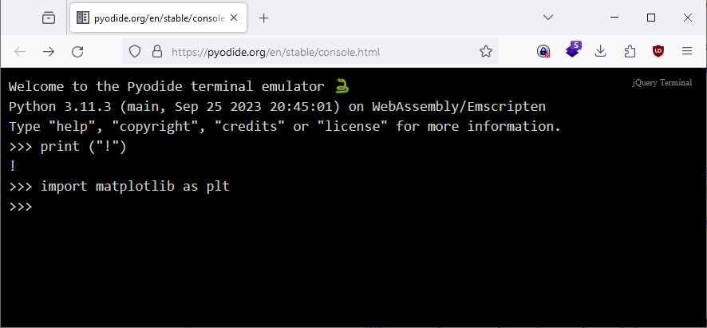
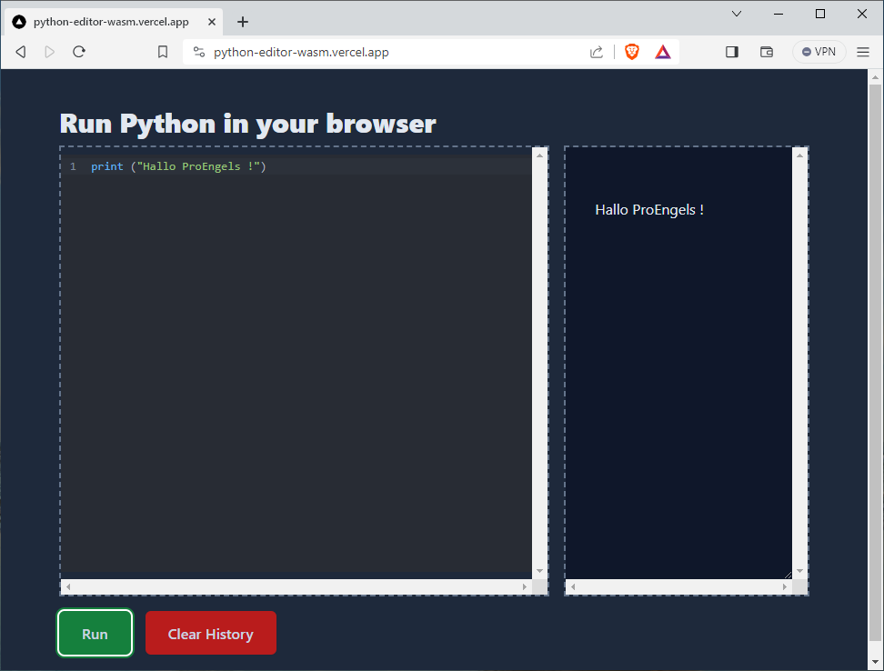
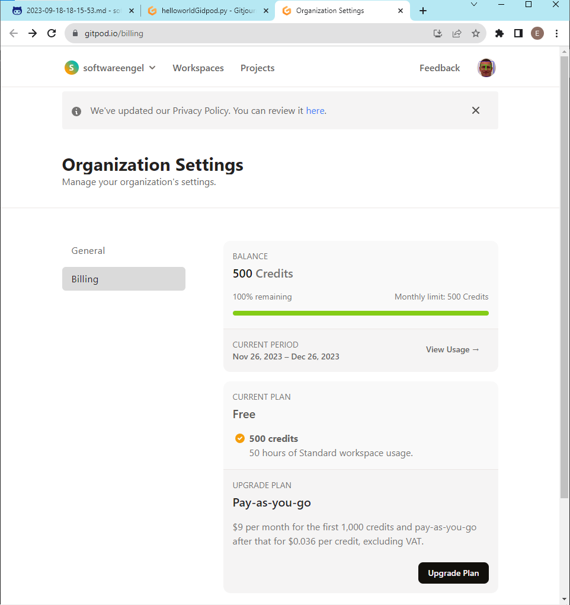
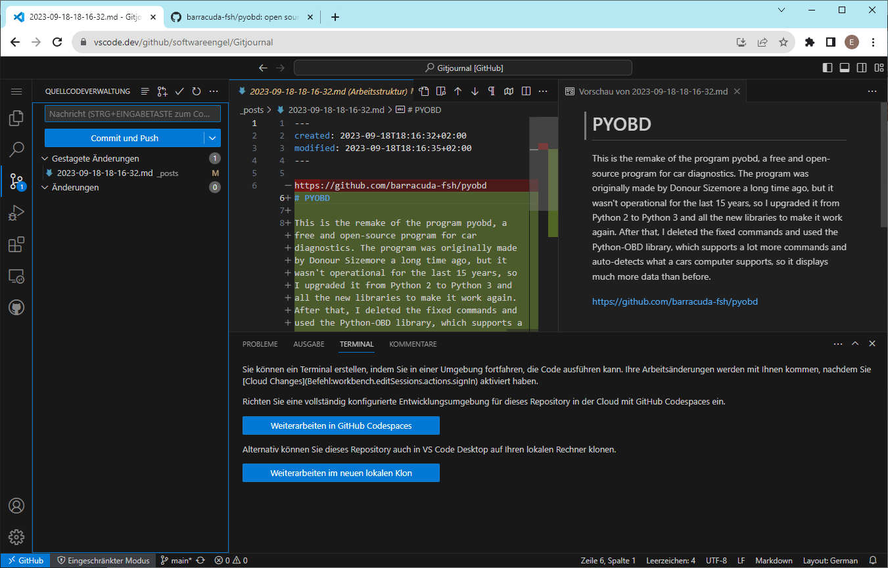
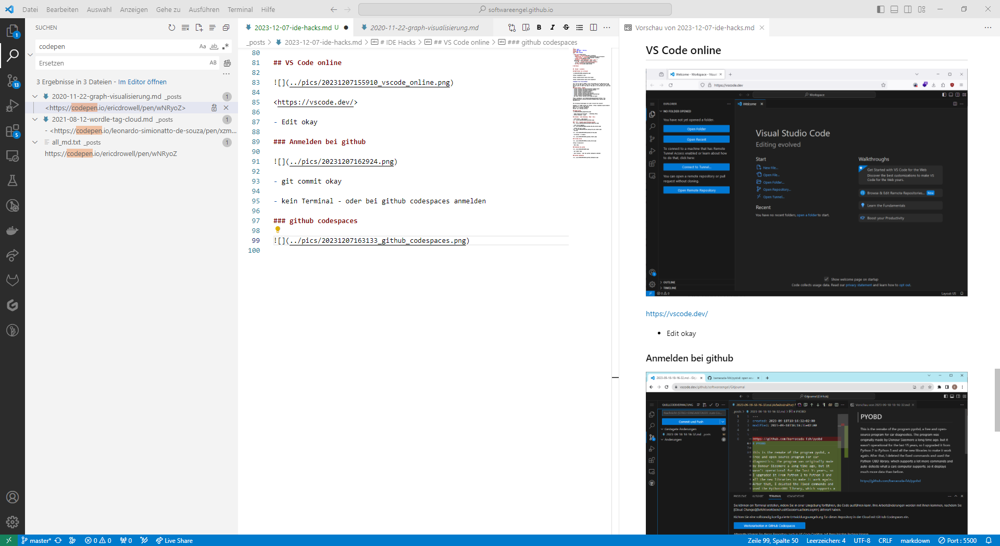
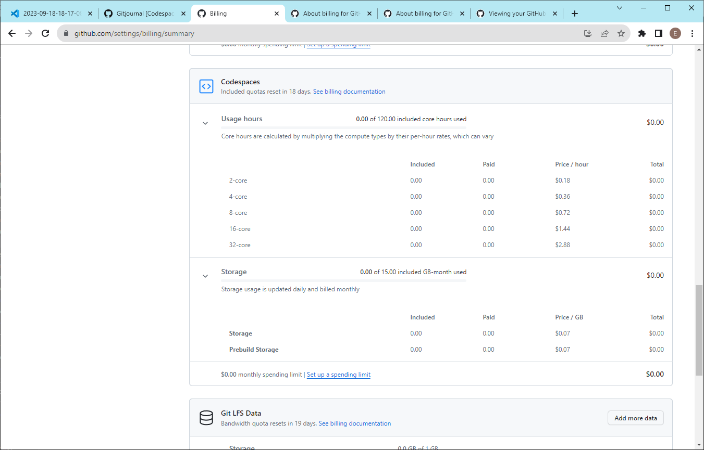
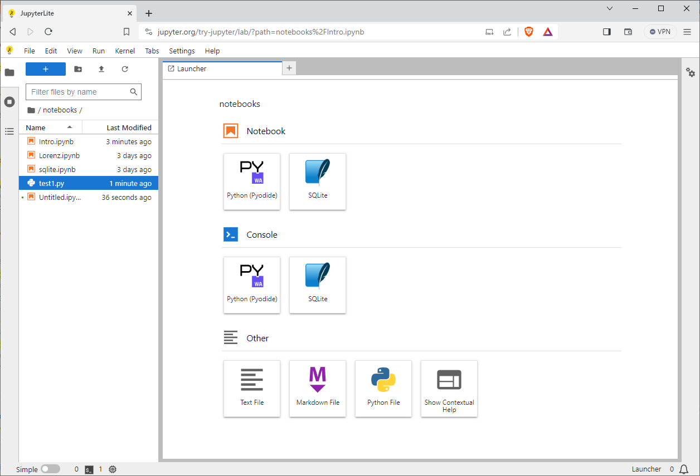
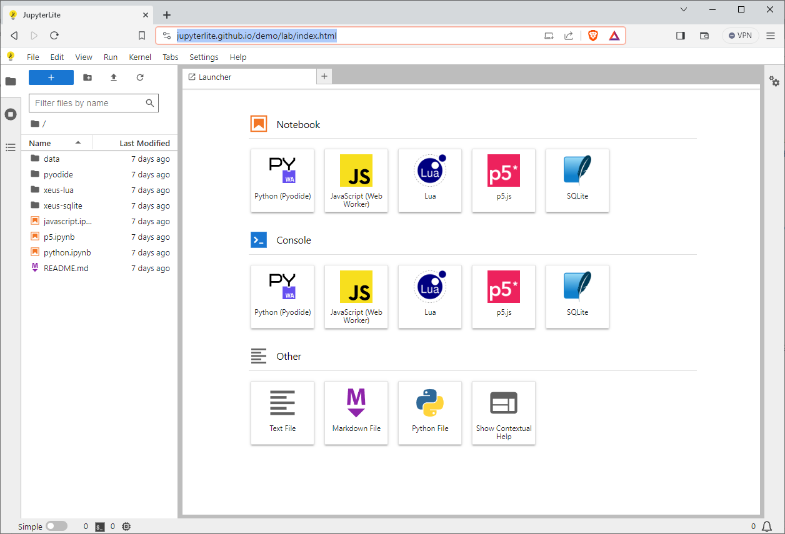

---
layout: post
title: IDE Hacks - Backlog 
categories: []
tags: [IDE, Python]
--- 
- [IDE Hacks](#ide-hacks)
  - [Own Dev Softwareengel](#own-dev-softwareengel)
  - [VScode + Liveshare](#vscode--liveshare)
  - [Welcome to the Pyodide terminal emulator 🐍](#welcome-to-the-pyodide-terminal-emulator-)
  - [WASM Python run in Browser](#wasm-python-run-in-browser)
    - [wasm python  sandbox](#wasm-python--sandbox)
  - [Google Colab](#google-colab)
  - [Github1s - ohne Anmeldung - REad - Only :](#github1s---ohne-anmeldung---read---only-)
    - [+ CPU  = Gitpod (nach Anmeldung github)](#-cpu---gitpod-nach-anmeldung-github)
  - [VS Code online](#vs-code-online)
    - [Anmelden bei github](#anmelden-bei-github)
    - [github codespaces](#github-codespaces)
  - [github Copilot](#github-copilot)
  - [Jupyter Hub (ohne Anmeldung)](#jupyter-hub-ohne-anmeldung)
  - [Jupuyter Lite (ohne Anmeldung) mit pyoide und ps5.js - Python-Runtime](#jupuyter-lite-ohne-anmeldung-mit-pyoide-und-ps5js---python-runtime)

# IDE Hacks

## Own Dev Softwareengel 


- <https://github.com/softwareengel/pyWasm>
  
- <https://softwareengel.github.io/pyWasm/lab/index.html>

##  VScode + Liveshare

## Welcome to the Pyodide terminal emulator 🐍

<https://pyodide.org/en/stable/console.html>
<https://github.com/pyodide/pyodide>

## WASM Python run in Browser



<https://wasmeditor.com/>

<https://python-editor-wasm.vercel.app/>

<https://python-editor-wasm.vercel.app/docs>

**Example file from Github**

Let's say we want to embed a file from Github to our page and let the users to run the code in the file in their browser. We want dark theme and let users to edit the code if the want to. So the URL will look like this:
### wasm python  sandbox 
- <https://github.com/jimkring/python-sandbox-wasm>
- <https://github.com/wasmerio/wasmer-python>
- <https://github.com/wasmerio/wasmer>
- <https://wasmer.io/python/python>
- <https://github.com/wasix-org/cpython>
- <https://github.com/bytecodealliance/wasmtime-py>
- <https://github.com/wasm3/pywasm3>
- Run wasm <https://github.com/slipHQ/run-wasm>
```
https://wasmeditor.com/?theme=dark&lang=python&url=https://raw.githubusercontent.com/amirtds/python-examples/main/replace.py&editable=true
```

The following technologies are used to build this project:

Pyodide: as a WASM runtime for Python. <https://pyodide.org/en/stable/>
Code Mirror: as our code editor.
Next.js: as frontend framework.
Vercel: as a hosting service.

## Google Colab 


- neues Colab und ausführen:  - Anmeldung nötig 
- Python Notebooks .ipynb
- 
## Github1s - ohne Anmeldung - REad - Only : 

- code browse , code history 


### + CPU  = Gitpod (nach Anmeldung github)


- code online together 


- coding test git client 

- billing 



- 32 Minuten ~ 5 Credits 


## VS Code online 


<https://vscode.dev/>

- Edit okay 

### Anmelden bei github 



- git commit okay

- kein Terminal - oder bei github codespaces anmelden 

### github codespaces 


- pricing 


## github Copilot 



- 120 includes Core hours (?)





## Jupyter Hub (ohne Anmeldung)

- pyoide wasm online Notebook 


<https://jupyter.org/try>

- jupyter pyoide WASM console 


- jupyter online Launcher 




## Jupuyter Lite (ohne Anmeldung) mit pyoide und ps5.js - Python-Runtime 


<https://jupyterlite.github.io/demo/lab/index.html>