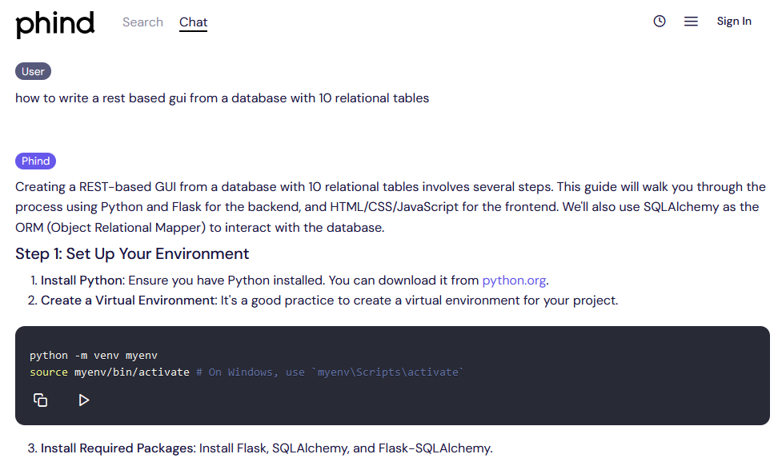

# Phind 

What Phind is

Phind is an intelligent answer engine for developers. Focused on helping you solve challenging problems, it uses generative AI to give you the answer you're looking for in seconds instead of hours. Connected to the internet and, optionally, to your codebase, Phind always maintains the right context.

With our new VS Code extension, you can now get Phind's help right in your editor.

<https://www.phind.com/agent>
