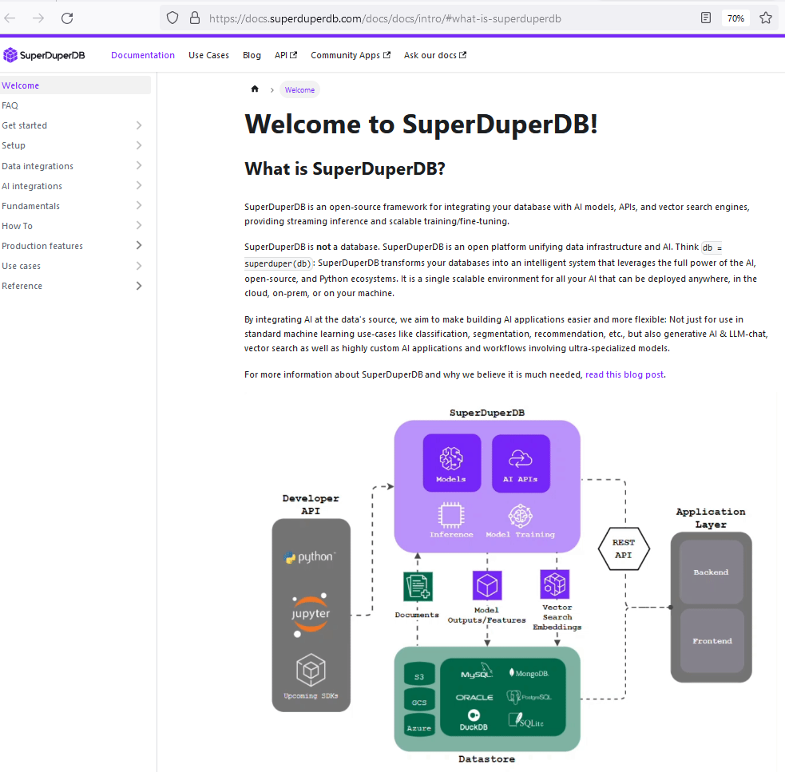
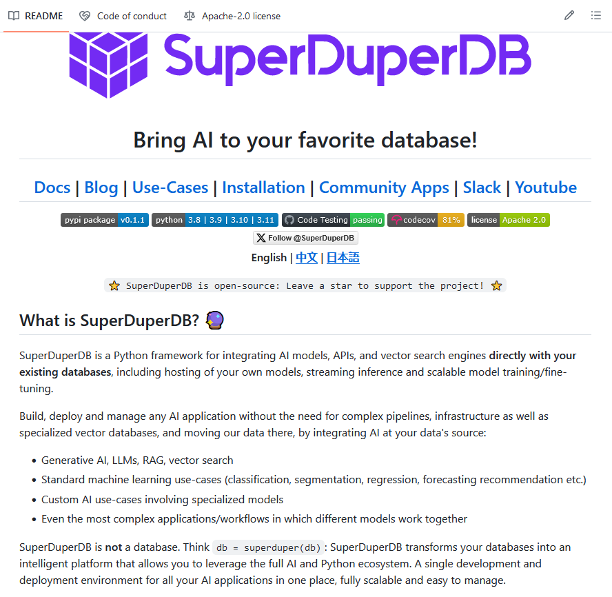

# SuperDuperDB

Build and manage AI applications easily without needing to move your data to complex pipelines and specialized vector databases. Integrate AI and vector search directly with your database including real-time inference and model training. Just using Python!

<https://docs.superduperdb.com/docs/docs/intro/#what-is-superduperdb>

SuperDuperDB is an open-source framework with the mission to bring AI to the database. With SuperDuperDB, you can integrate any ML model (i.e. from PyTorch, Sklearn, HuggingFace) and AI API (like OpenAI, Anthrophic, Cohere) directly with your existing databases, including streaming inference, scalable model training and vector search.

https://github.com/SuperDuperDB/superduperdb
