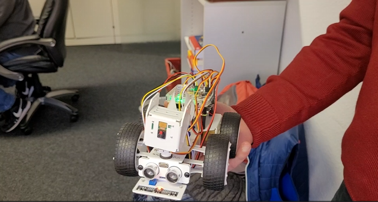
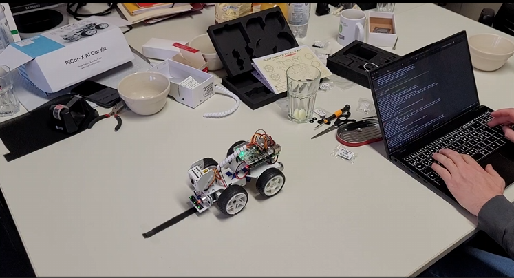
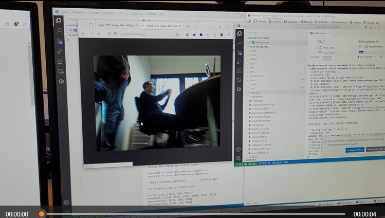

# Raspi ML/AI auf Car X - Platform 

 1. Open-Source Discovery with Comprehensive Video Tutorials: Picar-X, ideal for beginners from elementary school and beyond, presents a fascinating introduction to robotics, programming, and electronics. Its flexibility fosters unique project creation and exploration. The kit is compatible with Raspberry Pi 4/3B+/3B/Zero W ( ❤ Raspberry Pi is NOT included).
2. Quality Construction & FPV Capabilities: The durable metal build ensures longevity, while the included camera module supports FPV and video recognition for an interactive experience.
3. Feature-rich and Adaptable: PiCar-X offers engaging applications like line following and obstacle avoidance, TTS with various sensors and rechargeable batteries support, while its customizable design enables a wide range of projects and interests. ( ❤ Batteries Included).
4. Versatile Programming Options: Catering to users of all skill levels, Picar-X supports both Python and Scratch programming languages, allowing for flexible learning and skill development.
5. Simplified Assembly & Support: PiCar-X is perfect for beginners, yet learning with experienced users is recommended for best results. It comes with easy assembly instructions and forum support for smooth project completion. 

- Python 
- openCV
- Raspi 4 + 4GB 
- Cam, ...

 
## "Batteries Included"

noch ein paar Austauschakkus und besseres Ladegerät - vorher aufladen...

## Aufbau Raspi Car-X aus einigen Einzelteilen 

Auspacken und zusammenbauen - auch einige sehr kleine Teile dabei, etwas Fummelei, aber gut machbar, dauer ca. 3-4 h. 

## Testing QR - Code 

Video - QR Detection - CROP Picture - QR-Reader - Klartext QR-DECODE- Marierung im Video mit Klartext 

## Inbetriebnahme  - Funktionstest 

Richtungssteuerung - Videokamera vertikal - Videokamera horizontal 
<!-- poster pic Video 1

-->

<!-- blank line -->
<figure class="video_container">
  <video width="100%" controls="true" allowfullscreen="true" poster="/pic/20240122123403_startbildVideo1.png"> 
    <source src="/mov/20240120_150615.mp4" type="video/mp4">
  </video>
</figure>
<!-- blank line -->

## Kalibrieren: Schwarze Line 

<!-- poster pic Video 1

-->

<!-- blank line -->
<figure class="video_container">
  <video width="100%" controls="true" allowfullscreen="true" poster="/pic/20240122123850_poster2.png"> 
    <source src="/mov/20240120_152057.mp4" type="video/mp4">
  </video>
</figure>
<!-- blank line -->

## Follow me (hier rote Farbe) - Object Detection 
<!-- poster pic Video 1

-->
<!-- blank line -->
<figure class="video_container">
  <video width="100%" controls="true" allowfullscreen="true" poster="/pic/20240122123803_foster3.png"> 
    <source src="/mov/20240120_155714.mp4" type="video/mp4">
  </video>
</figure>
<!-- blank line -->

## Links

<https://docs.sunfounder.com/projects/picar-x/en/latest/>

<https://www.sunfounder.com/collections/deals-for-arduino-1/products/picar-x>
