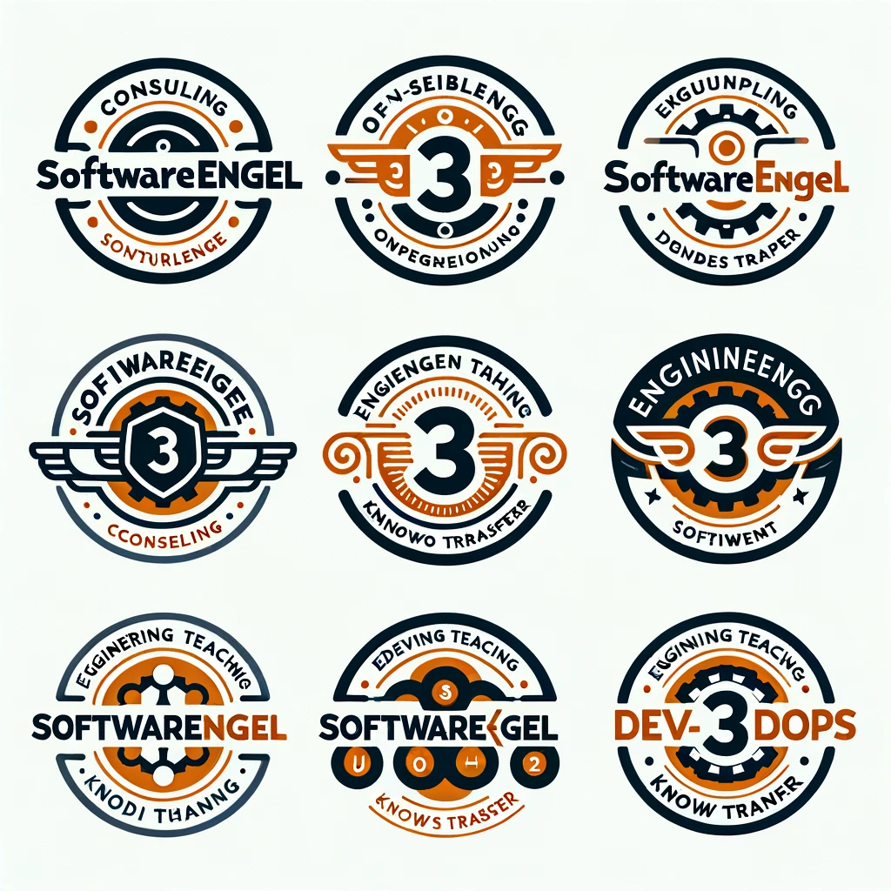
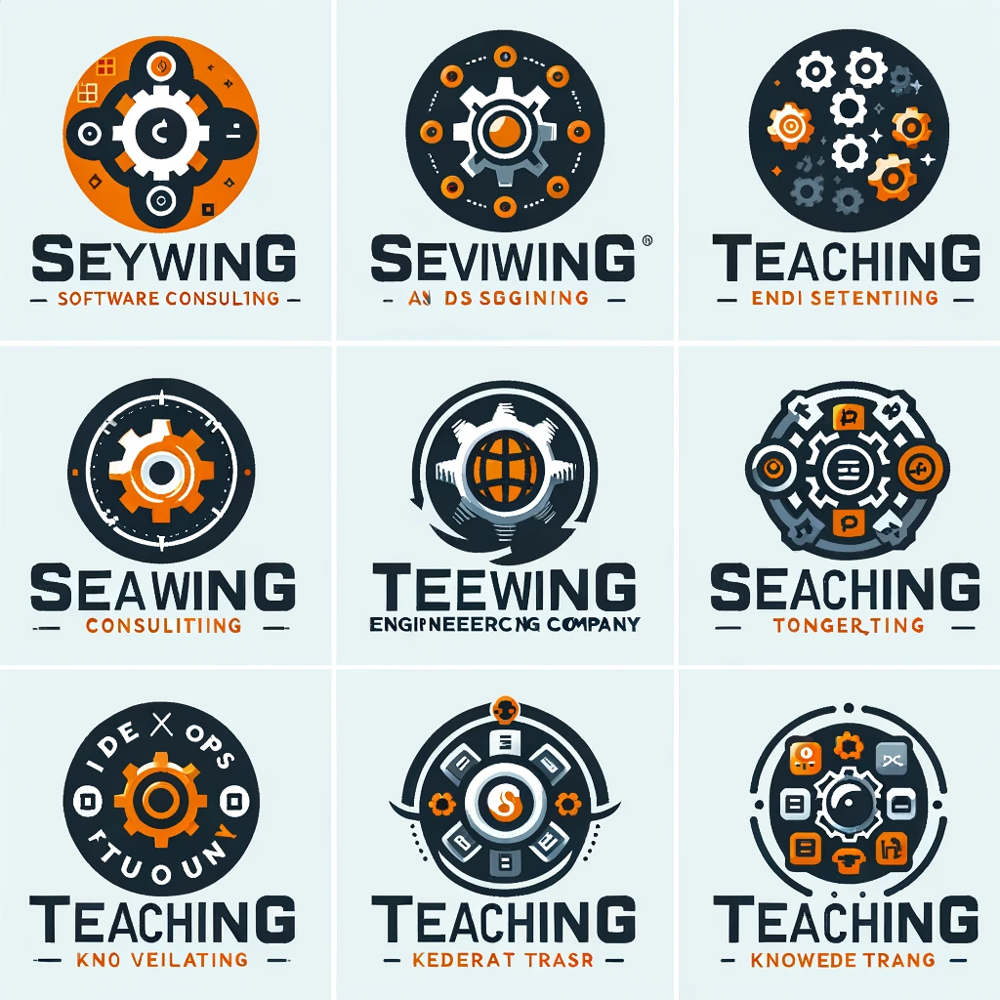
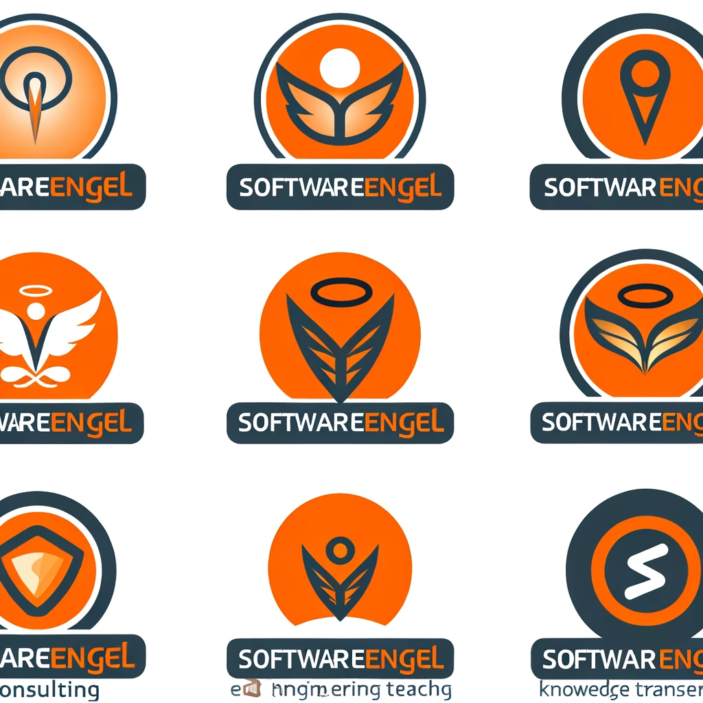
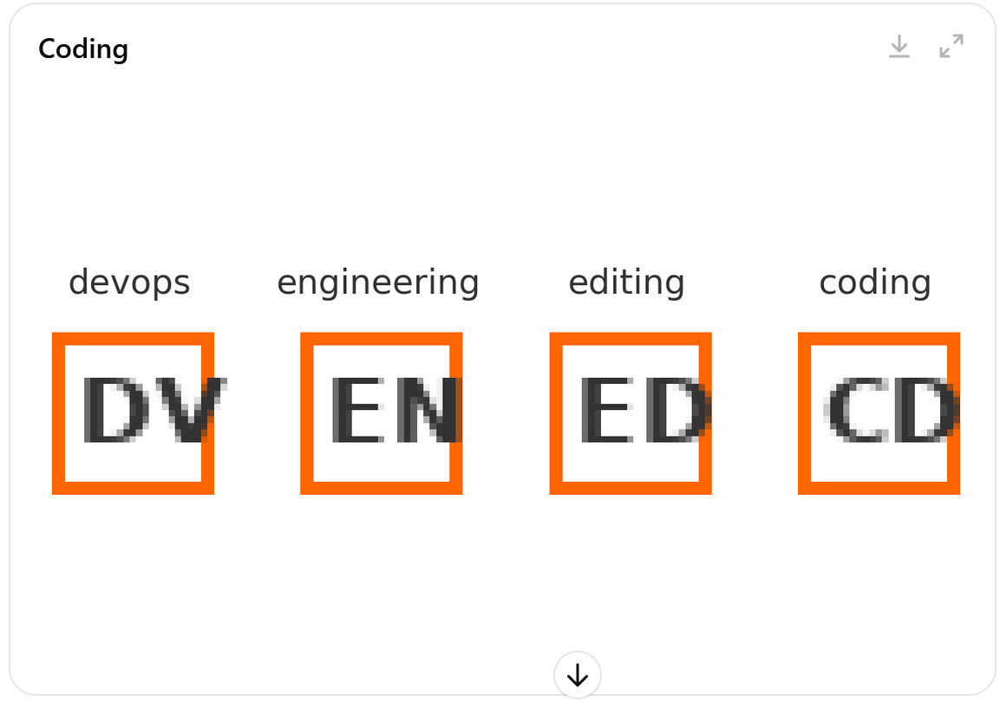

# OpenAI Logo Generation 


make a 9 logos for software company for consulting and engineering teaching and devops and know how transfer, serious logo it should be clean and simple , use orange and gray color palette

use the exact text "softwareengel"

on a scale of 1 to 10, would you prefer the logo to be:
1 - extremely clean and simple, or
10 - extremely detailed and complex, it should be 3




```
on a scale of 1 to 10, would you prefer the logo to be: 1 - extremely clean and simple, or 10 - extremely detailed and complex, it should be 1
```


## simplify Logo 


## simplify 2


```
make son alternatives - simplify
```


```
try again to simplify, make 9 logos
```


## other Prompts
```
9 logos for software company for consulting and engineering teaching and devops and know how transfer, serious logo it should be clean and simple , use orange and gray color palette, simple, vector, Pop Art.
```


```
use the exact text "softwareengel"
```





```
make a 9 logos for software company for consulting and engineering teaching and devops and know how transfer, serious logo it should be clean and simple , use orange and gray color palette, use the exact text "softwareengel"
```

```
try again
```


```
make a 9 logos for software company for consulting and engineering teaching and devops and know how transfer, use a serious logo, it should be clean and simple , use orange and gray color palette
```


# Logo  Generation GPT4o - 28-05-2024

```
make a 9 logos for software company for consulting and engineering teaching and devops and know how transfer, serious logo it should be clean and simple , use orange and gray color palette use the exact text "softwareengel" on a scale of 1 to 10, would you prefer the logo to be: 1 - extremely clean and simple, or 10 - extremely detailed and complex, it should be 3
```


```
simplify 9 alternatives
```


```
use exact text "softwareengel"
```


``` 
create 9 32x32 pixel icons for softwareengel devops, engineering, editing, coding
```

``` python 

import matplotlib.pyplot as plt
from PIL import Image, ImageDraw, ImageFont

# Define the text and color scheme
text = "SE"
colors = {
    "background": "#FFFFFF",
    "foreground": "#FF6600",
    "accent": "#333333"
}

# Create a function to generate icons
def create_icon(text, color_bg, color_fg, color_accent):
    icon_size = (32, 32)
    img = Image.new('RGB', icon_size, color=color_bg)
    draw = ImageDraw.Draw(img)
    font = ImageFont.truetype("/usr/share/fonts/truetype/dejavu/DejaVuSans-Bold.ttf", 14)
    
    # Draw shapes for devops, engineering, editing, coding
    draw.rectangle([4, 4, 28, 28], outline=color_fg, width=2)
    draw.text((8, 8), text, font=font, fill=color_accent)
    
    return img

# Create icons for devops, engineering, editing, and coding
icons = {
    "devops": create_icon("DV", colors["background"], colors["foreground"], colors["accent"]),
    "engineering": create_icon("EN", colors["background"], colors["foreground"], colors["accent"]),
    "editing": create_icon("ED", colors["background"], colors["foreground"], colors["accent"]),
    "coding": create_icon("CD", colors["background"], colors["foreground"], colors["accent"])
}

# Display the icons
fig, ax = plt.subplots(1, 4, figsize=(8, 2))
for i, (key, icon) in enumerate(icons.items()):
    ax[i].imshow(icon)
    ax[i].set_title(key)
    ax[i].axis('off')

plt.show()

```




