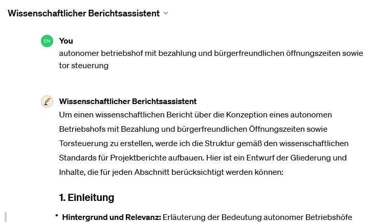

# OpenAI: Eigener Wissenschaftlicher Bericht GPT, 1-Stop - Wissenschftlicher Bericht 

autonomer betriebshof mit Bezahlung und bürgerfreundlichen öffnungszeiten sowie Tor Steuerung 

Um einen wissenschaftlichen Bericht über die Konzeption eines autonomen Betriebshofs mit Bezahlung und bürgerfreundlichen Öffnungszeiten sowie Torsteuerung zu erstellen, werde ich die Struktur gemäß den wissenschaftlichen Standards für Projektberichte aufbauen. Hier ist ein Entwurf der Gliederung und Inhalte, die für jeden Abschnitt berücksichtigt werden können:

### 1. Einleitung
- **Hintergrund und Relevanz:** Erläuterung der Bedeutung autonomer Betriebshöfe für die öffentliche Verwaltung und die Gemeinschaft, insbesondere in Bezug auf Effizienz, Zugänglichkeit und Sicherheit.
- **Zielsetzung:** Definition des Hauptziels, einen autonomen Betriebshof zu entwickeln, der innovative Bezahlmethoden integriert und bürgerfreundliche Öffnungszeiten bietet, kombiniert mit einer automatisierten Torsteuerung.

### 2. Forschungsfrage
- Wie kann ein autonomer Betriebshof mit einem effizienten Bezahlungssystem und bürgerfreundlichen Öffnungszeiten gestaltet werden, während gleichzeitig eine sichere und benutzerfreundliche Torsteuerung implementiert wird?

### 3. Methodik
- **Literaturrecherche:** Untersuchung bestehender Modelle autonomer Betriebshöfe und deren Betriebsmechanismen, Bezahlungssysteme und Sicherheitsfeatures.
- **Technologische Analyse:** Bewertung der Technologien für Zahlungssysteme, Zugangskontrollen und Automatisierung, die in der Entwicklung eines autonomen Betriebshofs verwendet werden können.
- **Stakeholder-Analyse:** Identifikation und Befragung von Interessengruppen, einschließlich Bürgern, Betreibern und lokalen Behörden, um Bedürfnisse und Erwartungen zu verstehen.

### 4. Durchführung von Tests
- **Prototyping:** Entwicklung eines Prototyps für den Betriebshof, einschließlich des Bezahlungssystems und der Torsteuerung.
- **Pilotbetrieb:** Implementierung des Prototyps in einem kontrollierten Umfeld zur Bewertung von Funktionalität, Benutzerfreundlichkeit und Sicherheit.

### 5. Evaluation
- **Ergebnisanalyse:** Auswertung der Testergebnisse basierend auf Effizienz, Benutzerfreundlichkeit, Sicherheit und Zufriedenheit der Stakeholder.
- **Vergleich mit Best Practices:** Abgleich der Ergebnisse mit etablierten Standards und Best Practices in ähnlichen Projekten.

### 6. Ergebnisse
- **Implementierte Lösungen:** Detaillierte Beschreibung der implementierten Systeme für Bezahlung, Öffnungszeiten und Torsteuerung.
- **Bewertung der Zielerreichung:** Analyse, inwieweit die gesetzten Ziele erreicht wurden und welche Verbesserungen oder Anpassungen erforderlich sind.

### 7. Zusammenfassung und Ausblick
- **Zusammenfassung der wichtigsten Erkenntnisse:** Kurze Wiederholung der wichtigsten Ergebnisse und deren Bedeutung für die Entwicklung autonomer Betriebshöfe.
- **Empfehlungen für die Praxis:** Vorschläge für die Implementierung und den Betrieb solcher Einrichtungen in verschiedenen Kontexten.
- **Zukünftige Forschungsrichtungen:** Identifikation von Bereichen, in denen weitere Forschung und Entwicklung notwendig sind, um die Effizienz und Benutzerfreundlichkeit autonomer Betriebshöfe zu verbessern.

Dieser Entwurf dient als Grundlage für die Erstellung eines umfassenden Berichts. Es ist wichtig, dass jeder Abschnitt auf gründlicher Forschung und Analyse basiert, um valide und nützliche Ergebnisse zu liefern.
