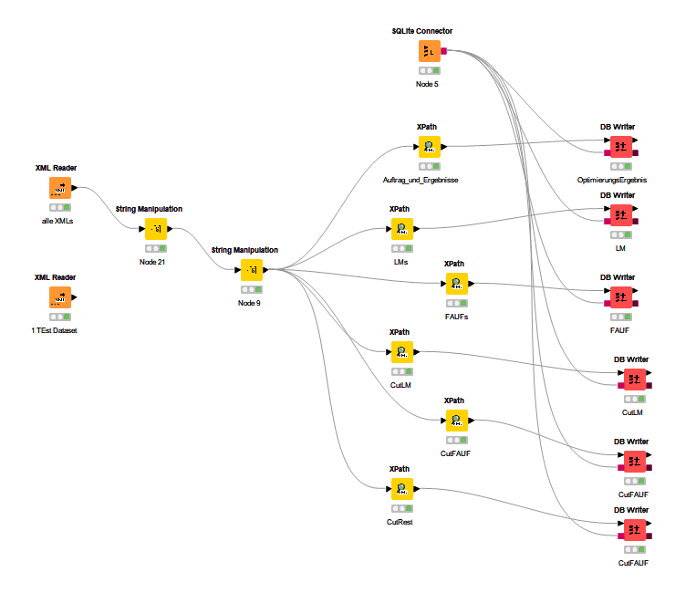
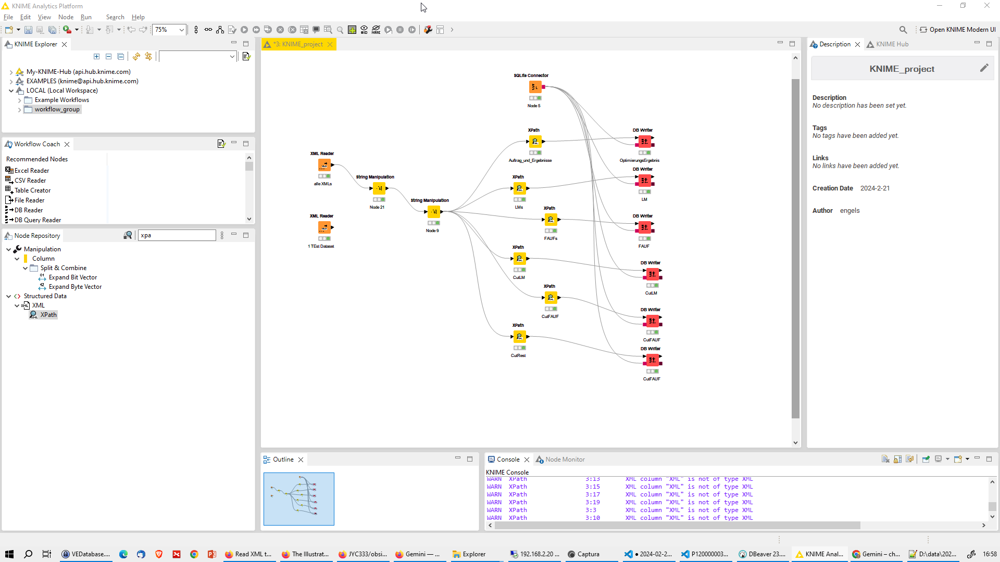

# XML Data Analytics with Knime -- working -- 


## Input Data 

```xml
<?xml version="1.0" encoding="UTF-8" standalone="yes"?>
<OptimierungsErgebnis ID="" INFO="">
    <OptimierungsAuftrag ID="P1200000043640">
        <startCalcTimeMillis>1707937438671</startCalcTimeMillis>
        <FAUF FAUF-LNR="0" FAUF-ID="12638121-1" X="108" Y="108" Z="260"/>
        <FAUF FAUF-LNR="1" FAUF-ID="12638121-2" X="108" Y="108" Z="260"/>
        <FAUF FAUF-LNR="2" FAUF-ID="12638121-3" X="108" Y="108" Z="260"/>
        <FAUF FAUF-LNR="3" FAUF-ID="12638121-4" X="108" Y="108" Z="260"/>
        <LM LM-ID="FR123430011:72:VG-1000016702" X="310" Y="281" Z="420" LM-TYPE="R" PRIO="1"/>
        <LM LM-ID="FR123430011:72:VG-1000016703" X="285" Y="285" Z="310" LM-TYPE="R" PRIO="1"/>
        <LM LM-ID="FR123430011:72:VG-1000018196" X="295" Y="160" Z="620" LM-TYPE="R" PRIO="1"/>
        <LM LM-ID="FR123430011:72:VG-1000018412" X="270" Y="150" Z="1055" LM-TYPE="R" PRIO="1"/>
        <LM LM-ID="FR123430011:72:VG-1000018744" X="285" Y="160" Z="310" LM-TYPE="R" PRIO="1"/>
        <LM LM-ID="FR123430011:72:VG-1000018745" X="295" Y="160" Z="310" LM-TYPE="R" PRIO="1"/>
        <LM LM-ID="FR123430011:72:VG-1000020101" X="275" Y="150" Z="885" LM-TYPE="R" PRIO="1"/>
        <LM LM-ID="FR123430011:72:VG-1000023087" X="270" Y="140" Z="500" LM-TYPE="R" PRIO="1"/>
        <LM LM-ID="FR123430011:72:VG-1000023088" X="270" Y="140" Z="505" LM-TYPE="R" PRIO="1"/>
        <LM LM-ID="FR123430011:72:VG-1000023193" X="305" Y="275" Z="960" LM-TYPE="R" PRIO="1"/>
        <LM LM-ID="FR123430011:72:VG-1000023544" X="270" Y="115" Z="820" LM-TYPE="R" PRIO="1"/>
        <LM LM-ID="FR123430011:72:VG-1000025361" X="300" Y="270" Z="530" LM-TYPE="R" PRIO="1"/>
        <LM LM-ID="FR123430011:72:VG-1000026757" X="270" Y="170" Z="365" LM-TYPE="R" PRIO="1"/>
        <LM LM-ID="FR123430011:72:VG-1000026800" X="220" Y="150" Z="270" LM-TYPE="R" PRIO="1"/>
        <LM LM-ID="FR123430011:72:VG-1000028317" X="570" Y="300" Z="730" LM-TYPE="R" PRIO="1"/>
        <LM LM-ID="FR123430011:72:VG-1000028328" X="305" Y="300" Z="765" LM-TYPE="R" PRIO="1"/>
        <LM LM-ID="FR123430011:72:VG-1000028334" X="305" Y="300" Z="765" LM-TYPE="R" PRIO="1"/>
        <LM LM-ID="FR123430011:72:VG-1000029056" X="310" Y="267" Z="940" LM-TYPE="R" PRIO="1"/>
        <LM LM-ID="FR123430011:72:VG-1000029525" X="270" Y="235" Z="675" LM-TYPE="R" PRIO="1"/>
        <LM LM-ID="FR123430011:72:VG-1000029914" X="265" Y="130" Z="440" LM-TYPE="R" PRIO="1"/>
        <LM LM-ID="FR123430011:72:VG-1000029919" X="270" Y="135" Z="435" LM-TYPE="R" PRIO="1"/>
        <LM LM-ID="FR123430011:72:VG-1000029927" X="270" Y="140" Z="440" LM-TYPE="R" PRIO="1"/>
        <LM LM-ID="FR123430011:72:VG-1000029928" X="270" Y="140" Z="440" LM-TYPE="R" PRIO="1"/>
        <LM LM-ID="FR123430011:72:VG-1000029981" X="265" Y="130" Z="440" LM-TYPE="R" PRIO="1"/>
        <LM LM-ID="FR123430011:72:VG-1000029983" X="265" Y="130" Z="440" LM-TYPE="R" PRIO="1"/>
        <LM LM-ID="FR123430011:72:VG-1000029993" X="270" Y="130" Z="440" LM-TYPE="R" PRIO="1"/>
        <LM LM-ID="FR123430011:72:VG-1000029998" X="320" Y="270" Z="850" LM-TYPE="R" PRIO="1"/>
        <LM LM-ID="FR123430011:72:VG-1000030079" X="310" Y="270" Z="855" LM-TYPE="R" PRIO="1"/>
        <LM LM-ID="FR123430011:72:VG-1000030580" X="310" Y="300" Z="765" LM-TYPE="R" PRIO="1"/>
        <LM LM-ID="FR123430011:72:VG-1000030583" X="300" Y="300" Z="765" LM-TYPE="R" PRIO="1"/>
        <PARAMS MaxLaufzeit="1740" Zielfunktion="ZF6" SchnittbreiteMillimeter="6" MaxSchnittlaengeMillimeter="1600" Schnittplanverfahren="2">
            <Schrottkonfig minimal_staerke_mm="100" minimal_breite_mm="250" minimal_laenge_mm="400" minParameterhit="1"/>
        </PARAMS>
    </OptimierungsAuftrag>
    <ZUWEISUNG>
        <Lagermaterial LM-ID="FR123430011:72:VG-1000029525" X="235" Y="675" Z="270" LM-TYPE="R" PRIO="1"/>
        <FAUF FAUF-LNR="0" FAUF-ID="12638121-1" X="108" Y="108" Z="260"/>
        <FAUF FAUF-LNR="1" FAUF-ID="12638121-2" X="108" Y="108" Z="260"/>
        <FAUF FAUF-LNR="2" FAUF-ID="12638121-3" X="108" Y="108" Z="260"/>
        <FAUF FAUF-LNR="3" FAUF-ID="12638121-4" X="108" Y="108" Z="260"/>
        <REST OM="1" X="235" Y="447" Z="270"/>
        <SCHROTT X="235" Y="108" Z="4"/>
        <SCHROTT X="7" Y="108" Z="260"/>
        <SCHROTT X="235" Y="108" Z="4"/>
        <SCHROTT X="7" Y="108" Z="260"/>
        <Zusammenfassung>
            <ABSOLUVOLUMENFAUF>12130560</ABSOLUVOLUMENFAUF>
            <ABSOLUVOLUMENREST>28362150</ABSOLUVOLUMENREST>
            <ABSOLUVOLUMENOM>28362150</ABSOLUVOLUMENOM>
            <ABSOLUVOLUMENSCHROTT>596160</ABSOLUVOLUMENSCHROTT>
            <ABSOLUVOLUMENLM>42828750</ABSOLUVOLUMENLM>
            <ABSOLUVOLUMENSCHNITTBREITE>1739880</ABSOLUVOLUMENSCHNITTBREITE>
            <ABSOLUTVOLUMENFAUFOVERHEAD>0</ABSOLUTVOLUMENFAUFOVERHEAD>
            <Profit>0.16147816349384103</Profit>
            <FAUFPROZENT>0.2832340425531915</FAUFPROZENT>
            <RESTPROZENT>0.6622222222222223</RESTPROZENT>
            <OMPROZENT>0.6622222222222223</OMPROZENT>
            <SCHROTTPROZENT>0.013919621749408983</SCHROTTPROZENT>
            <ANZAHLSCHNITTE>8</ANZAHLSCHNITTE>
            <ANZAHLFAUF>4</ANZAHLFAUF>
            <ANZAHLRESTE>1</ANZAHLRESTE>
            <ANZAHLOM>1</ANZAHLOM>
            <ANZAHLSCHROTT>4</ANZAHLSCHROTT>
        </Zusammenfassung>
        <Schnittplan>
            <SchnittplanID>FR123430011:72:VG-1000029525</SchnittplanID>
            <Lagermaterial LM-ID="FR123430011:72:VG-1000029525" X="235" Y="675" Z="270" LM-TYPE="R" PRIO="1"/>
            <SchnittZeile>
                <Lnr>1</Lnr>
                <Level>0</Level>
                <Objektinfo>[Y]</Objektinfo>
                <X>235</X>
                <Y>675</Y>
                <Z>270</Z>
                <UeberhangX>0</UeberhangX>
                <UeberhangY>0</UeberhangY>
                <UeberhangZ>0</UeberhangZ>
                <CutInfo>Y(108, 108)</CutInfo>
                <BilddateiName>cutplan-P1200000043640-FR123430011%3A72%3AVG-1000029525-1.png</BilddateiName>
            </SchnittZeile>
            <SchnittZeile>
                <Lnr>2</Lnr>
                <Level>2</Level>
                <Objektinfo>Rest</Objektinfo>
                <X>235</X>
                <Y>447</Y>
                <Z>270</Z>
                <UeberhangX>0</UeberhangX>
                <UeberhangY>0</UeberhangY>
                <UeberhangZ>0</UeberhangZ>
                <CutInfo></CutInfo>
                <BilddateiName></BilddateiName>
            </SchnittZeile>
            <SchnittZeile>
                <Lnr>3</Lnr>
                <Level>2</Level>
                <Objektinfo>[Z]</Objektinfo>
                <X>235</X>
                <Y>108</Y>
                <Z>270</Z>
                <UeberhangX>0</UeberhangX>
                <UeberhangY>0</UeberhangY>
                <UeberhangZ>0</UeberhangZ>
                <CutInfo>Z(260)</CutInfo>
                <BilddateiName>cutplan-P1200000043640-FR123430011%3A72%3AVG-1000029525-2.png</BilddateiName>
            </SchnittZeile>
            <SchnittZeile>
                <Lnr>4</Lnr>
                <Level>3</Level>
                <Objektinfo>Schrott</Objektinfo>
                <X>235</X>
                <Y>108</Y>
                <Z>4</Z>
                <UeberhangX>0</UeberhangX>
                <UeberhangY>0</UeberhangY>
                <UeberhangZ>0</UeberhangZ>
                <CutInfo></CutInfo>
                <BilddateiName></BilddateiName>
            </SchnittZeile>
            <SchnittZeile>
                <Lnr>5</Lnr>
                <Level>3</Level>
                <Objektinfo>[X]</Objektinfo>
                <X>235</X>
                <Y>108</Y>
                <Z>260</Z>
                <UeberhangX>0</UeberhangX>
                <UeberhangY>0</UeberhangY>
                <UeberhangZ>0</UeberhangZ>
                <CutInfo>X(108, 108)</CutInfo>
                <BilddateiName>cutplan-P1200000043640-FR123430011%3A72%3AVG-1000029525-3.png</BilddateiName>
            </SchnittZeile>
            <SchnittZeile>
                <Lnr>6</Lnr>
                <Level>5</Level>
                <Objektinfo>Schrott</Objektinfo>
                <X>7</X>
                <Y>108</Y>
                <Z>260</Z>
                <UeberhangX>0</UeberhangX>
                <UeberhangY>0</UeberhangY>
                <UeberhangZ>0</UeberhangZ>
                <CutInfo></CutInfo>
                <BilddateiName></BilddateiName>
            </SchnittZeile>
            <SchnittZeile>
                <Lnr>7</Lnr>
                <Level>5</Level>
                <Objektinfo>12638121-4</Objektinfo>
                <X>108</X>
                <Y>108</Y>
                <Z>260</Z>
                <UeberhangX>0</UeberhangX>
                <UeberhangY>0</UeberhangY>
                <UeberhangZ>0</UeberhangZ>
                <CutInfo></CutInfo>
                <BilddateiName></BilddateiName>
            </SchnittZeile>
            <SchnittZeile>
                <Lnr>8</Lnr>
                <Level>4</Level>
                <Objektinfo>12638121-2</Objektinfo>
                <X>108</X>
                <Y>108</Y>
                <Z>260</Z>
                <UeberhangX>0</UeberhangX>
                <UeberhangY>0</UeberhangY>
                <UeberhangZ>0</UeberhangZ>
                <CutInfo></CutInfo>
                <BilddateiName></BilddateiName>
            </SchnittZeile>
            <SchnittZeile>
                <Lnr>9</Lnr>
                <Level>1</Level>
                <Objektinfo>[Z]</Objektinfo>
                <X>235</X>
                <Y>108</Y>
                <Z>270</Z>
                <UeberhangX>0</UeberhangX>
                <UeberhangY>0</UeberhangY>
                <UeberhangZ>0</UeberhangZ>
                <CutInfo>Z(260)</CutInfo>
                <BilddateiName>cutplan-P1200000043640-FR123430011%3A72%3AVG-1000029525-4.png</BilddateiName>
            </SchnittZeile>
            <SchnittZeile>
                <Lnr>10</Lnr>
                <Level>2</Level>
                <Objektinfo>Schrott</Objektinfo>
                <X>235</X>
                <Y>108</Y>
                <Z>4</Z>
                <UeberhangX>0</UeberhangX>
                <UeberhangY>0</UeberhangY>
                <UeberhangZ>0</UeberhangZ>
                <CutInfo></CutInfo>
                <BilddateiName></BilddateiName>
            </SchnittZeile>
            <SchnittZeile>
                <Lnr>11</Lnr>
                <Level>2</Level>
                <Objektinfo>[X]</Objektinfo>
                <X>235</X>
                <Y>108</Y>
                <Z>260</Z>
                <UeberhangX>0</UeberhangX>
                <UeberhangY>0</UeberhangY>
                <UeberhangZ>0</UeberhangZ>
                <CutInfo>X(108, 108)</CutInfo>
                <BilddateiName>cutplan-P1200000043640-FR123430011%3A72%3AVG-1000029525-5.png</BilddateiName>
            </SchnittZeile>
            <SchnittZeile>
                <Lnr>12</Lnr>
                <Level>4</Level>
                <Objektinfo>Schrott</Objektinfo>
                <X>7</X>
                <Y>108</Y>
                <Z>260</Z>
                <UeberhangX>0</UeberhangX>
                <UeberhangY>0</UeberhangY>
                <UeberhangZ>0</UeberhangZ>
                <CutInfo></CutInfo>
                <BilddateiName></BilddateiName>
            </SchnittZeile>
            <SchnittZeile>
                <Lnr>13</Lnr>
                <Level>4</Level>
                <Objektinfo>12638121-3</Objektinfo>
                <X>108</X>
                <Y>108</Y>
                <Z>260</Z>
                <UeberhangX>0</UeberhangX>
                <UeberhangY>0</UeberhangY>
                <UeberhangZ>0</UeberhangZ>
                <CutInfo></CutInfo>
                <BilddateiName></BilddateiName>
            </SchnittZeile>
            <SchnittZeile>
                <Lnr>14</Lnr>
                <Level>3</Level>
                <Objektinfo>12638121-1</Objektinfo>
                <X>108</X>
                <Y>108</Y>
                <Z>260</Z>
                <UeberhangX>0</UeberhangX>
                <UeberhangY>0</UeberhangY>
                <UeberhangZ>0</UeberhangZ>
                <CutInfo></CutInfo>
                <BilddateiName></BilddateiName>
            </SchnittZeile>
        </Schnittplan>
        <raw_cutresponse>#Items n=4
 no [ dx, dy, dz]   x   y   z packed
  1 [114,114,266]   0   0   0 266
  2 [114,114,266]   0 114   0 266
  3 [114,114,266] 114   0   0 266
  4 [114,114,266] 114 114   0 266
TOTAL VOLUME 13827744 OF 18092352 FILL 0.764287
 1 : n   4 fill 76.4 miss 0 time   0.00 iter       2 knap       4
n       = 4.00
fill    = 76.4
miss    = 0.0
time    = 0.00
iter    =       2
knap    =       4
</raw_cutresponse>
    </ZUWEISUNG>
    <GesamtZusammenfassung>
        <ABSOLUVOLUMENFAUF>12130560</ABSOLUVOLUMENFAUF>
        <ABSOLUVOLUMENREST>28362150</ABSOLUVOLUMENREST>
        <ABSOLUVOLUMENOM>28362150</ABSOLUVOLUMENOM>
        <ABSOLUVOLUMENSCHROTT>596160</ABSOLUVOLUMENSCHROTT>
        <ABSOLUVOLUMENLM>42828750</ABSOLUVOLUMENLM>
        <ABSOLUVOLUMENSCHNITTBREITE>1739880</ABSOLUVOLUMENSCHNITTBREITE>
        <ABSOLUTVOLUMENFAUFOVERHEAD>0</ABSOLUTVOLUMENFAUFOVERHEAD>
        <Profit>0.16147816349384103</Profit>
        <FAUFPROZENT>0.2832340425531915</FAUFPROZENT>
        <RESTPROZENT>0.6622222222222223</RESTPROZENT>
        <OMPROZENT>0.6622222222222223</OMPROZENT>
        <SCHROTTPROZENT>0.013919621749408983</SCHROTTPROZENT>
        <ANZAHLSCHNITTE>8</ANZAHLSCHNITTE>
        <ANZAHLFAUF>4</ANZAHLFAUF>
        <ANZAHLRESTE>1</ANZAHLRESTE>
        <ANZAHLOM>1</ANZAHLOM>
        <ANZAHLSCHROTT>4</ANZAHLSCHROTT>
    </GesamtZusammenfassung>
    <RUNTIMESEC>33</RUNTIMESEC>
    <RUNTIME>0.00.33</RUNTIME>
</OptimierungsErgebnis>

```

## Versuch 1 ChatGPT 4 + Copilot (Nicht erfolgreich) 
```User
py read following xml file and store in sqlite db 
```
- Error 
  


## Versuch 2: Knime XML - ETL - Sqlite (Erfolgreiche) 
- XmlReader + XPath + DBWriter 




## DBeaver Data Analysis 


