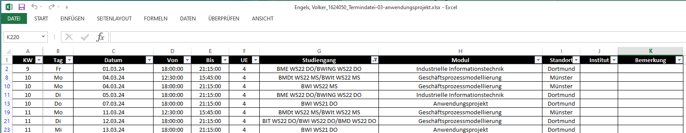
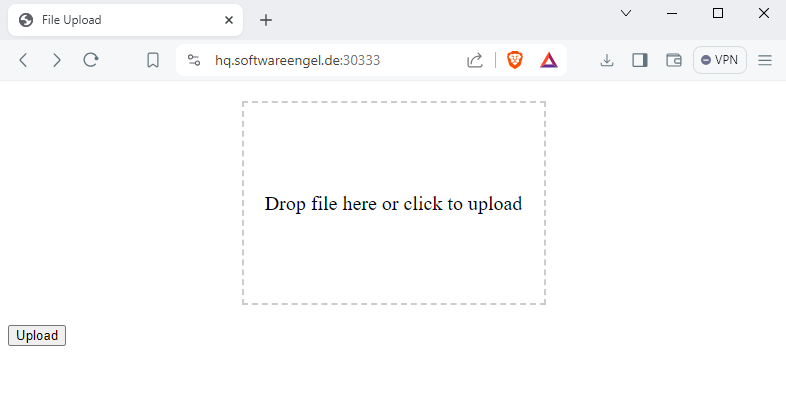
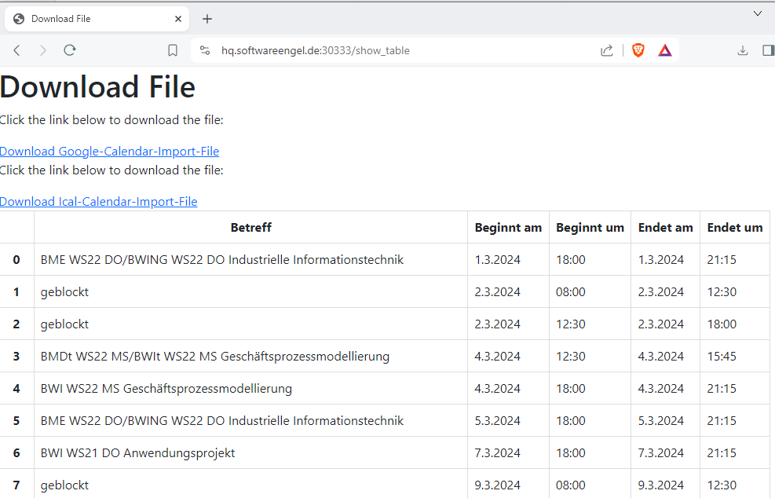
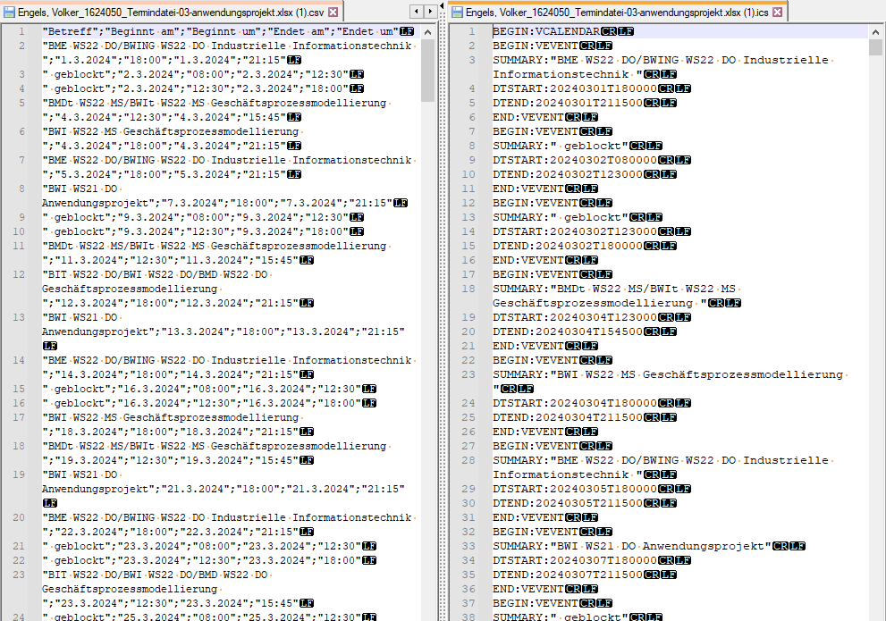

# Konvertiere FOM Teminplanung in Excel in ICS-Kalender und Google-Kalender-Format 

- keine Installation nötig 
- update 2024-05: neue Version (ab 2024-05) wird auch schon unterstützt (danke an M.G.)  

Webbasiertes Tool zum Konvertieren der FOM - Excel - Termin - Dateien (.xlsx) zu Kalender-Daten - nutzbar für Apple IOS-, Android-, Linux- und Windows-Systemen

Unterstützte Ausgabe - Formate :
- ICS - iCal-Kalender 
- CSV- Google - Import - Kalender 

## Webseite mit Dropzone zum Ablegen der Termin-xlsx-Datei

Testinstallation Verfügbar unter 

**<https://hq.softwareengel.de:30333/>**

## Screenshot Website 

-> Hier die XLSX - Datei in der Ablagefläche einfügen (hochladen)

## Sofortige Ausgabe der Kalender- Download - Links nach der Berechnung 

Nach der Berechnung der Kalender können diese heruntergeladen werden und direkt zur weiteren Nutzung importiert werden.
- Anzeige der berechneten Kalendereinträge als Liste 
- Link zu Google-Kalender CSV - Download 
- Link zu ICAL - Download 

## ICS - Import in Kalender (Video - Screencast) 

- Beispiel - Video: Upload Excel - Download in import ICS - Kalender (Apple Geräte, u.a.)
<figure class="video_container">
  <video width="100%"  controls="true" allowfullscreen="true" autoplay poster="/pics/2024-03-15-fom-excel-termin-dropzone-ics_video_1.mp4">
    <source src="/pics/2024-03-15-fom-excel-termin-dropzone-ics_video_1.mp4" type="video/mp4">
  </video>
</figure>

## CSV - Import in Google Kalender (Video - Screencast) 

- Beispiel - Video:  Import CSV - Kalender -Datei bei Google Kalender online 

<figure class="video_container">
  <video width="100%"  controls="true" allowfullscreen="true" autoplay poster="/pics/2024-03-15-fom-excel-termin-dropzone-ics_video_2.mp4">
    <source src="/pics/2024-03-15-fom-excel-termin-dropzone-ics_video_2.mp4" type="video/mp4">
  </video>
</figure>

## zur Info: CSV und ICS - Dateien (Beispiel-Dateien)

- Beispiel: Inhalt der CSV - Datei und ICS - Datei im Klartext 

