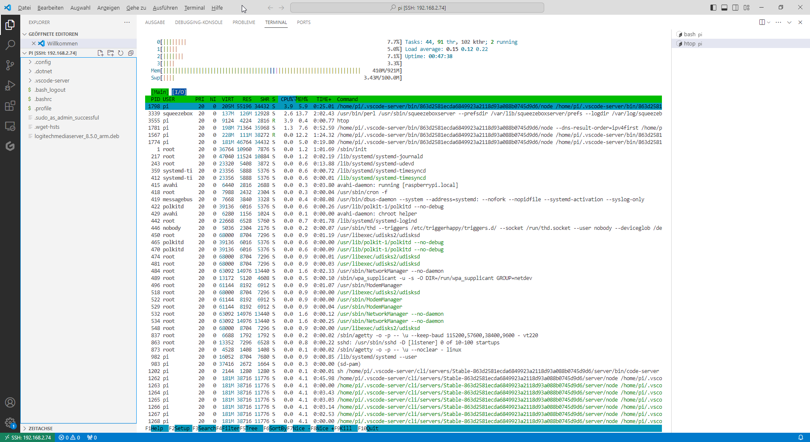

# Logitech Squeezebox UE - EOL - Logitech Media Server 

<https://www.golem.de/news/squeezebox-und-ue-smart-radio-logitech-deaktiviert-funktionen-fuer-musikstreaming-2401-181717.html>


## Raspi V2 OS Lite Image 

<<<<<<< HEAD

https://www.raspberrypi.com/software/operating-systems/#raspberry-pi-os-32-bit
=======

<https://www.raspberrypi.com/software/operating-systems/#raspberry-pi-os-32-bit>
>>>>>>> origin/master
## Rufus Portable 

<http://rufus.ie/en/>


## Getting Started 


<https://lyrion.org/getting-started/#download-and-install-logitech-media-server-v850>

```bash 
sudo apt install libcrypt-openssl-rsa-perl
sudo dpkg -i logitechmediaserver_x.y.z_*.deb
```

```bash 
ssh pi@192.168.2.74
pass raspberry
```
## Log


``` bash 
pi@raspberrypi:~ $ apt --fix-broken install
E: Could not open lock file /var/lib/dpkg/lock-frontend - open (13: Permission denied)
E: Unable to acquire the dpkg frontend lock (/var/lib/dpkg/lock-frontend), are you root?
pi@raspberrypi:~ $ sudo apt --fix-broken install
Reading package lists... Done
Building dependency tree... Done
Reading state information... Done
Correcting dependencies... Done
The following additional packages will be installed:
  libio-socket-ssl-perl libnet-ssleay-perl libregexp-ipv6-perl liburi-perl
Suggested packages:
  libbusiness-isbn-perl libwww-perl
The following NEW packages will be installed:
  libio-socket-ssl-perl libnet-ssleay-perl libregexp-ipv6-perl liburi-perl
0 upgraded, 4 newly installed, 0 to remove and 0 not upgraded.
1 not fully installed or removed.
Need to get 611 kB of archives.
After this operation, 2,108 kB of additional disk space will be used.
Do you want to continue? [Y/n] Y
Get:1 http://raspbian.raspberrypi.com/raspbian bookworm/main armhf libnet-ssleay-perl armhf 1.92-2+b2 [297 kB]
Get:2 http://ftp.halifax.rwth-aachen.de/raspbian/raspbian bookworm/main armhf libio-socket-ssl-perl all 2.081-2 [219 kB]
Get:4 http://mirror1.hs-esslingen.de/pub/Mirrors/archive.raspbian.org/raspbian bookworm/main armhf liburi-perl all 5.17-1 [90.4 kB]
Get:3 http://ftp.halifax.rwth-aachen.de/raspbian/raspbian bookworm/main armhf libregexp-ipv6-perl all 0.03-3 [5,212 B]
Fetched 611 kB in 1s (469 kB/s)                
Selecting previously unselected package libnet-ssleay-perl:armhf.
(Reading database ... 67241 files and directories currently installed.)
Preparing to unpack .../libnet-ssleay-perl_1.92-2+b2_armhf.deb ...
Unpacking libnet-ssleay-perl:armhf (1.92-2+b2) ...
Selecting previously unselected package libio-socket-ssl-perl.
Preparing to unpack .../libio-socket-ssl-perl_2.081-2_all.deb ...
Unpacking libio-socket-ssl-perl (2.081-2) ...
Selecting previously unselected package libregexp-ipv6-perl.
Preparing to unpack .../libregexp-ipv6-perl_0.03-3_all.deb ...
Unpacking libregexp-ipv6-perl (0.03-3) ...
Selecting previously unselected package liburi-perl.
Preparing to unpack .../liburi-perl_5.17-1_all.deb ...
Unpacking liburi-perl (5.17-1) ...
Setting up libnet-ssleay-perl:armhf (1.92-2+b2) ...
Setting up libregexp-ipv6-perl (0.03-3) ...
Setting up liburi-perl (5.17-1) ...
Setting up libio-socket-ssl-perl (2.081-2) ...
Setting up logitechmediaserver (8.5.0) ...
Adding system user `squeezeboxserver' (UID 106) ...
Adding new user `squeezeboxserver' (UID 106) with group `nogroup' ...
Not creating home directory `/usr/share/squeezeboxserver'.
Created symlink /etc/systemd/system/multi-user.target.wants/logitechmediaserver.service → /lib/systemd/system/logitechmediaserver.service.
Processing triggers for man-db (2.11.2-2) ...
pi@raspberrypi:~ $ sudo dpkg -i logitechmediaserver_8.5.0_arm.deb 
(Reading database ... 67467 files and directories currently installed.)
Preparing to unpack logitechmediaserver_8.5.0_arm.deb ...
Unpacking logitechmediaserver (8.5.0) over (8.5.0) ...
Setting up logitechmediaserver (8.5.0) ...
pi@raspberrypi:~ $ 
```

## Logitech Media Server 


http://192.168.2.74:9000/stream.mp3


## Links zu WDR

<https://www1.wdr.de/unternehmen/der-wdr/empfang-technik/webradio-100.html>

## Raspi 2 und CPU 



## Links

<https://lyrion.org/getting-started/#download-and-install-logitech-media-server-v850>
