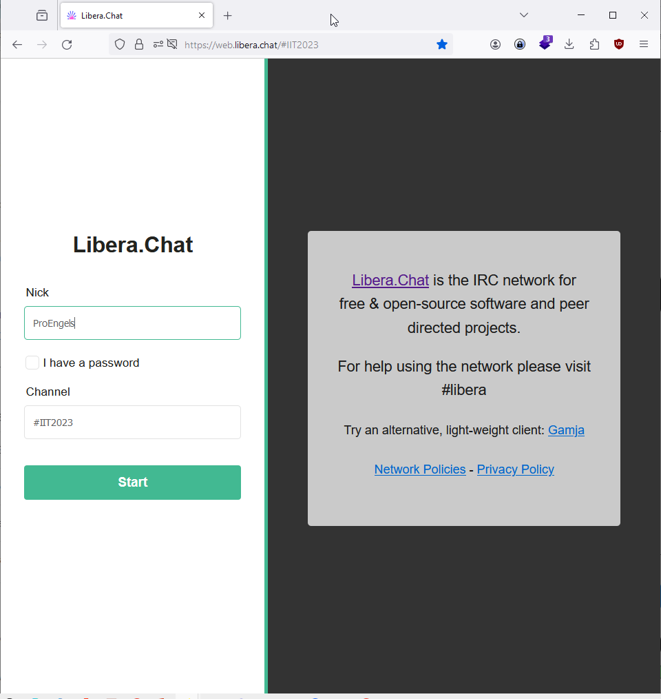
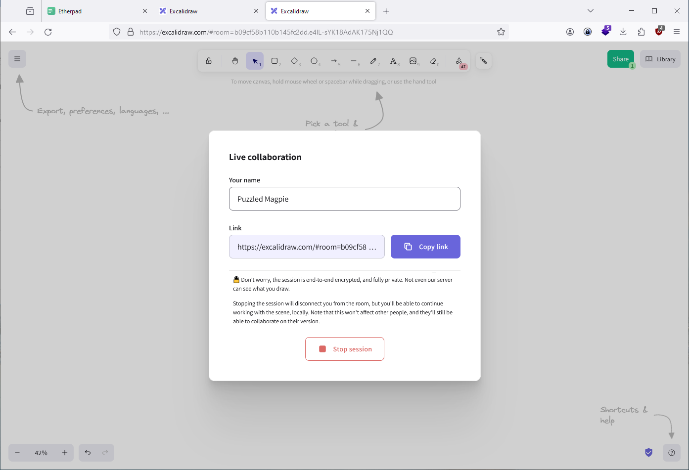
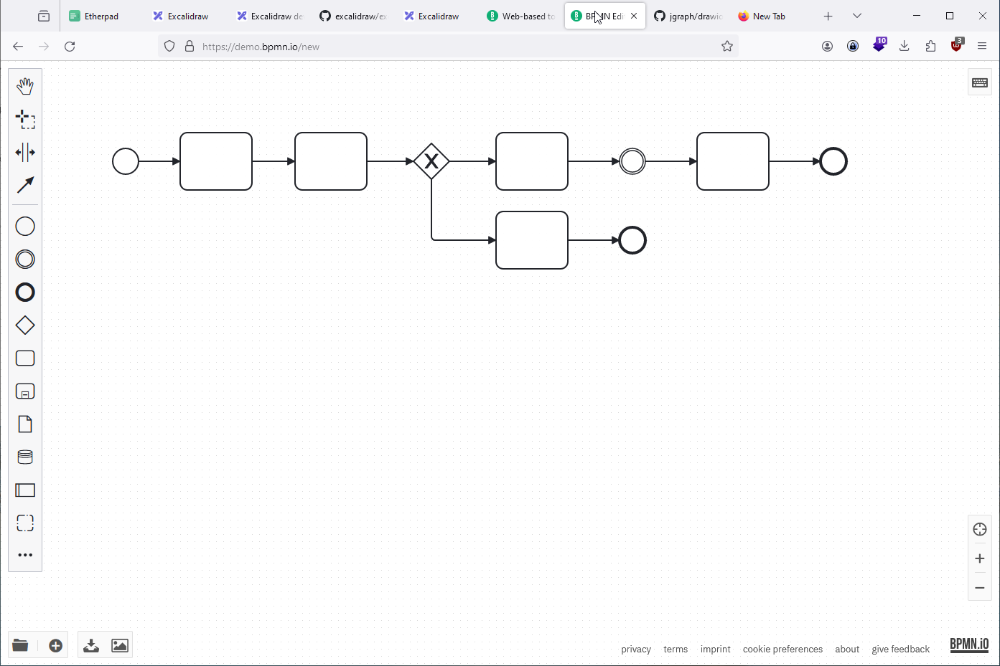
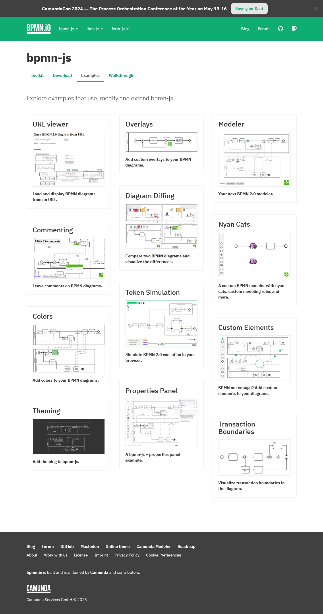
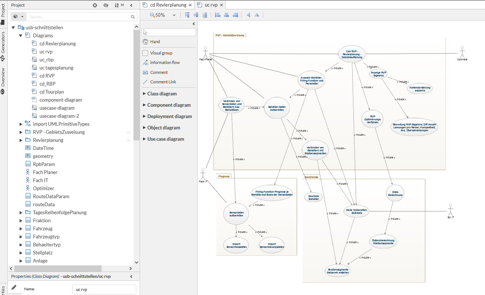
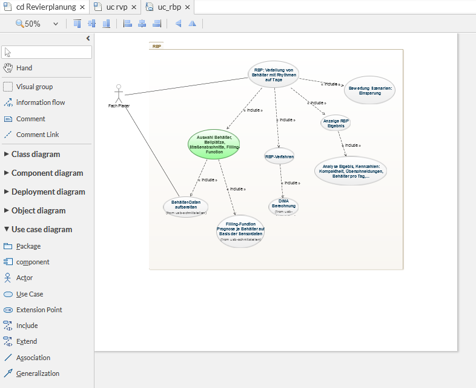
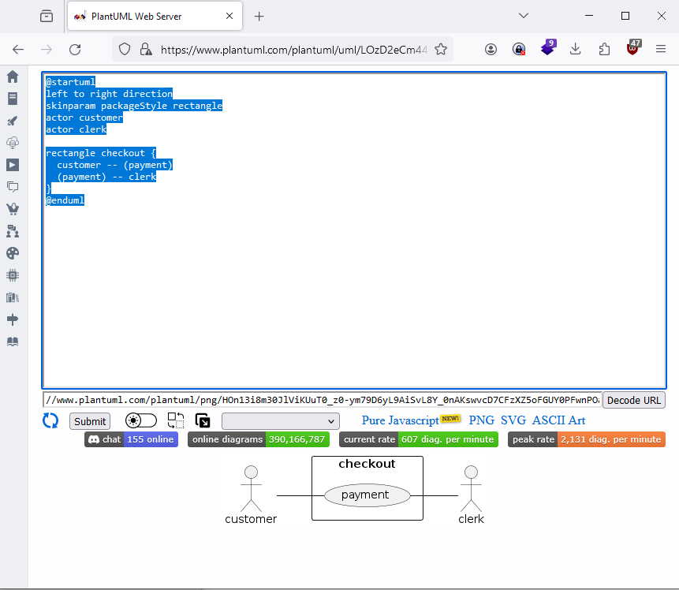
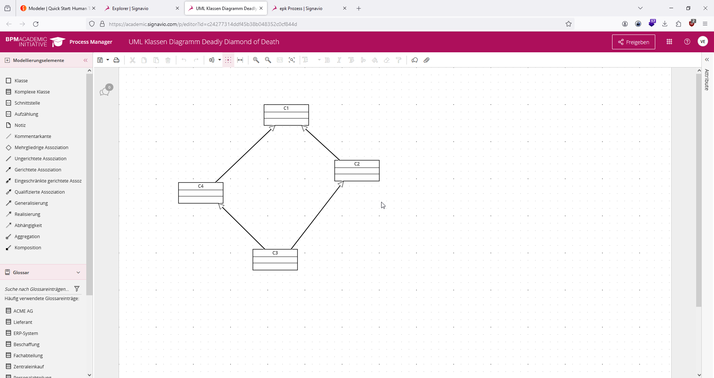
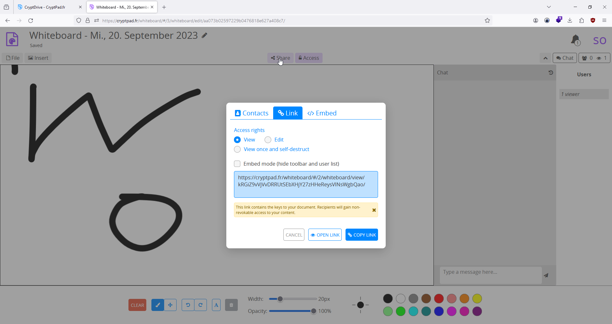
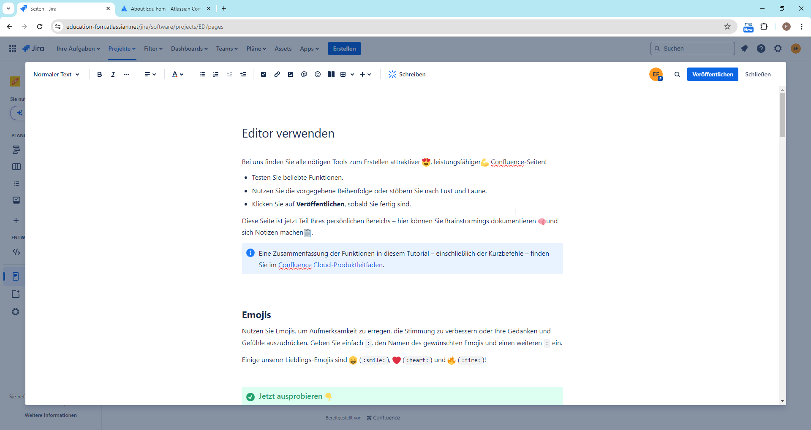

# Online Colaboration Tools 


## Chat 
### Libra Chat (ohne Anmeldung)




<https://web.libera.chat/#IIT2023>

## Web App Design und Run 

### Flutter Flow 


##  Draw Editor - Whiteborad 
### Multiuser Draw Editor Excalidraw (OSS)  ohne Anmeldung 



<https://excalidraw.com/>

<https://github.com/excalidraw/excalidraw>

### draw.io Online Zeichen - Editor (OSS) / ohne Anmeldung 
<https://app.diagrams.net/>

<https://github.com/jgraph/drawio>

#### UML KD


#### Auswahl Vorlagen 

#### EPK 


### bpmn.io (ohne Anmeldung ) - von camunda 






https://demo.bpmn.io/
#### Token Simulation 

https://github.com/bpmn-io/bpmn-js-token-simulation

### GenMyModel 


#### Generators 


#### Projekt Type Selection 


#### UML - Diagram Typen 


#### Beispiel BPMN mit Animation 

#### Beispiel UML Klassendiagramm


#### Beispiel Komponenten Diagramm 


#### Beispiel UML Usecase 


### Miro Board 


### PlantUML - Generator 
#### Liste der Modellierungs-Diagramm-Sprachen


<https://plantuml.com/sitemap-language-specification>

<https://crashedmind.github.io/PlantUMLHitchhikersGuide/layout/layout.html>

<https://plantuml.com/guide>

#### Beispiel Usecase Diagram
```
@startuml
left to right direction
skinparam packageStyle rectangle
actor customer
actor clerk

rectangle checkout {
  customer -- (payment)
  (payment) -- clerk
}
@enduml
```


```
@startuml
' left to right direction
skinparam packageStyle rectangle
actor customer
actor clerk

rectangle checkout {
  customer -- (payment)
  (payment) - clerk
  (payment) ..>(identification) : <<include>>
  (help) .> (payment) : <<extends>>
}
@enduml

```


#### Beispiel Class Diagram 
``` code 
@startuml
left to right direction
'top to bottom direction
class Haus {
  wand:Wand
}
Haus --- "abmessung" Abmessung3d
class Raum {
  raumnummer: String
}
Raum ---"abmessung" Abmessung3d

class Abmessung3d{
  länge_cm: double
  breite_cm: double
  höhe_cm: double
}

class Wand {
  berechneOberfläche(): double
}

Wand "1"--"abmessung" Abmessung3d

class Farbe {
  name: String
  rbg: int
}

class Tür
Tür --"abmessung" Abmessung3d
Tür "1"--"0..*" Fenster 
class Fenster 
Fenster --"abmessung" Abmessung3d
class Gebäude 
Wand "1"--"0..*" Tür
Gebäude <|--Haus
Haus "1"*--- "1..*" Raum
Raum "1"---"1..*" Wand
Wand "1"---"0..*" Fenster 
Wand "1..*"---"farbe" Farbe


@enduml
```


<https://www.plantuml.com/plantuml/uml/XP5FIZGn4CNtTOgYDz-dq8FYhd4nRaPtWYvSIjAfwGxaZoGLNAYtcJDuWRcOIIRJ3eAugJn-nNjvdLv75e6JDM1eoyWUWvvcHgK3ZQozWt_iNmgNdjdRayLeH8nu9rB4Dq1y5KuDJtd01xJTWqWsxpAegk_xJaXBCIOtTNXpb5Ug6KvHYJJxdPleURG3Af-aeSna8Cq_sBp_d2jgP2bGwjHoMn4a3RWf1vOK2ZJEZkwpsEPhnfd-dmsu-Aknk-p-R5mJwnLEM1hmaODs4o06EGse7N-NsP2BJ07XA7uDRuPRaljTKeG0Yxn-x_lov536eM6VZzNglAlF3MKqtd3z9sKSyKN5IvssAh2QkiD7mPgSIjPy0G00>

## BPMN Suites

### Signavio - Academic  


#### Beispiel BPMN Token 


#### Beispiel EPK


#### Beispiel UML Klassendiagramm 



#### Beispiel UML Usecase Diagramm 


<https://academic.signavio.com/p/explorer>

### Camunda 


### Camunda Formular Builder


<https://demo.bpmn.io/form/new>

## Multiuser Text Editor 

### Etherpad - OSS 


Testinstanz: 
<https://etherpad.wikimedia.org/>

Sites That Run Etherpad:

<https://github.com/ether/etherpad-lite/wiki/Sites-That-Run-Etherpad#sites-that-run-etherpad>

<https://etherpad.org/#/#download>
<https://github.com/ether/etherpad-lite>

<https://de.m.wikipedia.org/wiki/Etherpad>

## Office - Word - Excel - Powerpoint 

### Google Documents 

### MS Teams 

### CryptPad (ohne Anmeldung) 


#### Beispiel Multiuser - Whiteboard 




## Online Feedback 

### Mentimeter 


### Padlet - 


<https://padlet.com/dashboard/gallery/all>

## Projekt-Management 

### Jira - Confluence 

#### Beispiel Zeitleiste Gantt 


#### Beispiel Kanban Board 


