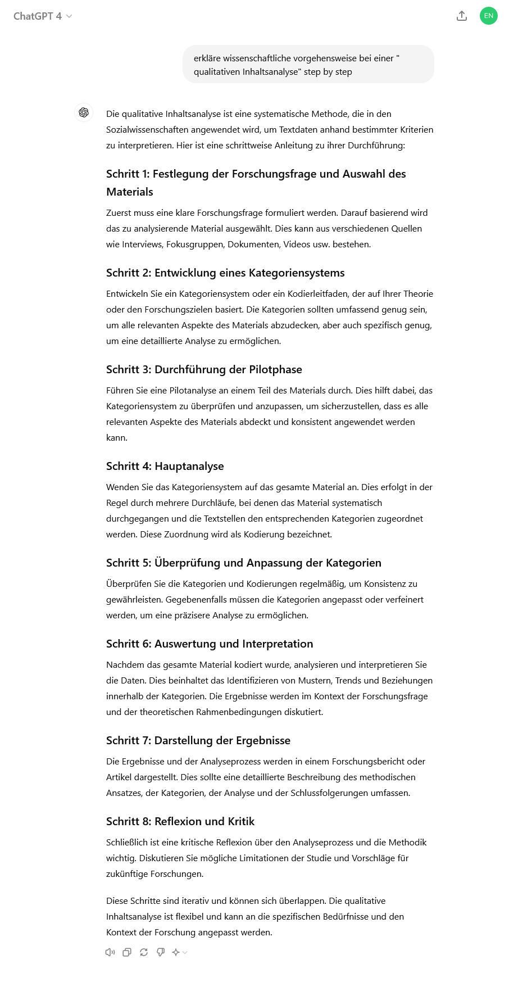
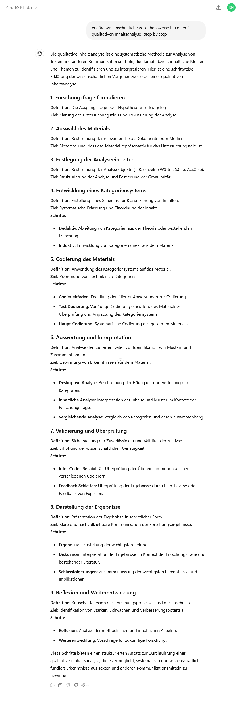
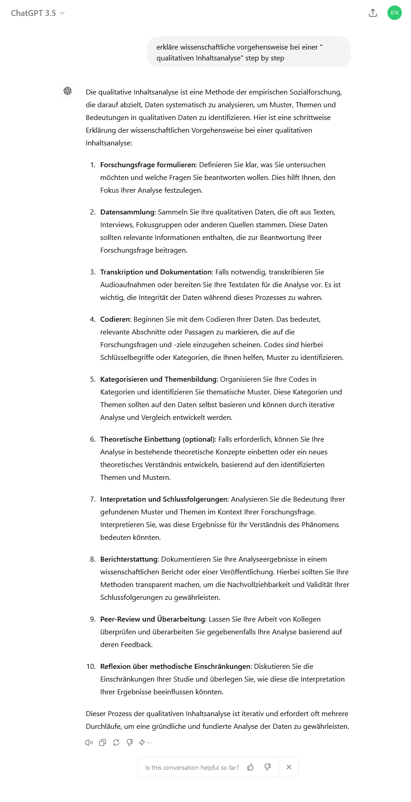
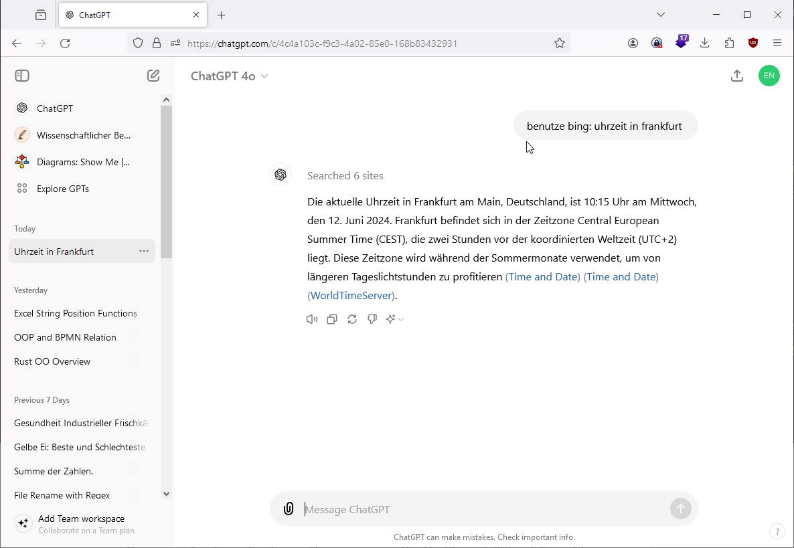
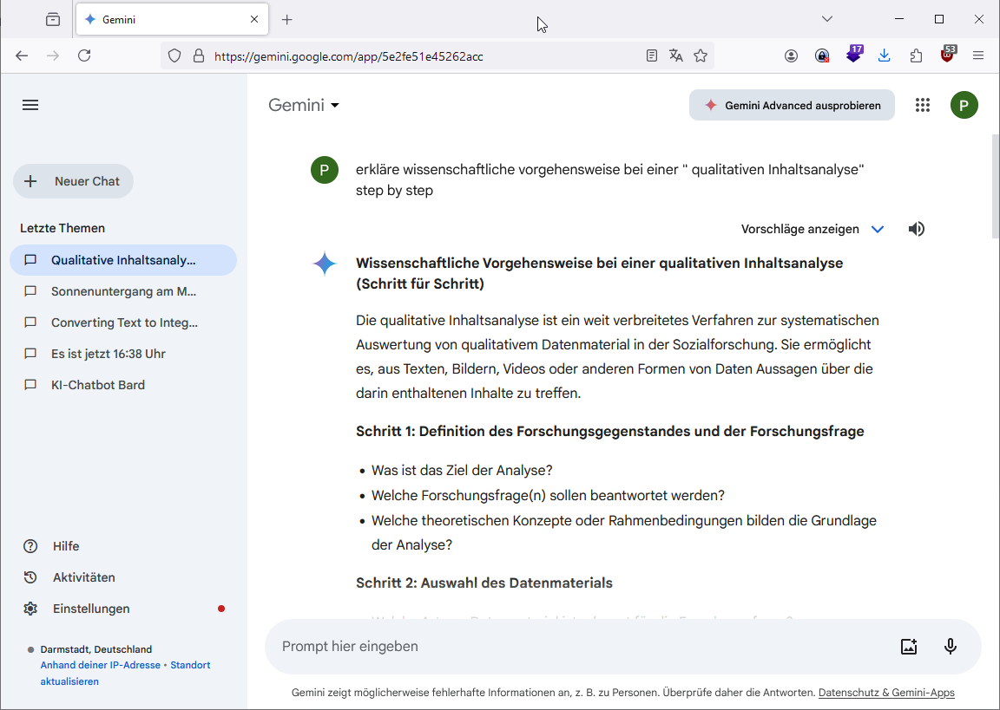
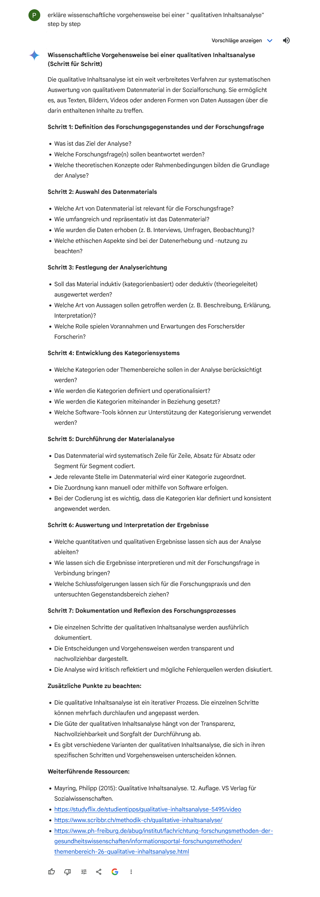
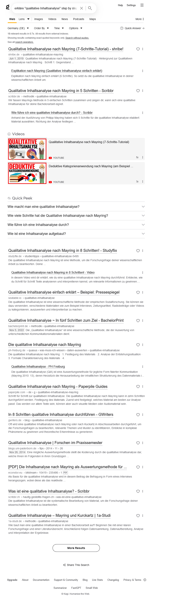
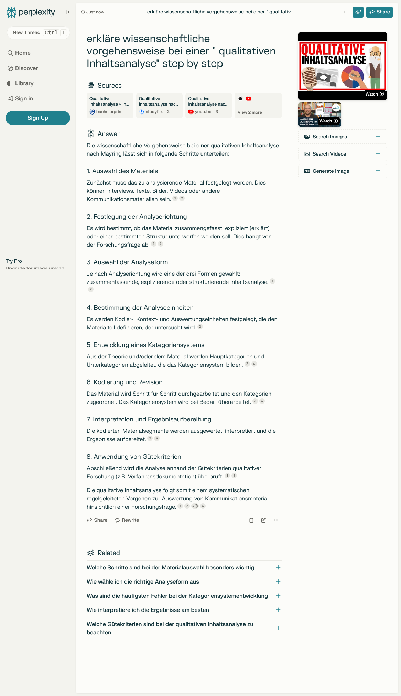
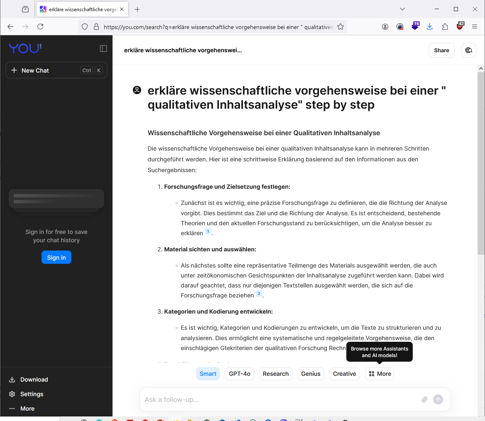
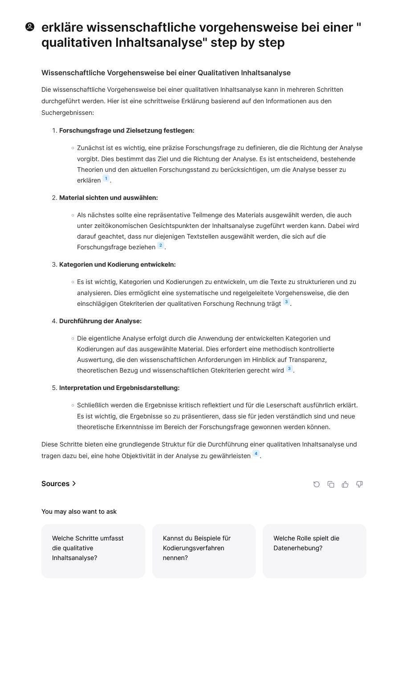

# Suchmaschinen mit KI - Beispiel 'erkläre wissenschaftliche vorgehensweise bei einer " qualitativen Inhaltsanalyse" step by step'

## [**Bing**](https://bing.com)

## [**Brave Search**](https://search.brave.com)

  
## [**ChatGPT**](https://chatgpt.com)

### Websuchen mit "Benutze Bing" 

### GPT - Store

    
##  [**Google Gemini**](https://gemini.google.com)

### Hotelreservierung 

##  [**Kagi**](https://kagi.com)

## [**Perplexity**](https://www.perplexity.ai)

## [**You.com**](https://you.com)

##  [**Arc Search**](https://apps.apple.com/us/app/arc-search-find-it-faster/id6472513080)

- nur Iphone 

