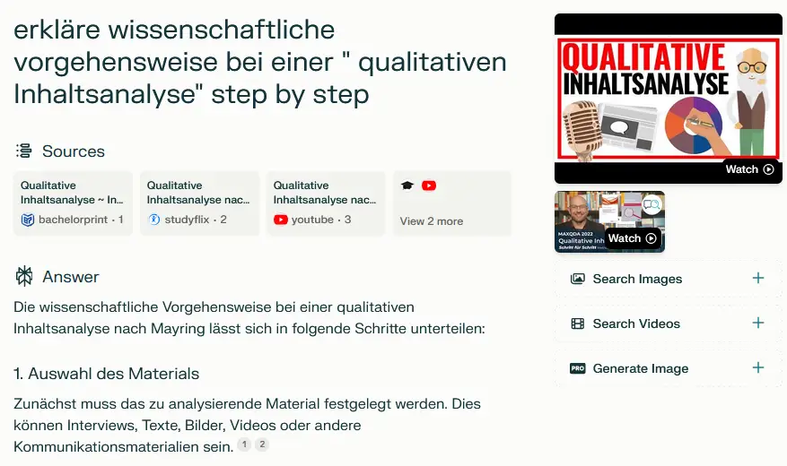
# Suchmaschinen mit KI - Beispiel 'erkläre wissenschaftliche Vorgehensweise bei einer "qualitativen Inhaltsanalyse" step by step'

## [**Bing**](https://bing.com)

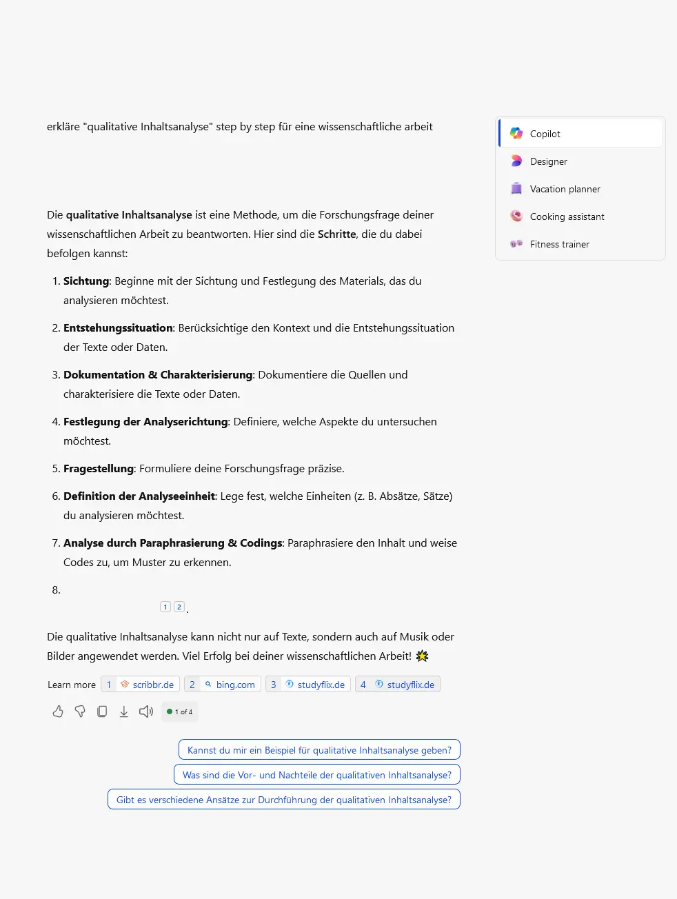

## [**Brave Search**](https://search.brave.com)

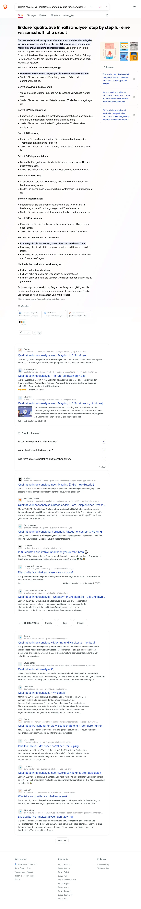
  
## [**ChatGPT**](https://chatgpt.com)

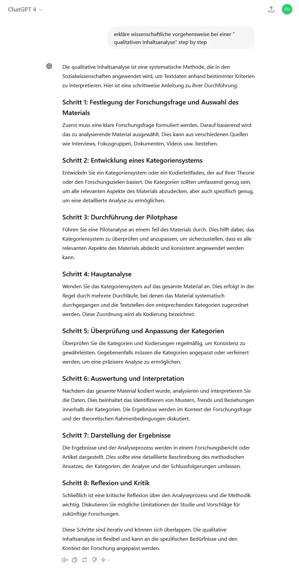

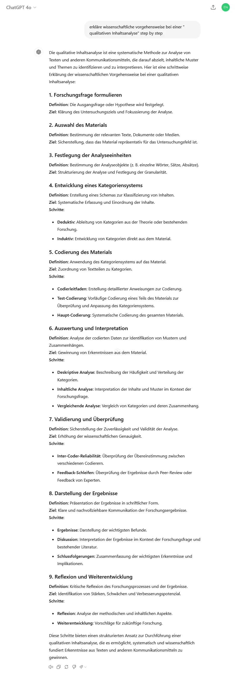

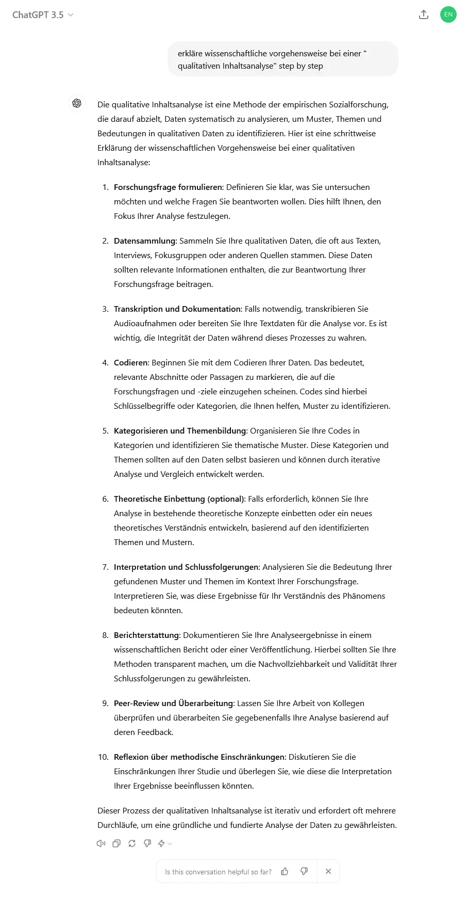

### Websuchen mit "Benutze Bing" 
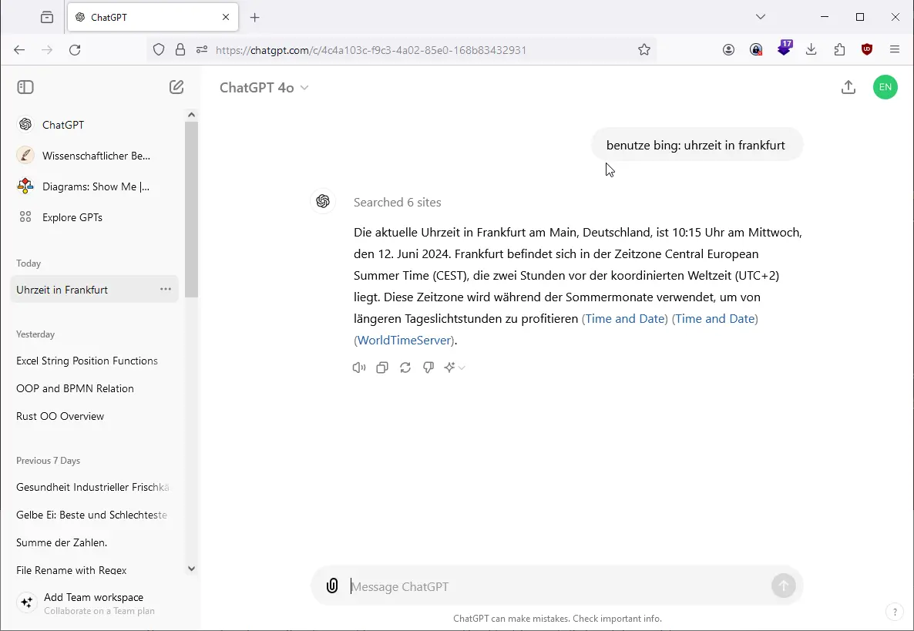
### GPT - Store

    
##  [**Google Gemini**](https://gemini.google.com)

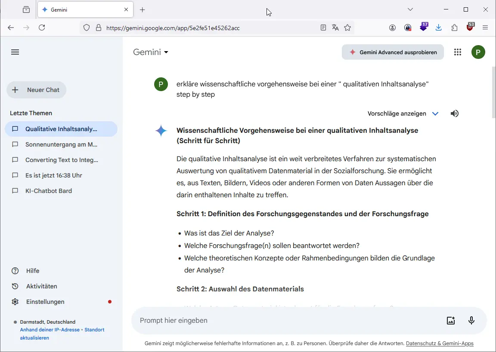

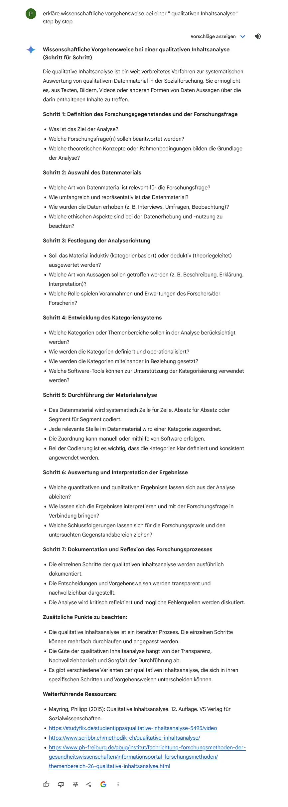
### Hotelreservierung 
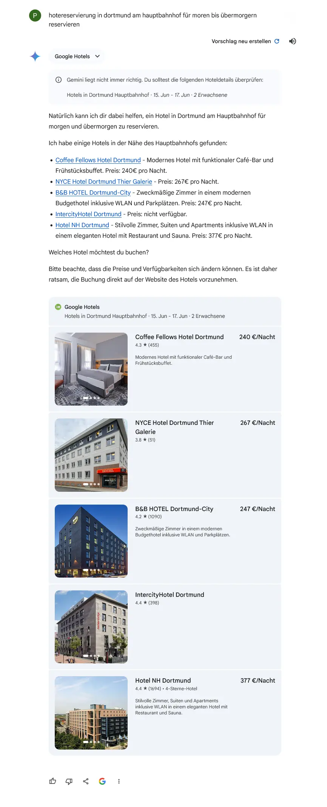

##  [**Kagi**](https://kagi.com)

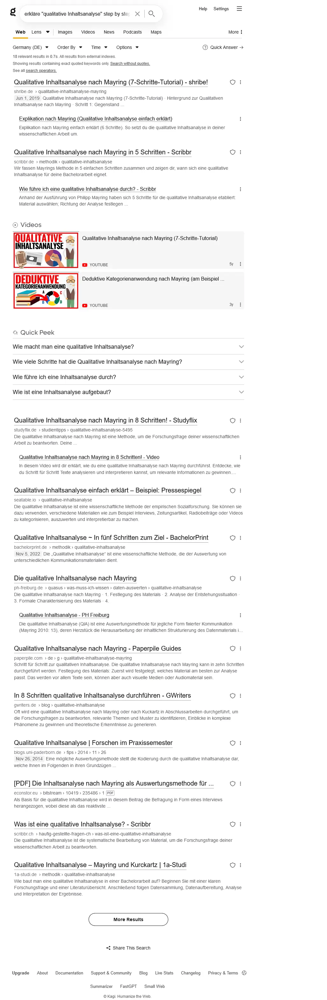
## [**Perplexity**](https://www.perplexity.ai)

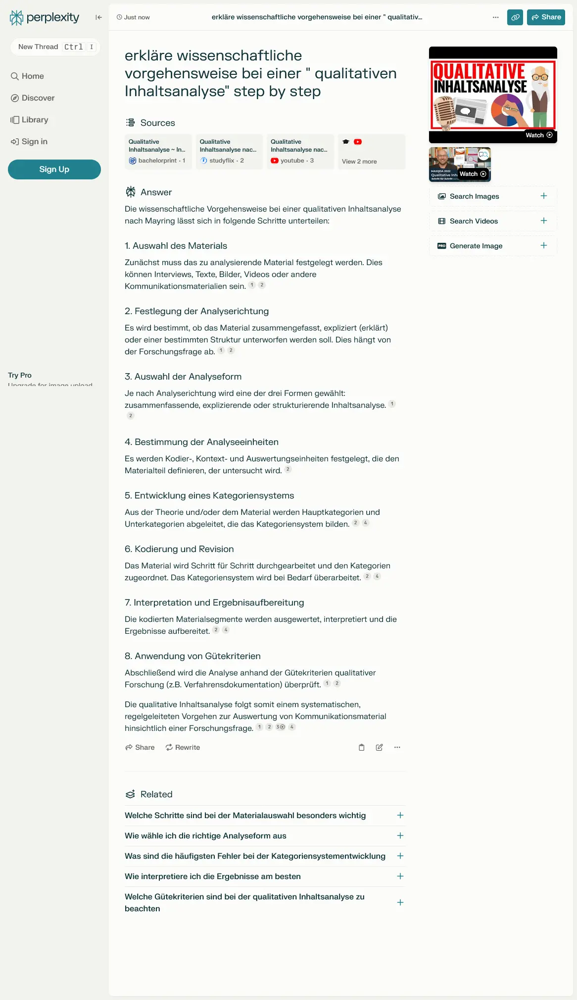

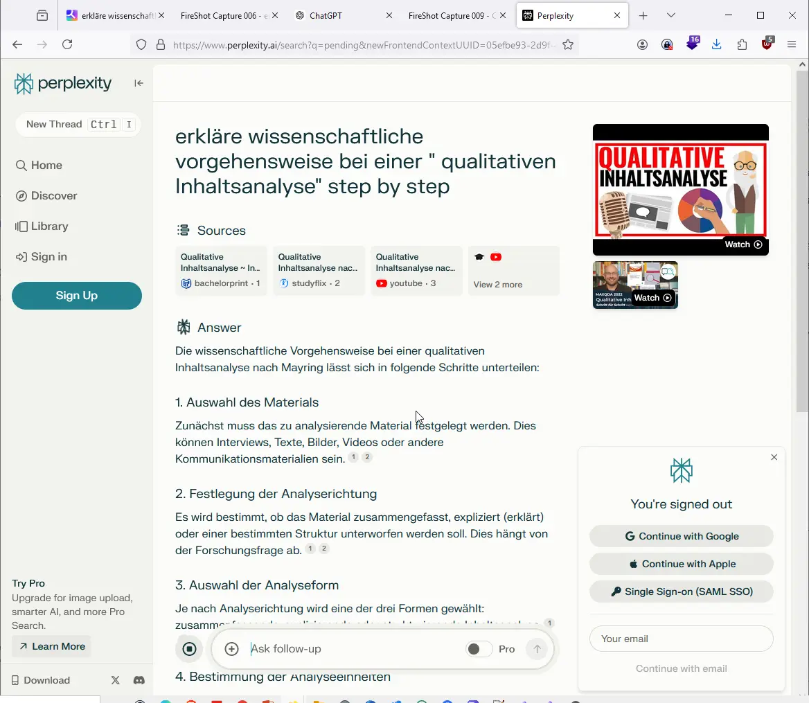

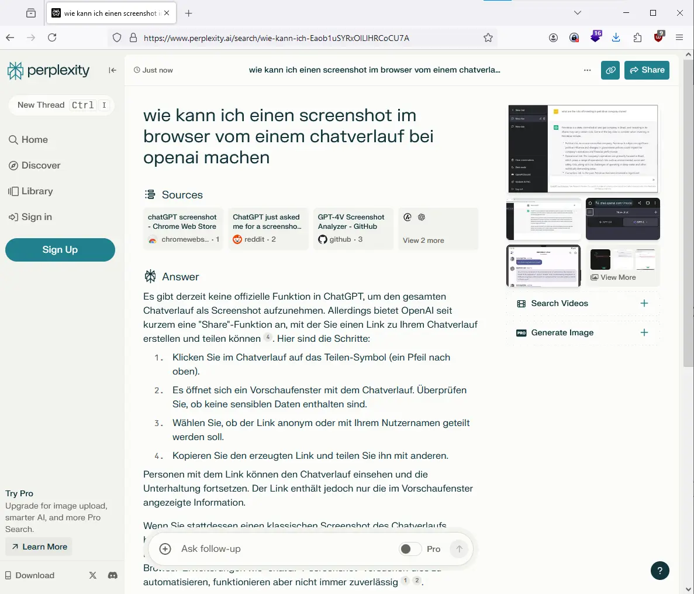
## [**You.com**](https://you.com)

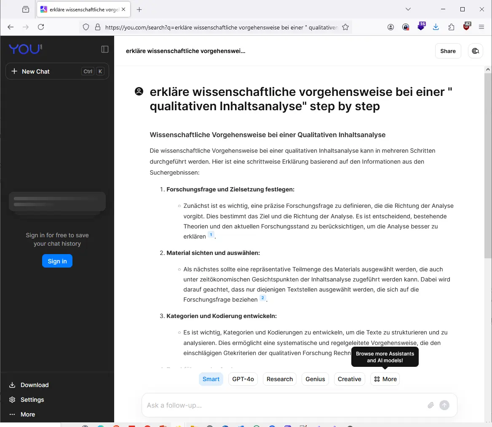

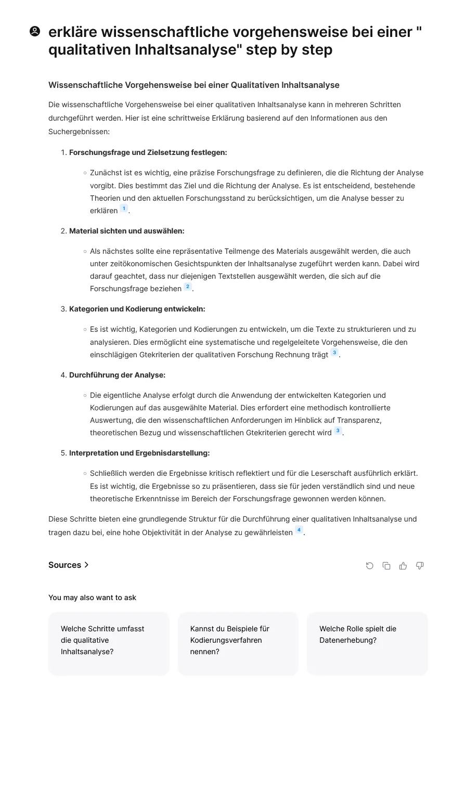

##  [**Arc Search**](https://apps.apple.com/us/app/arc-search-find-it-faster/id6472513080)

- nur Iphone 

