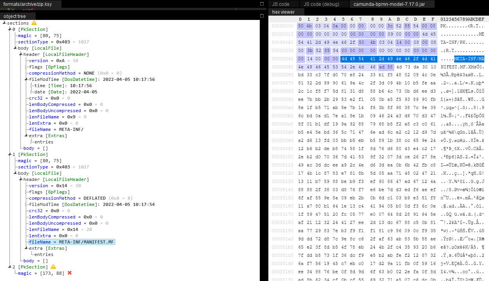
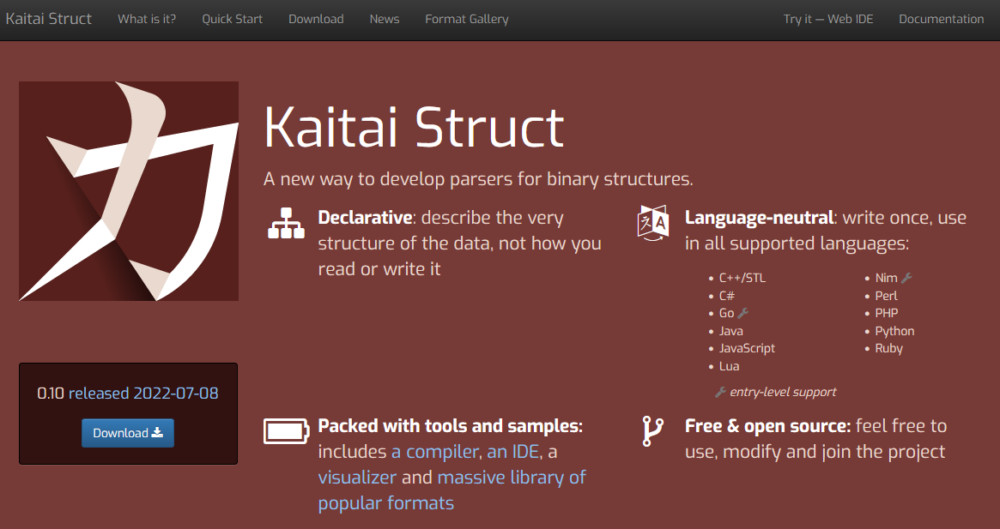
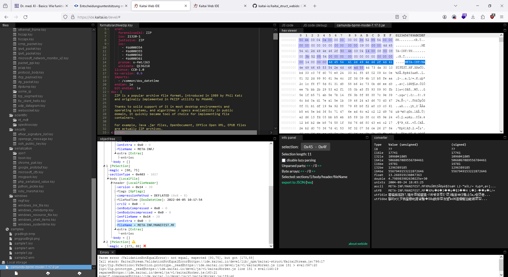

## Kaitai Struct - A new way to develop parsers for binary structures.

Reading and writing binary formats is hard, especially if it’s an interchange format that should work across a multitude of platforms and languages.

Have you ever found yourself writing repetitive, error-prone and hard-to-debug code that reads binary data structures from files or network streams and somehow represents them in memory for easier access?

Kaitai Struct tries to make this job easier — you only have to describe the binary format once and then everybody can use it from their programming languages — cross-language, cross-platform.

# What is Kaitai Struct?

Kaitai Struct is a declarative language used to describe various binary data structures, laid out in files or in memory: i.e. binary file formats, network stream packet formats, etc.

The main idea is that a particular format is described in Kaitai Struct language (`.ksy` file) and then can be compiled with `ksc` into source files in one of the supported programming languages. These modules will include a generated code for a parser that can read the described data structure from a file or stream and give access to it in a nice, easy-to-comprehend API.

http://kaitai.io/#what-is-it
http://kaitai.io/news/2024/02/21/web-ide-improvements.html