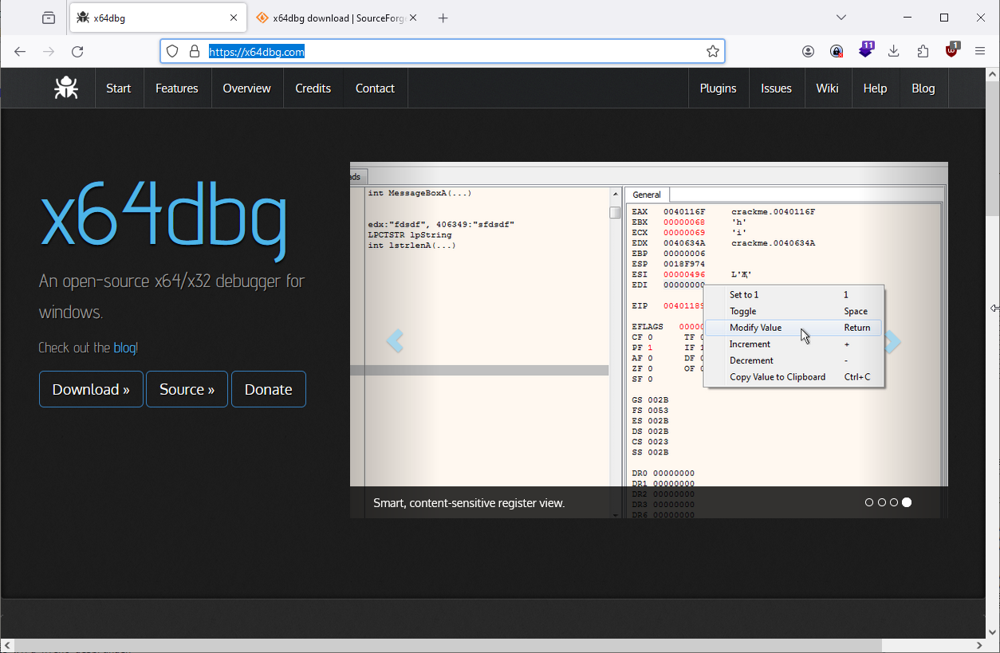
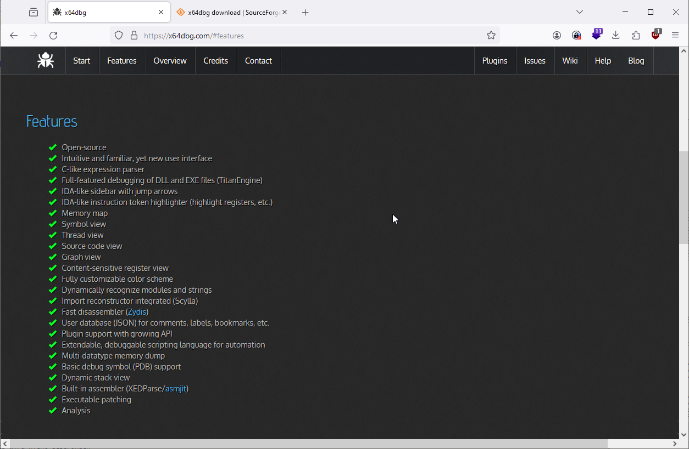
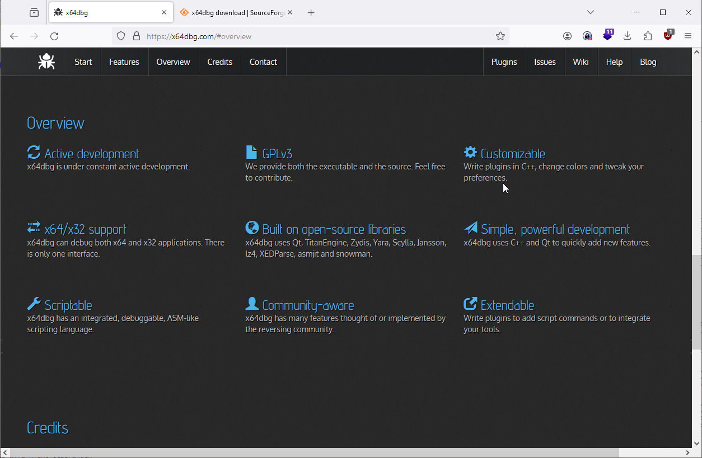
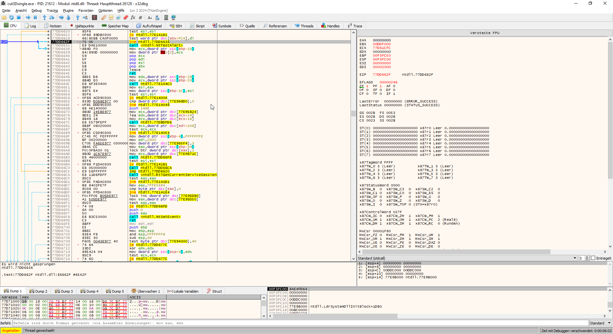
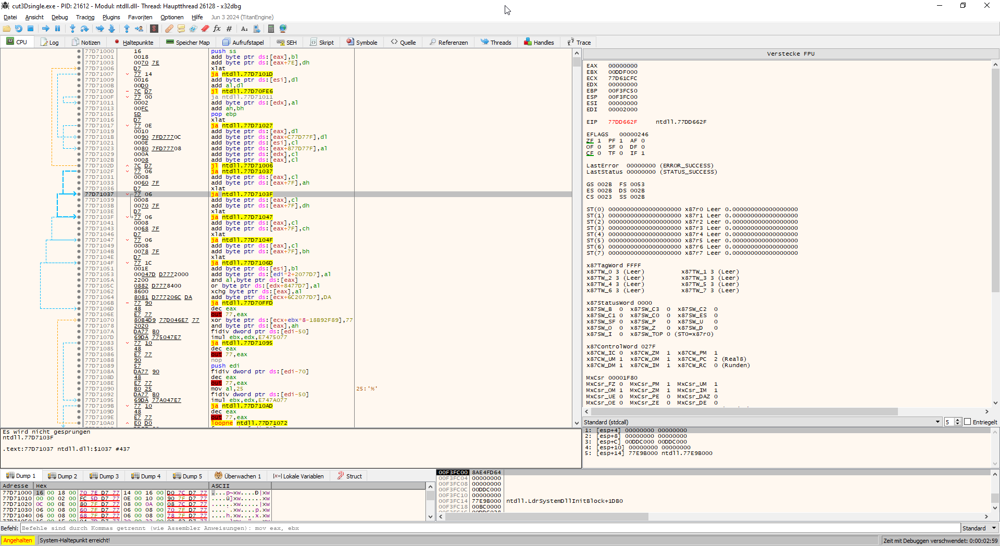
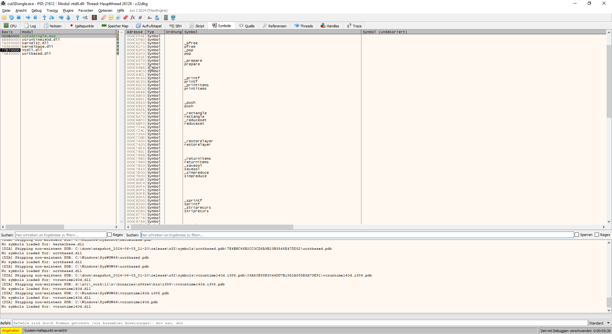
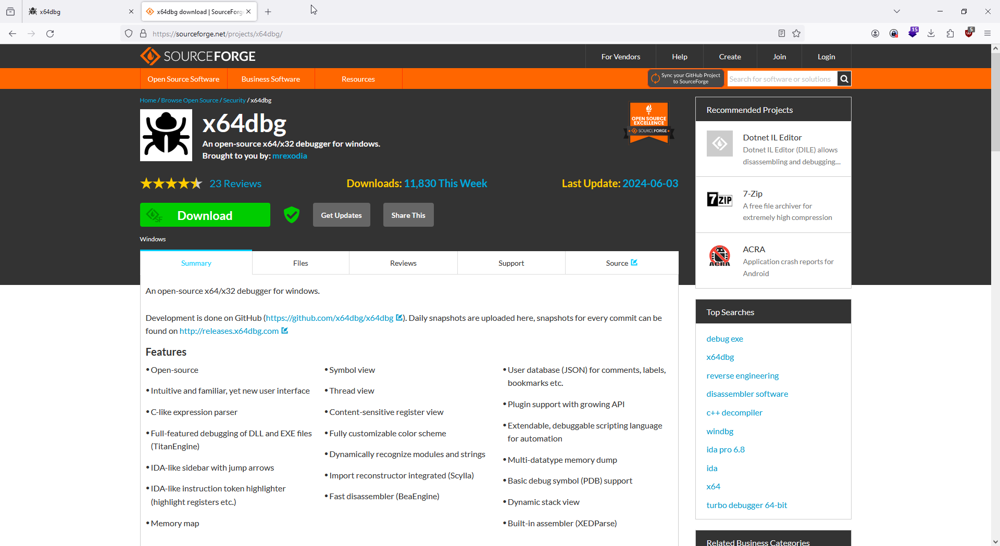

# Debugger x32dbg x64dbg 

An open-source binary debugger for Windows, aimed at malware analysis and reverse engineering of executables you do not have the source code for. There are many features available and a comprehensive [plugin system](https://plugins.x64dbg.com) to add your own. You can find more information on the [blog](https://x64dbg.com/blog)!

## Features

- Open-source
- Intuitive and familiar, yet new user interface
- C-like expression parser
- Full-featured debugging of DLL and EXE files (TitanEngine)
- IDA-like sidebar with jump arrows
- IDA-like instruction token highlighter (highlight registers, etc.)
- Memory map
- Symbol view
- Thread view
- Source code view
- Graph view
- Content-sensitive register view
- Fully customizable color scheme
- Dynamically recognize modules and strings
- Import reconstructor integrated (Scylla)
- Fast disassembler ([Zydis](https://zydis.re))
- User database (JSON) for comments, labels, bookmarks, etc.
- Plugin support with growing API
- Extendable, debuggable scripting language for automation
- Multi-datatype memory dump
- Basic debug symbol (PDB) support
- Dynamic stack view
- Built-in assembler (XEDParse/[asmjit](https://github.com/asmjit))
- Executable patching
- Analysis

 

Symbole

https://x64dbg.com/

https://sourceforge.net/projects/x64dbg/

https://x64dbg.com/blog/

https://github.com/x64dbg/x64dbg

https://github.com/x64dbg/x64dbg/wiki/Plugins