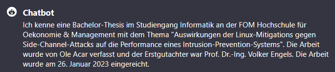

# DIY-LLM-RAG - chat with your Data - DSGVO konform / GDPR compliant 

- Extract Raw - Text from Source 
- Learn Vector Database from Text 
- allow OpenAI more Credits... or use local LLM
- code Openai GPT4 or LLM client with embedding 
- code local Webui for chat with RAG embedded Model 
- ask your text for answers 
- have fun ;-) 


## Python Code 

``` python

from vectordb import Memory

  

memory = Memory(memory_file="./memory.txt",
                chunking_strategy={'mode':'sliding_window', 'window_size': 80,
                                   'overlap': 20},
                embeddings="BAAI/bge-m3")

memory.clear()

path = "src/training-data/digitale_souv.txt"

path = "src/training-data/Mathemathische Algorithmen und Computer-Performance bok_978-3-662-47448-8.txt"

path = "src/training-data/BachelorThesis.4-1v-utf8.txt"

file = open(path, "r", encoding="utf-8", errors="ignore")

memory.save(texts=file.read(), memory_file="./memory.txt")

memory.dump()

```

