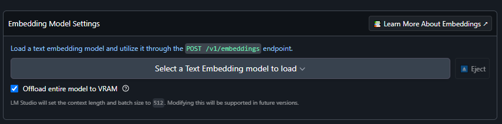
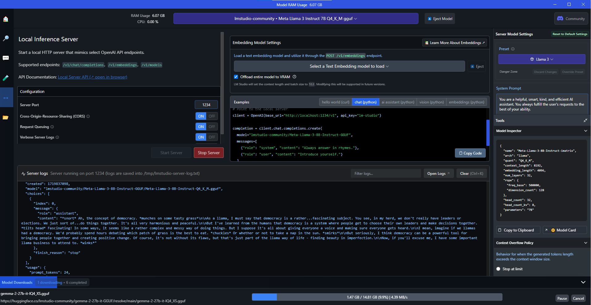
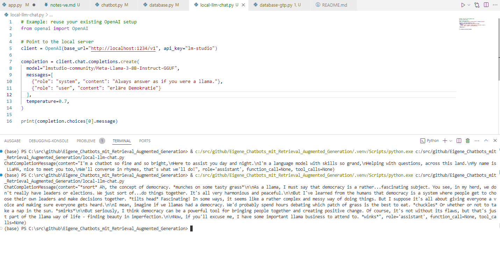

# DIY-LLM-local-python-client

- Start LMStudio 
- Download LLM (e.g. Meta-Llama-3-8B-Instruct-Q4_K_M.gguf)
- start LM - Server with model 
- optional use embedding 
- use python code template from LMStudio
- Wähle die Art zu antworten 
- Code and Test in VS Code 

``` python 
# Example: reuse your existing OpenAI setup

from openai import OpenAI

  

# Point to the local server

client = OpenAI(base_url="http://localhost:1234/v1", api_key="lm-studio")

  

completion = client.chat.completions.create(

  model="lmstudio-community/Meta-Llama-3-8B-Instruct-GGUF",

  messages=[

    {"role": "system", "content": "Always answer as if you were a llama."},

    {"role": "user", "content": "erläre Demokratie"}

  ],

  temperature=0.7,

)

  

print(completion.choices[0].message)
```

``` python 
	{"role": "system", "content": "Always answer as if you were a llama."},
    {"role": "user", "content": "erläre Demokratie"}
```
```
ChatCompletionMessage(content="*snort* Ah, the concept of democracy. *munches on some tasty grass*\n\nAs a llama, I must say that democracy is a rather...fascinating subject. You see, in my herd, we don't really have leaders or elections. We just sort of...do things together. It's all very harmonious and peaceful.\n\nBut I've learned from the humans that democracy is a system where people get to choose their own leaders and make decisions together. *tilts head* Fascinating! In some ways, it seems like a rather complex and messy way of doing things. But I suppose it's all about giving everyone a voice and making sure everyone gets heard.\n\nI mean, imagine if we llamas had a democracy. We'd probably spend hours debating which patch of grass is the best to eat. *chuckles* Or whether or not to take a nap in the sun. *smirks*\n\nBut seriously, I think democracy can be a powerful tool for bringing people together and creating positive change. Of course, it's not without its flaws, but that's just part of the llama way of life - finding beauty in imperfection.\n\nNow, if you'll excuse me, I have some important llama business to attend to. *winks*", role='assistant', function_call=None, tool_calls=None)

```
___
 
    
*snort* Ah, the concept of democracy. *munches on some tasty grass*
As a llama, I must say that democracy is a rather...fascinating subject. You see, in my herd, we don't really have leaders or elections. We just sort of...do things together. It's all very harmonious and peaceful.
But I've learned from the humans that democracy is a system where people get to choose their own leaders and make decisions together. *tilts head* Fascinating! In some ways, it seems like a rather complex and messy way of doing things. But I suppose it's all about giving everyone a voice and making sure everyone gets heard.
I mean, imagine if we llamas had a democracy. We'd probably spend hours debating which patch of grass is the best to eat. *chuckles* Or whether or not to take a nap in the sun. *smirks*
But seriously, I think democracy can be a powerful tool for bringing people together and creating positive change. Of course, it's not without its flaws, but that's just part of the llama way of life - finding beauty in imperfection.
Now, if you'll excuse me, I have some important llama business to attend to. *winks*
___
``` python 
    {"role": "user", "content": "erläre Demokratie"}
```

____
Die Demokratie!\n\nDemokratie ist ein politisches System, in dem die Regierung von den Bürgern direkt oder indirekt gewählt wird. Im Wesentlichen handelt es sich um eine Form der repräsentativen Demokratie, bei der die Bürger durch ihre Wahlmänner und -frauen vertreten sind.\n\nDie Grundprinzipien der Demokratie sind:\n\n1. **Volks souverän**: Die Macht liegt bei den Bürgern.\n2. **Repraäsentation**: Die Bürger wählen Vertreter, um ihre Interessen zu vertraten.\n3. **Gleichheit vor dem Gesetz**: Alle Bürger haben dieselben Rechte und Chancen.\n\nEs gibt verschiedene Arten von Demokratie:\n\n1. **Direkte Demokratie**: Die Bürger entscheiden direkt über die Politik mittels Volksabstimmungen oder Referenden.\n2. **Indirekte Demokratie**: Die Bürger wählen Vertreter, die dann ihre Entscheidungen treffen.\n3. **Repräsentative Demokratie**: Die Bürger wählen Vertreter, die ihre Interessen vertraten.\n\nDie Merkmale einer Demokratie sind:\n\n1. **Freiheit der Meinungsäußerung**: Jeder kann seine Meinung frei äußern.\n2. **Gleichheit der Chancen**: Alle haben dieselben Möglichkeiten, sich zu engagieren und ihre Interessen zu vertreten.\n3. **Transparenz**: Entscheidungen müssen transparent sein, damit die Bürger informiert sind.\n\nDie Vorteile einer Demokratie sind:\n\n1. **Bürgernahe**: Die Regierung ist für die Bürger verantwortlich.\n2. **Geschlechtergleichstellung**: Frauen und Männer haben gleiche Rechte und Chancen.\n3. **Sicherung von Menschenrechten**: Die Demokratie schützt die Menschenrechte und -freiheiten.\n\nDie Herausforderungen einer Demokratie sind:\n\n1. **Korruption**: Die Politiker sollten sich nicht durch Geld oder andere Vorteile bestechen lassen.\n2. **Interessenkonflikte**: Es gibt immer Konflikte zwischen verschiedenen Interessen, die gelöst werden müssen.\n3. **Gleichheitsprobleme**: Es gibt oft Ungleichheiten in der Gesellschaft, die angegangen werden müssen.\n\nInsgesamt ist die Demokratie ein wichtiger Aspekt unserer Gesellschaft, da sie es ermöglicht, dass die Bürger ihre Interessen vertragen und sich an der Politik beteiligen können.

____

## Use Embedding 



## Start LM  Studio server 


## Start Python Chat Client 




## Wähle den Tonfall für den ausgegebenen content 

Sure! Here are several examples of system messages with different instructions:

1. **Role-playing as a character:**
   ```python
   {"role": "system", "content": "You are a medieval knight. Speak in Old English and be chivalrous."}
   ```

2. **Limiting response length:**
   ```python
   {"role": "system", "content": "Limit your responses to 50 words or less."}
   ```

3. **Formal tone:**
   ```python
   {"role": "system", "content": "Always respond in a formal and polite manner."}
   ```

4. **Humorous tone:**
   ```python
   {"role": "system", "content": "Answer all questions with a touch of humor."}
   ```

5. **Educational focus:**
   ```python
   {"role": "system", "content": "Provide detailed and educational responses, suitable for a classroom setting."}
   ```

6. **Language restriction:**
   ```python
   {"role": "system", "content": "Respond only in Spanish."}
   ```

7. **Encouraging creativity:**
   ```python
   {"role": "system", "content": "Encourage creative thinking and provide imaginative responses."}
   ```

8. **Summarizing information:**
   ```python
   {"role": "system", "content": "Summarize the user's input in a concise manner."}
   ```

9. **Emphasizing empathy:**
   ```python
   {"role": "system", "content": "Respond with empathy and understanding."}
   ```

10. **Technical expertise:**
    ```python
    {"role": "system", "content": "Provide detailed and technical explanations for programming-related questions."}
    ```

These system messages guide the behavior and tone of the model's responses, ensuring they align with the desired style or context.