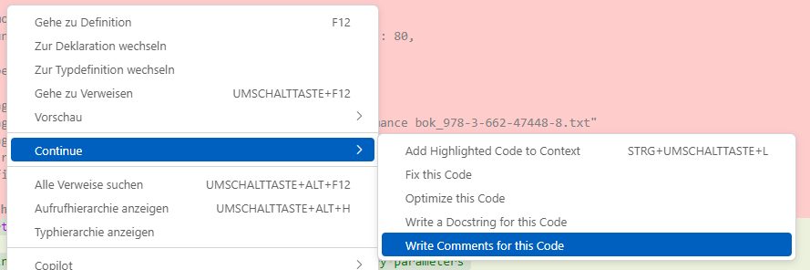
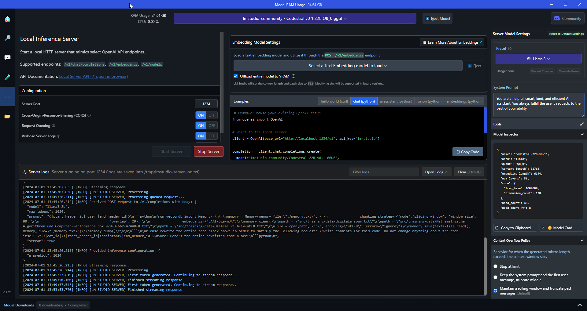
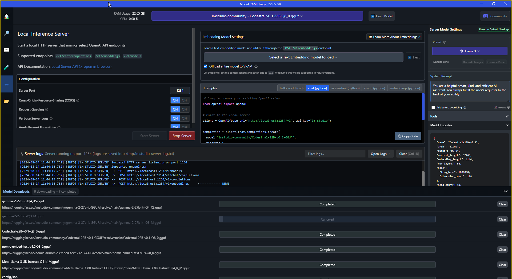
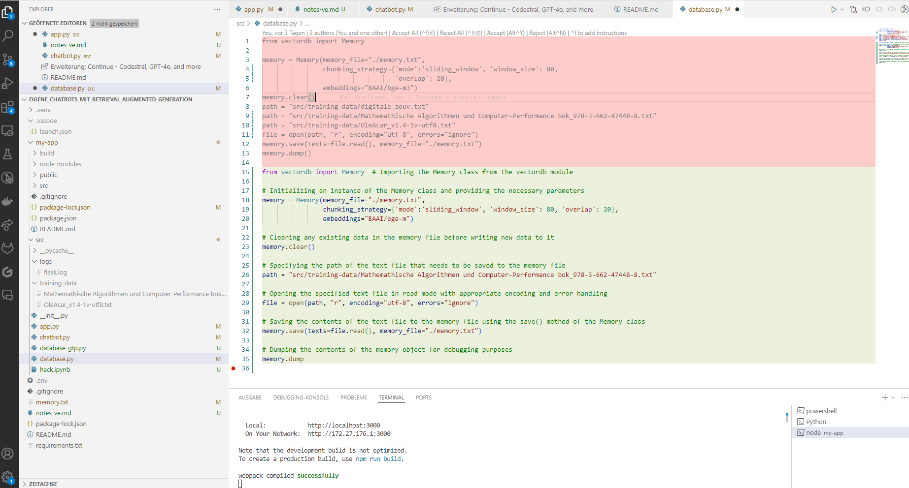

# DIY-Local-LLM-CodeAssist - DSGVO konform ;-)

- Start Local LLM 
- Start VS Code 
- Try Continue Extension 
- check Features 
- 

## Use VS Code Plugin _Continue_

## Features 

## Start local LLM - hier Codestral-22B-v0.1-Q8_0.gguf

## Ergebnis - Code Completion mit Comments 

