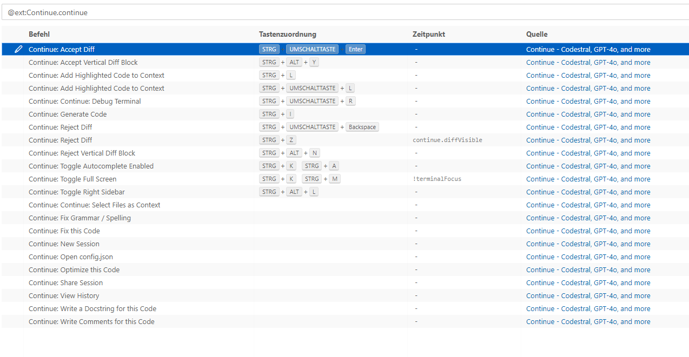
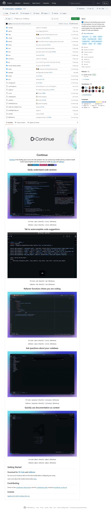
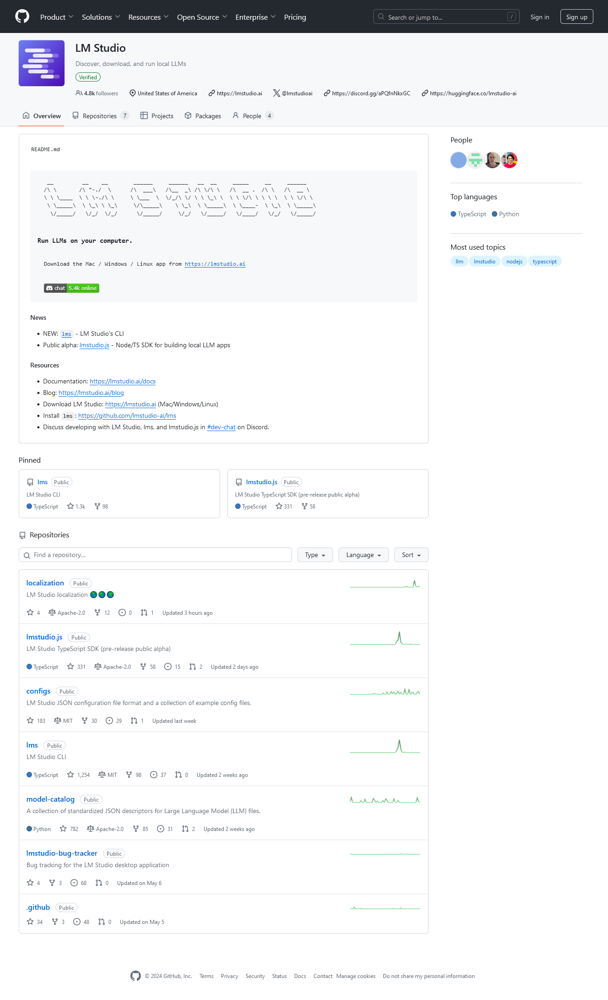

# DIY-Local-LLM-CodeAssist - DSGVO konform ;-)

- Start Local LLM 
- Start VS Code 
- Try Continue Extension 
- check Features 
- 

## Start local LLM - hier Codestral-22B-v0.1-Q8_0.gguf

## Use VS Code Plugin _Continue_

## Features 

## Ergebnis - Code Completion mit Comments 

## Links

- LM Studio https://github.com/lmstudio-ai
- Codestral-22B-v0.1-Q8_0.gguf: https://huggingface.co/lmstudio-community/Codestral-22B-v0.1-GGUF/resolve/main/Codestral-22B-v0.1-Q8_0.gguf
- VSCode Continue: https://docs.continue.dev/quickstart , https://github.com/continuedev/continue

## WebScreenshots

