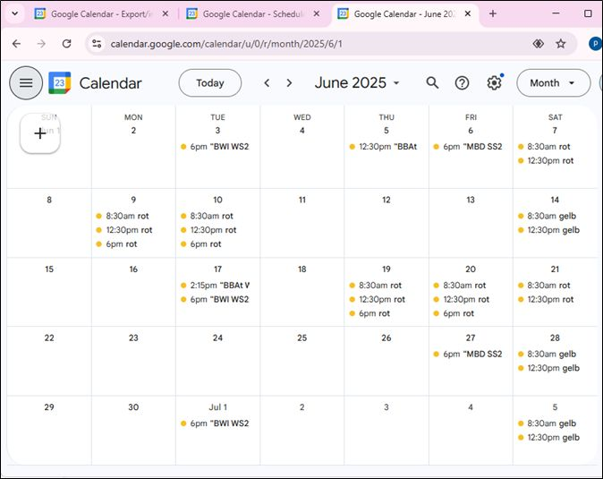

# FOM Planungsbuch (Verfügbarkeiten und Termine) von HTML in ical Kalender kopieren 

## Ablauf - Schritte zum eigenen Kalender 

1.  HTML Seite speichern (Chrome oder Edge nutzen, leider Probleme bei Firefox... )
2. gespeicherte HTML - Seite mit Verfügbarkeiten und Terminen hochladen auf  https://hq.softwareengel.de:30334/   und neue .ical -  Kalender Datei herunterladen 
3.  .ical - Kalender - Datei  importieren ( z.B. bei Goolge Calenar, Outlook, Handy)

## Schritt 1: HTML - Datei Speichern 
- Darauf achten, Dass in der Ansicht alle gewünschten Daten (Auswahl des Planungsjahres (!)" ) auf der Website sichtbar sind 

<figure class="video_container">
  <video width="100%"  controls="true" allowfullscreen="true" autoplay poster="/pics/2025-01-23%2014-17-13.mp4">
    <source src="/pics/2025-01-23%2014-17-13.mp4" type="video/mp4">
  </video>
</figure>

## Schritt 2: gespeicherte HTML -Datei hochladen, ical - Datei herunterladen 

<figure class="video_container">
  <video width="100%"  controls="true" allowfullscreen="true" autoplay poster="/pics/2025-01-23%2014-18-01.mp4">
    <source src="/pics/2025-01-23%2014-18-01.mp4">
  </video>
</figure>

## Schritt 3: neuen Google Kalender anlegen ical -Kalender - Datei importieren 
<figure class="video_container">
  <video width="100%"  controls="true" allowfullscreen="true" autoplay poster="/pics/2025-01-23%2014-17-13.mp4">
    <source src="/pics/2025-01-23%2014-17-13.mp4" type="video/mp4">
  </video>
</figure>

Hinweis:  Löschen von Terminen im Google - Kalender mit (del) 

## Beispiel Website - Ausschnitt

## Beispiel Kalender - Ansicht 

