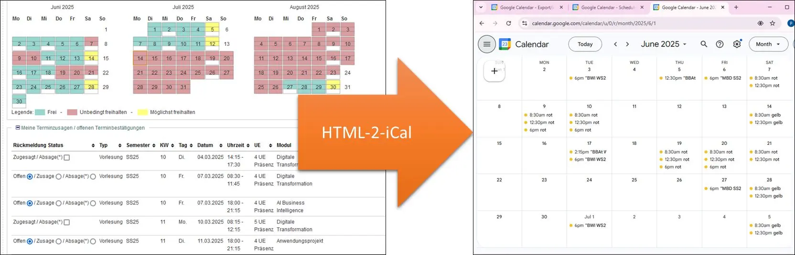

# FOM Planungsbuch (Verfügbarkeiten und Termine) von HTML in iCal Kalender kopieren (HTML-2-iCAL)

## Url:  <https://hq.softwareengel.de:30334/>

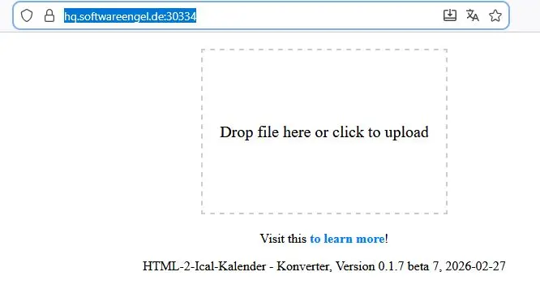

## Update 2026-02-27 Small Fixes V.0.1.7

- Erkennung komplizierter Namen Zusammansetzunggen 
- Erstellung Terminliste mit laufender Nummer und Berechnung Summe UE (fixed )

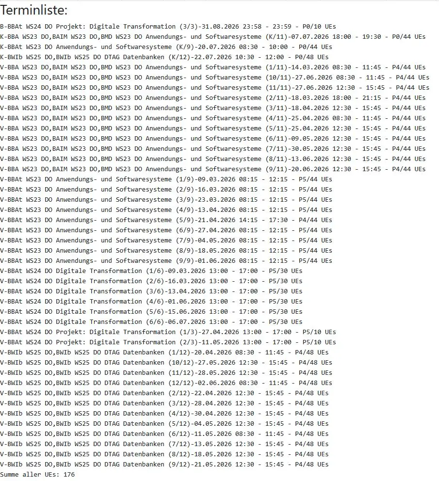

- Online Kalender für 
	- ical  - Export Verhinderungen + Termine  + Online Kalender 
	- ical  - Export Nur Verfügbarkeiten  + Online Kalender View 
	- ical - Export nur Termine + Online Kalender View 
- txt - Export Check der Termin - Liste 

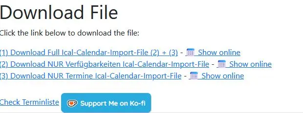

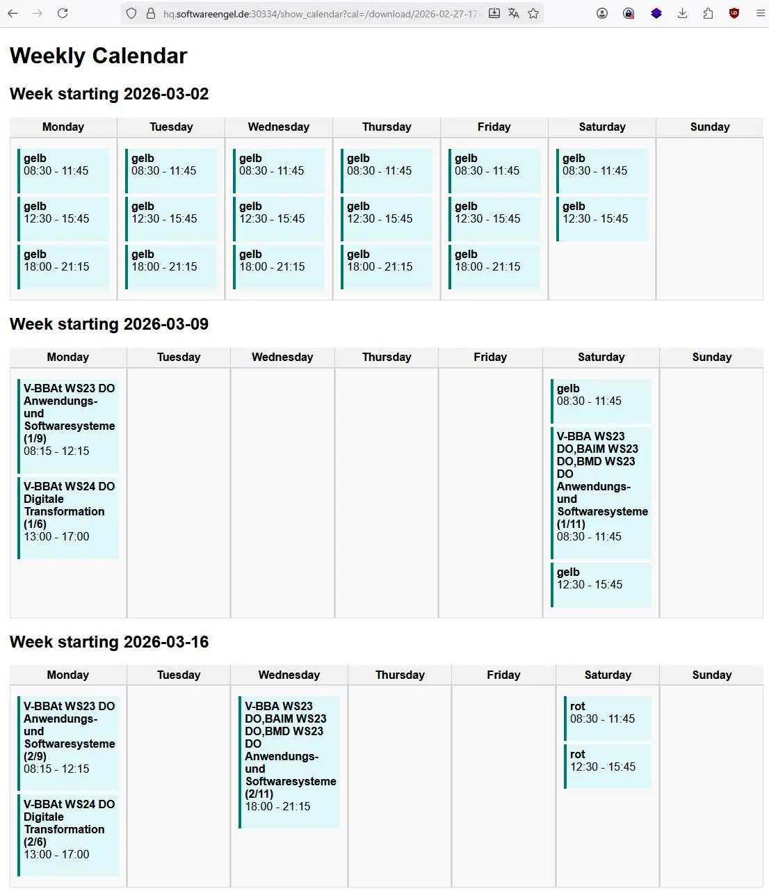

## Update 2025-08-22- Full Video: Vom OC HTML zur Kalender-Integration 

<iframe
  src="https://drive.google.com/file/d/1SFLyPPYfpg-rZiKVzSc2pRNrNdGaOrQK/preview"
  width="100%" height="480" allow="autoplay">
</iframe>

## Update 2025-01-28 - Beta 4

- Liste der Termine sortiert nach Modul und Gruppe 
- Anführungszeichen entfernt,  Encoding- Probleme gelöst 

## Update 2025-01-28 - Beta 3

- Klausuren beider Nummerierung nicht berücksichtigt 
- Show Online! Kalender online anschauen 

## Update 2025-01-26 - Beta 2

- Termin - Typ ist mit drin ("K"lausur , "V"orlesung, "B"etreuung) , also erster Buchstabe von Typ 
- Laufende Nummer des Termins und die Gesamtanzahl der Termine dieses Kurses ist mit drin 
- Beispiel "B-BWIt SS25 DLS Management Grundlagen (3/8)"

## Update 2025-01-24 - Beta 1 

Es sind  nun 3 Kalender - Downloads möglich : 
 
- (1) alles (=2+3): alle Verfügbarkeiten und alle Planungs-Termine 
- (2) nur Verfügbarkeiten
- (3) nur Planungs-Termine

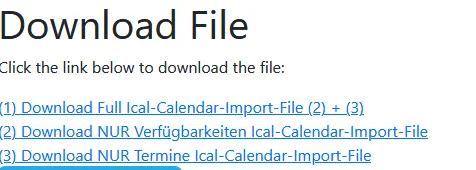

und Danke an einen der ersten Alpha-Tester, um den Nutzen einmal zu zeigen: was fällt hier auf ;-) ?

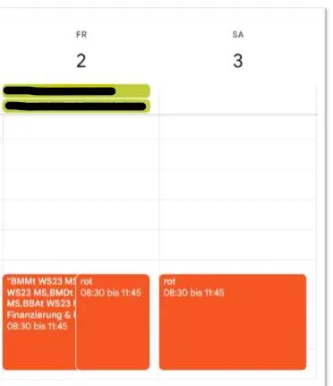

## Ablauf - Schritte zum eigenen Kalender 

1.  HTML Seite speichern (Chrome oder Edge nutzen, leider Probleme bei Firefox... )
2. gespeicherte HTML - Seite mit Verfügbarkeiten und Terminen hochladen auf  <https://hq.softwareengel.de:30334/>    und neue .iCal-Kalender Datei herunterladen 
3.  .iCal-Kalender-Datei  importieren ( z.B. bei Goolge Calendar, Outlook, Handy)

## Schritt 1: HTML - Datei speichern 
- Darauf achten, dass in der Ansicht alle gewünschten Daten (Auswahl des Planungsjahres (!) ) auf der Website sichtbar sind 

<figure class="video_container">
  <video width="100%"  controls="true" allowfullscreen="true" autoplay poster="/pics/2025-01-23-fom-html-cal_video_1.mp4">
    <source src="/pics/2025-01-23-fom-html-cal_video_1.mp4" type="video/mp4">
  </video>
</figure>

## Schritt 2: gespeicherte HTML -Datei hochladen, iCal - Kalender - Datei herunterladen 

<figure class="video_container">
  <video width="100%"  controls="true" allowfullscreen="true" autoplay poster="/pics/2025-01-23-fom-html-cal_video_2.mp4">
    <source src="/pics/2025-01-23-fom-html-cal_video_2.mp4">
  </video>
</figure>

## Schritt 3: neuen Google Kalender anlegen, iCal -Kalender - Datei importieren 
<figure class="video_container">
  <video width="100%"  controls="true" allowfullscreen="true" autoplay poster="/pics/2025-01-23%2014-21-43.mp4">
    <source src="/pics/2025-01-23%2014-21-43.mp4" type="video/mp4">
  </video>
</figure>

Hinweis:  Löschen von Terminen im Google - Kalender mit (del) - Taste  

## Beispiel Website - Ausschnitt

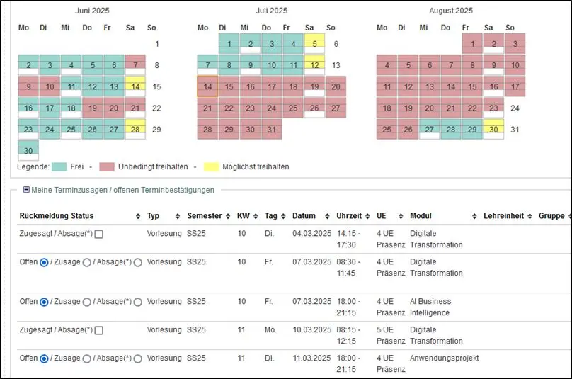

## Beispiel Kalender - Ansicht 
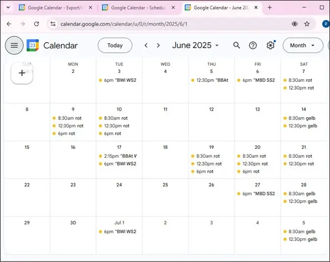

## Weitere Informationen und Ansichten 

### Ansicht Google Import 
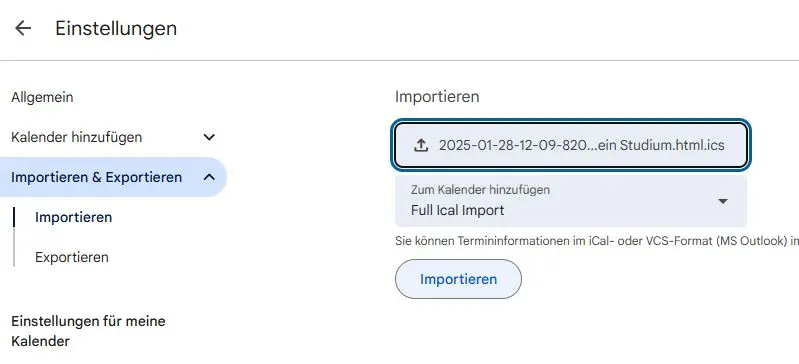

### Ansicht Google Kalender nach Full - iCal - Import 

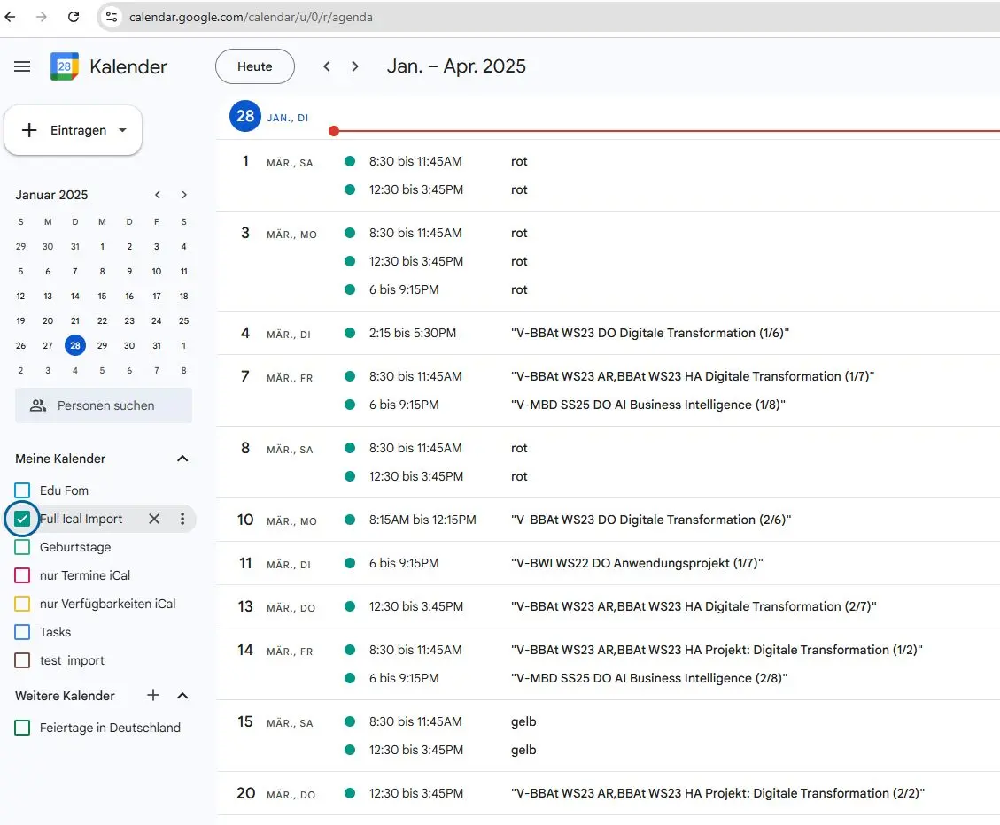

### Ansicht Google Kalender nur Termine iCal Import 

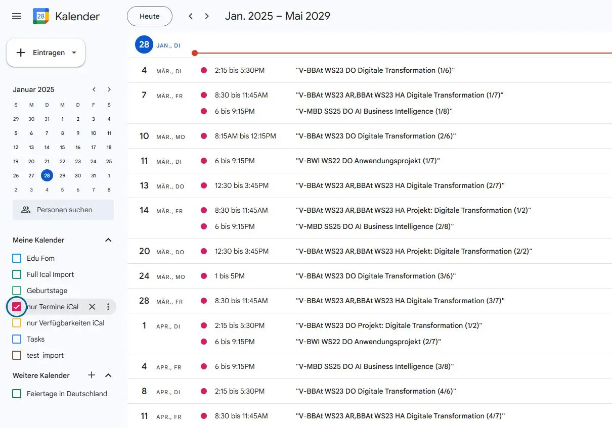

### Ansicht Google Kalender iCal Verfügbarkeiten nach Import 

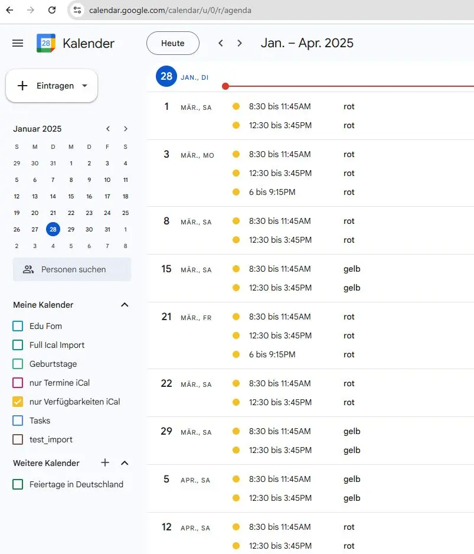

### Ansicht Google Wochen-Kalender nach Full - iCal - Import mit Beispielterminen "Klausur" und "Vorlesung" 

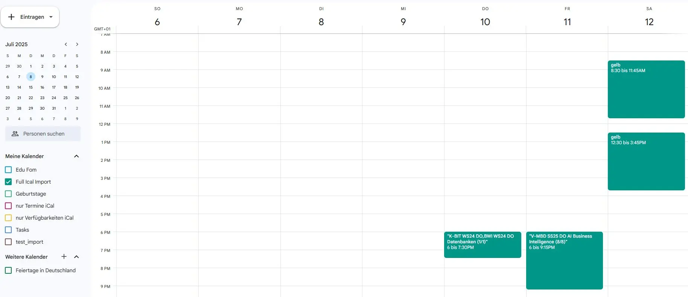

### Google Kalender: löschen von Terminen 

<figure class="video_container">
  <video width="100%"  controls="true" allowfullscreen="true" autoplay poster="/pics/2025-01-28-13-40-42.mp4">
    <source src="/pics/2025-01-28-13-40-42.mp4" type="video/mp4">
  </video>
</figure>

### Google Kalender Plugin zum Löschen nach Filter 

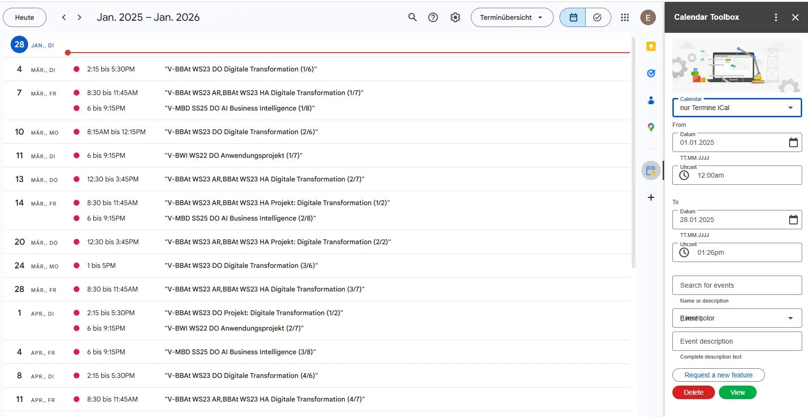
#### Google Calendar Toolbox 

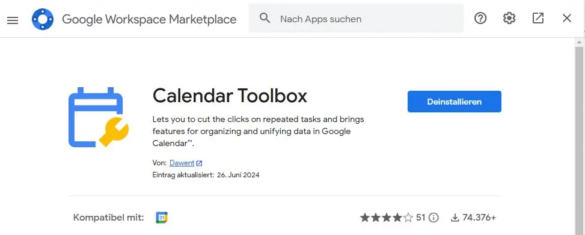

Links:

<https://workspace.google.com/u/0/marketplace/app/calendar_toolbox/517631215797>

### Neue Nummerierung der Termine 

### Beispiel Screen Show Online 

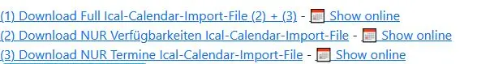

### Beispiel Screen Show Online Kalender 

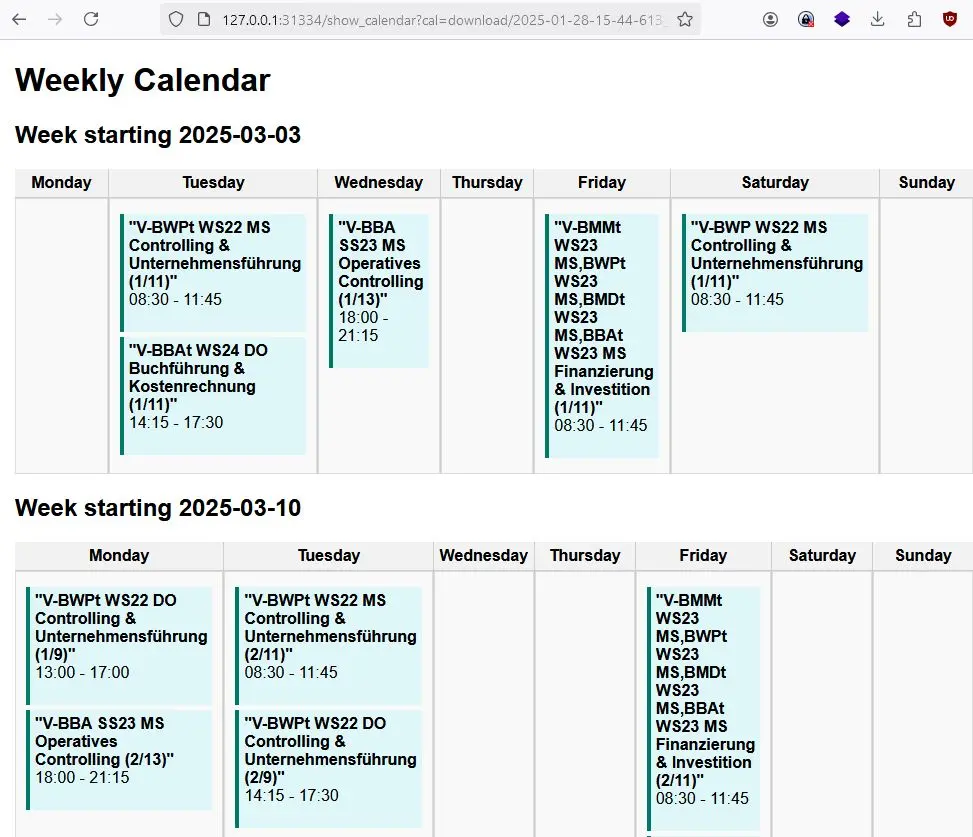
