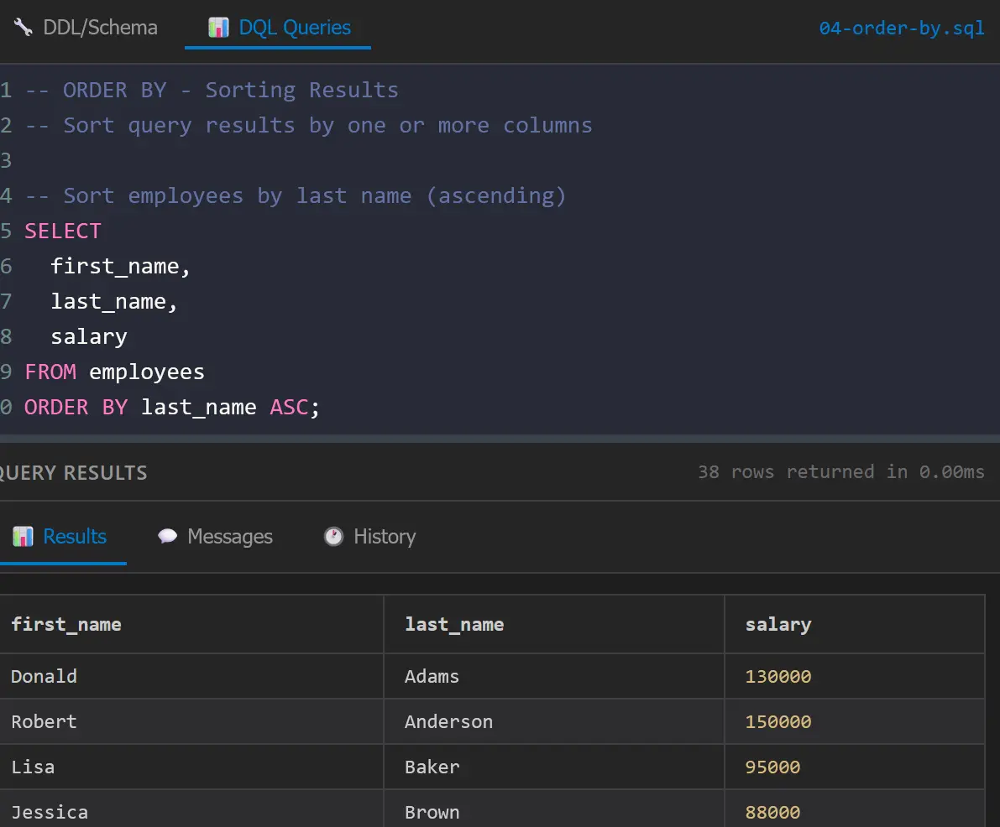
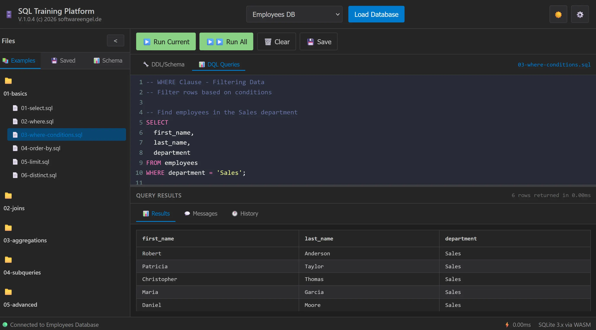
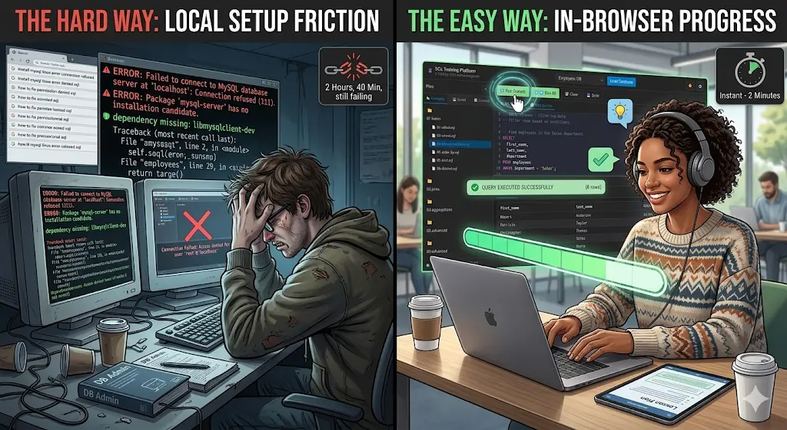
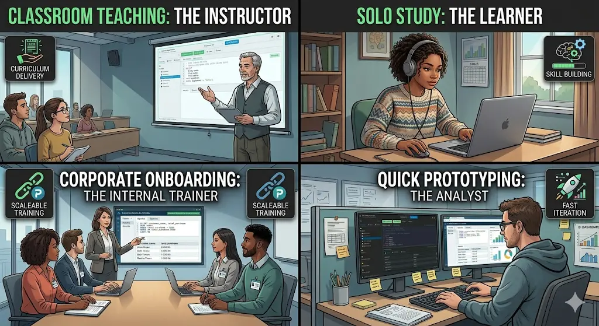
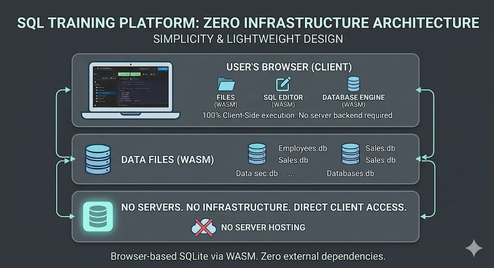
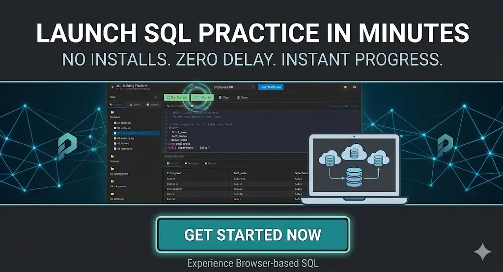

# SQL Training Without Setup Hell

<https://softwareengel.github.io/hacker-codes/>

Most SQL learning fails before the first `SELECT`.

Not because SQL is too hard. Not because learners are lazy. It fails because the first hour is usually wasted on setup friction: installing a database, handling permissions, fixing path issues, matching operating systems, or explaining why something works on one laptop but not another.

That is the real problem this SQL Training Platform solves.

It is a browser-based SQL learning environment that runs SQLite directly in the browser via WebAssembly. No backend. No local database install. No accounts. No fragile classroom setup ritual. Open the app, load a sample database, run a query, and start learning.

## The Hidden Cost of Traditional SQL Training

If you teach, learn, or deploy SQL training at scale, the same problems appear again and again:

- Students lose momentum before they write their first real query.
- Instructors spend class time debugging environments instead of teaching joins, aggregations, and schema design.
- Internal training teams cannot assume every employee has the right tools, access, or permissions.
- Self-learners want practice, but not another half-day setup project.
- Developers and analysts often need a safe scratchpad, not a full database stack.

That friction is expensive. It steals attention, reduces confidence, and turns an approachable skill into a technical obstacle course.

## A Simpler Model: Open Browser, Load Data, Learn SQL

This project takes a different route.

The SQL Training Platform ships as a static web app built with HTML, CSS, and vanilla JavaScript. Under the hood it uses SQL.js, so SQLite runs entirely in the browser. That means users can work with real SQL against realistic sample databases without installing a server or exposing production data.

The experience is practical by design:

- Load a sample database such as Employees, E-Commerce, School, Counties, or Kurs DB.
- Browse curated SQL examples organized from basics to advanced topics.
- Write in a real editor with syntax highlighting, autocomplete, formatting, and keyboard shortcuts.
- Run the current statement or run all statements in a multi-query script.
- Inspect results instantly in a structured table view.
- Save queries locally, review query history, and export results as CSV or JSON.
- Keep working offline after first load with PWA support.

This is not a toy demo. It is a focused learning and practice environment designed to shorten the path from curiosity to confidence.

## Who This Product Actually Serves

### 1. Instructors and academic programs

This is the strongest segment.

When an instructor needs every student to reach the same working starting point fast, zero-install matters more than feature bloat. The platform provides a shared, deterministic environment with structured examples, sample databases, and a learning path from `SELECT` basics to joins, subqueries, DDL, DML, CTEs, and window functions.

### 2. Students and self-directed learners

Learners need repetition, not infrastructure. With built-in examples, multiple realistic datasets, query history, and saved queries, the platform supports short daily practice sessions without redoing setup every time.

### 3. Internal training and onboarding teams

Many companies need to teach SQL to analysts, operations staff, product managers, or junior engineers. They need something lightweight, safe, and easy to distribute. A browser-based training environment with no backend and no install burden is much easier to roll out than a managed training database stack.

### 4. Developers and analysts who need a safe SQL sandbox

Sometimes the goal is not formal training. Sometimes you want to test a query pattern, explain a join, demonstrate grouped results, or prototype a small schema. This product works as a quick SQL scratchpad with less ceremony than a local database setup.

## Why the Feature Set Matters

The most useful product decisions in this repo are the ones that remove small but repeated sources of friction.

For example, example files are organized by topic and difficulty, which gives beginners a clear path forward instead of a random collection of snippets. The app also supports separate DQL and DDL workflows, so users can inspect or modify schema scripts as well as run query exercises.

A particularly strong teaching feature is the split between running the current statement and running all statements. In real SQL lessons, files often contain multiple statements separated by semicolons. If the only option is “run everything,” learners end up deleting blocks, commenting lines in and out, or copy-pasting fragments. This platform avoids that by letting users execute the statement at the cursor or the entire script when needed.

Other features reinforce the practice loop:

- local query history for reviewing what was tried
- saved queries for returning to useful exercises
- schema visualization for understanding table structure faster
- export tools for moving result sets into CSV or JSON
- offline support for classrooms, travel, or unreliable networks

Each feature is modest on its own. Together they create a learning environment that feels immediate and dependable.

## The Real Differentiator: No Backend, No Excuses

A lot of tools promise easy learning. Fewer remove infrastructure from the equation.

This platform is appealing because it is intentionally small in the right places:

- no backend to provision
- no database server to administer
- no account system to manage
- no dependence on internet connectivity after the first load
- no heavy framework complexity for teams that want to inspect or extend it

That makes it attractive not just for learners, but also for educators and technical teams who care about portability, predictability, and maintainability.

## What Problem It Solves for the Customer

If you are the buyer, adopter, or internal champion, the core value is simple:

You reduce time-to-first-query.

That is the metric that matters.

Faster time-to-first-query means:

- less drop-off in beginner learning
- more teaching time spent on concepts instead of troubleshooting
- lower support overhead for internal enablement
- more confidence for learners because the environment works immediately
- faster experimentation for technical users who just need a safe place to think in SQL

In other words, the platform does not just teach SQL. It protects momentum.

## Why This Is Credible

This article is not based on a landing-page promise alone. The repo already shows the product thinking behind the claim.

The documentation and codebase reveal a practical feature set:

- browser-based SQLite execution via WebAssembly
- organized examples from beginner to advanced
- sample databases with realistic tables and relationships
- query history and saved-query persistence in browser storage
- export support
- schema inspection
- theme and editor preferences
- offline-capable PWA behavior
- dual-editor workflow for query execution and schema work

There is also evidence of iterative improvement around real usage flows, including work on running current vs all statements, loading database SQL into the DDL editor, and maintaining predictable UI behavior through testing.

That matters because training products win or lose in the boring details. Reliability is part of the value proposition.

## The Opportunity

The market opportunity is broader than “SQL tutorial app.”

This can be positioned as:

- a classroom-ready SQL trainer for schools and universities
- a low-friction onboarding tool for companies teaching data literacy
- a practice environment for bootcamps and tutoring programs
- a lightweight SQL playground for developers and analysts

The strongest go-to-market message is not technical sophistication. It is reduced friction.

People do not buy this because it uses WebAssembly. They buy in because it gets learners into real SQL work in minutes.

## Call to Action

If you teach SQL, onboard teams into data work, or want a practice environment that removes setup pain, this is the kind of tool worth putting in front of users now.

Start with one course, one workshop, or one onboarding flow.

Measure how quickly people get to their first successful query. Watch how much less time gets lost to environment issues. That is where the value becomes obvious.

If you want to turn SQL from a setup problem into a learning experience, this platform is the right shape of solution.

<https://softwareengel.github.io/hacker-codes/>

<https://softwareengel.de/kontakt/>
## Suggested CTA Buttons for Publishing Later

- Try the SQL Training Platform
- Use It in Your Course
- Start a Team SQL Sandbox
- Explore the Example Databases

# Backup 

## PDF
[Softwareengel - SQL Trainer 2026](../pics/Softwareengel%20-%20SQL%20Trainer%202026.pdf)

## Video 

<figure class="video_container">
  <video width="100%"  controls="true" allowfullscreen="true" autoplay poster="/pics/2024-08-23-GenAIProgrammierung_video_1.mp4">
    <source src="/pics/2026-05-27%2019-14-27.mp4" type="video/mp4">
  </video>
</figure>

